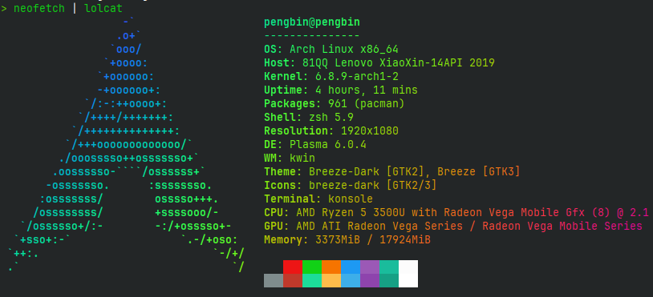
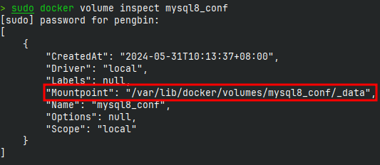
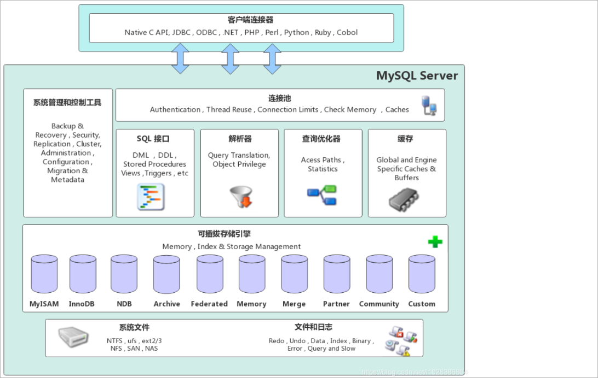
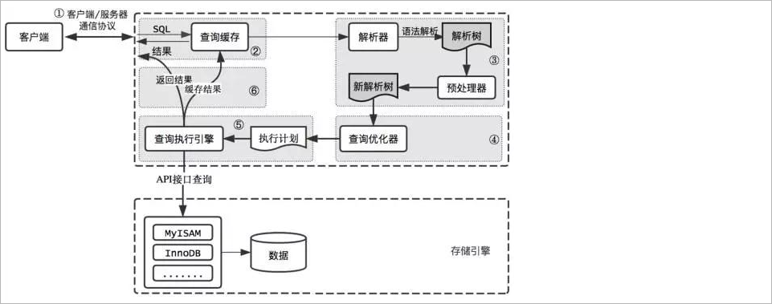
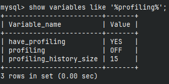
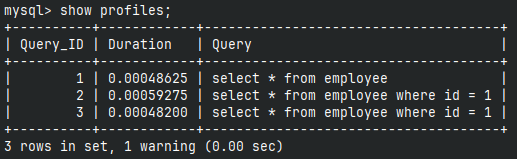
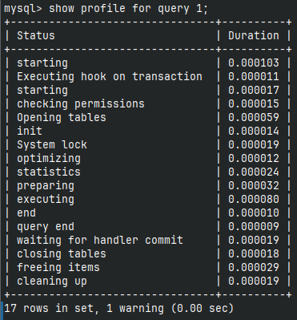

> 本机环境：
>
> 

## docker 安装MySQL

```sh
sudo docker run -p 3307:3306 -v mysql8_conf:/etc/mysql/conf.d -v mysql8_data:/var/lib/mysql -e MYSQL_ROOT_PASSWORD=root --name mysql8-senior -d mysql
```

> ```sh
> sudo docker volume inspect mysql8_conf
> ```
>
> 

## 进入MySQL

```sh
sudo docker exec -it mysql8-senior env LANG=C.UTF-8 bash
mysql -uroot -proot
```

加上参数`env LANG=C.UTF-8`是为了在终端使用MySQL是可以输入中文

## sql_mode

 sql_mode是MySQL中的一个系统变量，用于控制MySQL服务器在执行SQL语句时的行为和规则。**它定义了MySQL对于SQL语句的语法、数据校验和处理方式的严格程度。**

```mysql
SHOW VARIABLES LIKE 'sql_mode';
```

### 常见的sql_mode值

#### <strong style='color:red'>ONLY_FULL_GROUP_BY</strong>

在该模式下，要求GROUP BY子句中的列必须出现在SELECT列表中，或者是聚合函数的参数，否则会抛出错误。

#### STRICT_TRANS_TABLES

在该模式下，如果一个值不能插入到一个事务表中，则中断当前的操作。

对于单个<strong style='color:red'>insert</strong>操作，无论插入单行或是多行，只要插入数据与字段类型不兼容，则本次insert操作失败并回滚；

对于多个<strong style='color:red'>insert</strong>操作，如果插入数据的第一行内容与字段类型兼容，但后续的数据存在不兼容的情况，则兼容的数据正常插入，不兼容的数据则会报错并终止insert操作

#### NO_ZERO_IN_DATE

不允许日、月以及日月都为零，但允许年月日都为零

>  测试时注意：在该模式下测试要将**NO_ZERO_DATE**去掉
>
> ```mysql
> set  session sql_mode='ONLY_FULL_GROUP_BY,STRICT_TRANS_TABLES,NO_ZERO_IN_DATE,ERROR_FOR_DIVISION_BY_ZERO,NO_ENGINE_SUBSTITUTION';
> ```

#### NO_ZERO_DATE

在该模式下，禁止使用零值，例如'0000-00-00'或'0000-00-00 00:00:00'，否则会抛出错误。

> 测试时注意：在该模式下测试要将**NO_ZERO_IN_DATE**去掉
>
> ```mysql
> set  session sql_mode='ONLY_FULL_GROUP_BY,STRICT_TRANS_TABLES,NO_ZERO_DATE,ERROR_FOR_DIVISION_BY_ZERO,NO_ENGINE_SUBSTITUTION';
> ```

#### ERROR_FOR_DIVISION_BY_ZERO

在该模式下，当除数为零时，执行除法运算会抛出错误,如果未给出该模式，那么数据被零除时MySQL返回NULL。

#### NO_ENGINE_SUBSTITUTION

在该模式下，如果需要的存储引擎被禁用，那么抛出错误。不能执行，不设置此值时，用默认的存储引擎替代，**但是不会抛出错误。**

### 更改sql_mode

#### 临时设置

```java
SET GLOBAL sql_mode = 'mode1,model2,...';  -- 全局针对所有的客户端连接有效，要重新启动客户端生效，重启MySQL服务后失效
SET SESSION sql_mode = 'mode1,model2,...'; -- 当前会话生效，关闭当前会话就不生效了。可以省略SESSION关键字
```

#### 永久设置

在mysql配置文件中配置，永久生效：在mysql配置文件中配置，永久生效：在宿主机上执行以下命令，创建配置文件：

```shell
vim /var/lib/docker/volumes/mysql8_conf/_data/base.cnf
```

编辑配置文件

```.properties
[mysqld]
sql-mode = "mode1,model2,..."
```

重启mysql容器

```Bash
docker restart atguigu-mysql8
```

## MySQL逻辑架构



### Connectors(客户端)

MySQL服务器之外的客户端程序，与具体的语言相关，例如Java中的JDBC，图形用户界面Navicat等。本质上都是在TCP连接上通过MySQL协议和MySQL服务器进行通信。

### 系统管理和控制工具

在MySQL服务层中，系统管理和控制工具是指用于管理和控制MySQL数据库服务器的软件工具。这些工具提供了对MySQL服务器的配置、监控、维护和故障排除等功能。

### 连接层

1、客户端访问 MySQL 服务器前，做的第一件事就是**建立TCP连接**。

2、经过三次握手建立连接成功后， MySQL 服务器对 TCP 传输过来的账号密码做**身份认证、权限获取**。

3、用户名或密码不对，会收到一个**Access denied for user**错误，客户端程序结束执行。

4、用户名密码认证通过，会从权限表查出账号拥有的权限。

5、TCP 连接收到请求后，必须要分配给一个线程专门与这个客户端的交互。所以还会有个**线程池**，去走后面的流程。

### SQL接口

1、接收用户的SQL命令，并且返回用户需要查询的结果。

2、实现更加丰富的功能，MySQL支持DML（数据操作语言）、DDL（数据定义语言）、存储过程、视图、触发器、自定义函数等多种SQL语言接口。

### 解析器

在SQL命令传递到解析器的时候会被解析器**验证**和**解析**。解析器对SQL 语句进行**词法分析、语法分析、语义分析**，并为其**创建语法树**。

### 优化器

经过了分析器，MySQL 就知道你要做什么了。但是在开始执行之前，还要先经过优化器的处理。比如在表里面有多个索引的时候，决定使用哪个索引，在比如能在排序的时候，能不能利用索引的顺序等等。总之优化器的作用就是找到这其中**最好的执行计划从而最大程度地减少查询语句的执行时间**。

### 执行器

进入执行器阶段，MYSQL就开始开表执行语句。执行器就会根据表的引擎定义，去使用这个引擎提供的接口。

### 查询流程说明



### SQL执行流程

利用`profiling`可以查看SQL语句执行过程及耗时，默认profiling是关闭的



通过设置其值为1即可开启：`set profiling = 1;`

接下来执行三条查询语句：

```mysql
select * from employee;
select * from employee where id = 1;
select * from employee where id = 1;
```

再通过`show profiles;`可以得到保存的`Query_ID`，根据这个id就可以得到具体的执行过程



```mysql
show profile for query 1;
```

