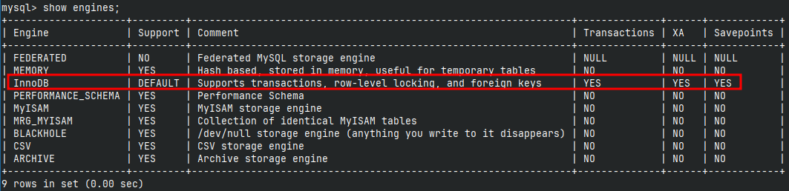

## 查看存储引擎

```mysql
show engines;
```



## InnoDB

1、默认存储引擎：在MySQL 5.5版本之后，InnoDB成为了MySQL的默认存储引擎。

2、支持事务：InnoDB是一个支持ACID事务的存储引擎，可以提供数据的一致性和可靠性。

3、行级锁定：InnoDB使用行级锁定来实现并发控制，允许多个事务同时读取和写入不同的行，提高了并发性能。

4、外键约束：InnoDB支持外键约束.

5、支持崩溃恢复：InnoDB具有崩溃恢复机制，可以在数据库异常关闭后进行恢复。

## MyISAM

1、不支持事务：MyISAM是一个不支持事务的存储引擎，无法提供数据的一致性和可靠性。

2、表级锁定：MyISAM使用表级锁定来实现并发控制，只允许一个事务对整个表进行读写操作，限制了并发性能。

3、较低的存储空间占用：相比InnoDB，MyISAM在存储空间占用方面较低，适合存储大量非事务性的数据。