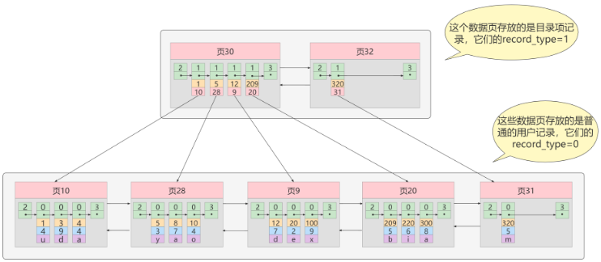

## 索引概述

MySQL官方对索引的定义为：索引（index）是帮助MySQL高效获取数据的**数据结构**（有序）。在数据之外，数据库系统还维护者满足特定查找算法的数据结构，这些数据结构以某种方式引用（指向）数据， 这样就可以在这些数据结构上实现高级查找算法，这种数据结构就是索引


> 利用二叉查找树（排序）树，既能有顺序的将那些无序的元素，变为有序，而且还自带了一种折半的思想算法在里面。因此这用树作为索引结构而不去用数组+算法作为所以会更加的方便。

## 优点和缺点

<strong style='color:red'>优势</strong>

1）**降低了Io次数：** 类似于书籍的目录索引，提高数据检索的效率，降低数据库的IO成本。 

2） **降低了cpu的消耗**：通过索引列对数据进行排序，降低数据自己排序的成本，进一步能降低CPU的消耗。

<strong style='color:red'>劣势</strong>

1）**空间利用率**： 实际上索引也是一张表，该表中保存了主键与索引字段，并指向实体类的记录，所以**索引列也是要占用空间**的。

2） **时间利用率**：虽然索引大大提高了查询效率，同时却也**降低更新表的速度**，如对表进行INSERT、UPDATE、DELETE。因为更新表时，MySQL 不仅要更新数据，还要更新一下索引文件。

## 常见索引结构

1、**B树(B-tree):** B树是一种平衡的**多路搜索树**，被广泛应用于数据库系统中。B树的特点是每个节点可以存储多个键值，并且保持有序。B树的高度相对较低，可以快速定位到目标数据。

2、**B+树(B+tree):** B树是一种平衡的**多路搜索树**，被广泛应用于数据库系统中。B+树的特点是**每个节点可以比B树还存储更多的键值**，并且保持有序。初次之外B+树的**高度相对B树更低**，因此查询数据的Io次数就更少，查询效率就更高。

2、**Hash索引**（Hash Index）：Hash索引使用哈希函数将索引列的值映射为一个固定长度的哈希码，并将哈希码作为索引的键值。Hash索引适用于等值查询，可以快速定位到目标数据。**BUT**，Hash索引不支持<strong style='color:red'>范围查询和排序</strong>操作。

3、R树（R-tree）：R树是一种用于处理多维数据的索引结构，常用于地理信息系统（GIS）和空间数据库中。R树可以高效地支持范围查询和最近邻查询。

4、Full-text （全文索引） ：全文索引也是MyISAM的一个特殊索引类型，主要用于全文索引，InnoDB从Mysql5.6版本开始支持全文索引。

MyISAM、InnoDB、Memory三种存储引擎对各种索引类型的支持

| 索引        | InnoDB引擎      | MyISAM引擎 | Memory引擎 |
| ----------- | --------------- | ---------- | ---------- |
| BTREE索引   | 支持            | 支持       | 支持       |
| HASH 索引   | 不支持          | 不支持     | 支持       |
| R-tree 索引 | 不支持          | 支持       | 不支持     |
| Full-text   | 5.6版本之后支持 | 支持       | 不支持     |

而我们平常所说的索引，如果没有特别指明，都是指**B+树**（多路搜索树，注意：并不一定是二叉的）结构组织的索引。

## 索引结构-树

### 二叉树

#### BST

二叉搜索树存在一个常见的问题：**退化问题** ， 例如左子树全部为空，从形式上看，更像一个单链表，不能发挥BST的优势，影响了查询数据效率。

#### AVL

**磁盘的IO次数和索引树的高度是相关**

### B Tree

B-tree又叫**多路（叉）平衡搜索树**，一颗m叉的B-tree特性如下：

1、树中每个节点最多包含m个子节点。

2、除根节点与叶子节点外，每个节点至少有[ceil(m/2)]个孩子。

3、若根节点不是叶子节点，则至少有两个孩子。

4、所有的叶子节点都在同一层。

5、每个非叶子节点由n个key与n+1个指针组成，其中[ceil(m/2)-1] <= n <= m-1 

如下所示：


B树相比于AVL来说磁盘IO操作更少，效率更高

### B+ Tree

从B树结构图中可以看到每个节点中不仅包含数据的（key）主键值，还有data值，因此一个磁盘块中存不下太多的key(主键值)和data，因为磁盘块的存储空间是有限的（默认是16kb），那么当MySQL存储的数据量很大时势必会导致B树的深度很深即高度很高，而B树的高度很高，就会增大磁盘的IO次数，进而影响查询数据的效率。

> **如何优化？**
>
> **<strong style='color:red'>思路</strong>**：其实我们只要能够降低树的高度即可。
>
> **<strong style='color:red'>问题</strong>**：那么在数据量不变的情况下如何降低树的高度呢?
>
> **<strong style='color:red'>解决</strong>**：我们如果能每个节点多存储（key）主键值的数量，那么不就可以降低B+树的高度。此时B+树就孕育而生。

#### B+树定义

1、树中每个节点最多包含m个子节点。

2、除根节点与叶子节点外，每个节点至少有[ceil(m/2)]个孩子。

3、若根节点不是叶子节点，则至少有两个孩子。

4、所有的叶子节点都在同一层。

5、每个非叶子节点由n个key与n+1个指针组成，其中[ceil(m/2)-1] <= n <= m-1

**6、m 叉树非叶子节点只存储索引值和磁盘块（页）的地址，并不真正存储数据，**

**7、叶子节点存放真正的数据。**

#### **B+** **树和** **B** **树的差异：**

**1**、**data数据存储不同**：B+树中非叶子节点仅用于索引，不保存数据记录，跟记录有关的信息都放在叶子节点中。而B树中， 非叶子节点既保存索引，也保存数据记录 。

**2、时间复杂度不同：**由于B+树的数据都存在叶子节点，因此B+树的时间复杂度固定为o(log n)，而B树的数据分布在每个节点中，因此时间复杂度不固定，最好为o(1)，最不好为o(log n)。

**3**、**节点连接顺序不同**：B+树中所有关键字[**主键**]都在叶子节点出现，叶子节点构成一个有序链表，而B树没有。

**4**、**区间查询效率不同**，因为B树查询范围需要进行树的中序遍历，而B+树的范围查询只需从当前页或者沿着链表的当前页查询下一个页，因此范围查询效率更快，而B树范围查询比较慢。

## InnoDB中的索引底层

```mysql
CREATE TABLE index_demo(c1 INT,c2 INT,c3 CHAR(1),PRIMARY KEY(c1)) ;
```

这里我们简化了index_demo表的行格式示意图：


把一些记录放到**页**里的示意图就是【**数据都是存储到数据页中，一个数据页占用一个磁盘块**】：


MySQL InnoDB的默认的页大小是16KB：

```sql
-- 查看默认页的大小
SHOW GLOBAL STATUS LIKE 'Innodb_page_size';
```

## InnoDB中的索引方案

### 目录项纪录的页

我们继续把前边使用到的目录项也要放到数据页中，那么对于该页中存放的是目录项，因此我们把该页叫做目录页，如下图所示：


**这里要注意的是：**目录项记录和普通的用户记录的不同点：

1、**目录项记录 的 record_type 值是1**，而普通用户记录 的 record_type值是0。

2、目录项记录只有主键值和页的编号两个列，而普通的用户记录的列是用户自己定义的，可能包含很多列，另外还有InnoDB自己添加的隐藏列。

### 多个目录项记录的页

但是随着数据持续增加，存放数据的数据页也就会增多，而当数据页越来越多的时候，目录页也会变多，比如：



### 目录项记录页的目录页


### 聚簇索引（主键索引）

**特点：**

1、使用记录主键值的大小进行记录和页的排序，这包括三个方面的含义

* 页内的记录是按照主键的大小顺序排成一个单向链表。 
* 各个存放用户记录的页 也是根据页中用户记录的主键大小顺序排成一个双向链表 。 
* 存放目录项记录的页分为不同的层次，在同一层次中的页也是根据页中目录项记录的主键大小顺序排成一个双向链表 

2、B+树的**叶子节点存储的是完整的用户记录**【所谓完整的用户记录，就是指这个记录中存储了所有列的值】。

**优点：**

1、**数据访问更快** ，因为聚簇索引将索引和数据保存在同一个B+树中，因此从聚簇索引中获取数据比非聚簇索引更快 

2、聚簇索引对于主键的排序查找和范围查找速度非常快 

```
select * from t1  where col1=1;
```

3、按照聚簇索引排列顺序，查询显示一定范围数据的时候，由于数据都是紧密相连，数据库不用从多个数据块中提取数据，所以 节省了大量的io操作 。

**缺点：**

1、**插入速度严重依赖于插入顺序** ，按照主键的顺序插入是最快的方式，否则将会出现页分裂，严重影响性能。因此，对于InnoDB表，我们一般都会定义一个自增的ID列为主键。

2、**更新主键的代价很高** ，因为将会导致被更新的行移动。因此，对于InnoDB表，我们一般定义**主键为不可更新**。【主键不可修改，可以在MySQL中通过触发器来实现】

**限制：**

1、只有InnoDB引擎支持聚簇索引，**MyISAM不支持聚簇索引**。

2、由于数据的物理存储排序方式只能有一种，所以**每个MySQL的表只能有一个聚簇索引**。

3、如果没有为表定义主键，InnoDB会选择**非空且唯一索引列代替**。如果没有这样的列，InnoDB会**隐式的定义一个主键**（row_id）作为聚簇索引。

4、为了充分利用聚簇索引的聚簇特性，InnoDB中**表的主键应选有序自增的短整型类型的id**，不建议使用无序的较长的id，比如UUID、MD5、HASH、字符串作为主键，无法保证数据的顺序增长。

> 不用uuid作为主键的原因：
>
> 1、 UUID占用更多的存储空间，UUID是一个128位的数字，。相比之下，整型主键只需要4个字节即可表示，导致存储索引和数据占用的页会变多，出现页的裂化。
>
> 2、 UUID会导致索引性能下降，使用UUID作为主键会导致索引树的深度增加，从而降低索引的查询效率。
>
> 3、UUID会导致数据插入性能下降。因为无顺序，那么在插入数据时无法按照顺序进行排序，进而会导致数据的存储的性能下降。

### 非聚簇索引

非聚簇索引通常也被人们称之为：二级索引、辅助索引。以c2列作为搜索条件，那么需要使用c2列创建一棵B+树，如下所示：


**这棵B+树与聚簇索引有几处不同：**

1、页内的记录是按照从c2列的大小顺序排成一个单向链表 。

2、页和页之间也是根据页中记录的c2列的大小顺序排成一个双向链表 。

3、非叶子节点存储的是记录的c2列+页号。

4、**叶子节点存储的并不是完整的用户记录**，而只是c2列+主键这两个列的值。

我们根据这个以c2列大小排序的B+树只能确定我们要查找记录的主键值，所以如果我们想根据c2列的值查找到完整的**用户记录**的话，仍然需要到聚簇索引中再查一遍，这个过程称为回表 。也就是根据c2列的值查询一条完整的用户记录**需要使用到2棵B+树**！

### 联合索引

我们也可以同时以多个列的大小作为排序规则，也就是**同时为多个列建立索引**，比方说我们想让B+树按照c2和c3列的大小进行排序:

1、先把各个记录和页按照c2列进行排序。 

2、在记录的c2列相同的情况下，采用c3列进行排序

### 覆盖索引

如果能通过读取索引就可以得到想要的数据，那就不需要读取用户记录，或者不用再做回表操作了。**一个索引包含了满足查询结果的所有数据**就叫做覆盖索引。例如，如果为前面例子中的数据库表创建c2列索引，则如下SQL会使用覆盖索引。

假设：t1 ---c1 c2 c3

```sql
SELECT c2 from index_demo where c2 = 5;
SELECT c1,c2 from index_demo where c2 = 5;---也叫
SELECT  * from index_demo where c2 = 5;---不叫
```

## MyISAM索引结构

MyISAM引擎使用 B+Tree 作为索引结构，**叶子节点的data域存放的是数据记录的地址** 。

下图是MyISAM索引的原理图**（索引和数据分开存储，是非聚簇索引）**：


## MyISAM与InnoDB对比

1、InnoDB的数据文件和索引文件是在一起的，而MyISAM索引文件和数据文件是分离的：

- InnoDB的表在磁盘上存储在以下文件中： **.ibd（表结构、索引和数据都存在一起,MySQL5.7表结构放在.frm中）**
- MyISAM的表在磁盘上存储在以下文件中：**.sdi（表结构，MySQL5.7是.frm）**、**.MYD（数据）**，**.MYI（索引）**

2、InnoDB中主键索引是聚簇索引，叶子节点中存储完整的数据记录；其他索引是非聚簇索引，存储相应的索引值+主键索引值 。

3、InnoDB要求表必须有主键 （ MyISAM可以没有 ）。如果没有显式指定，则MySQL系统会自动选择一个可以**非空且唯一**标识数据记录的列作为主键。如果不存在这种列，则MySQL自动为InnoDB表生成一个隐含字段作为主键。row_id.

4、MyISAM中无论是主键索引还是非主键索引都是非聚簇的，叶子节点记录的是数据的地址。
