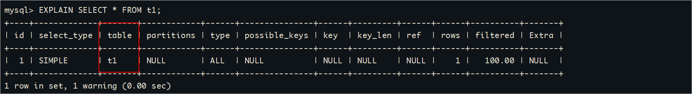
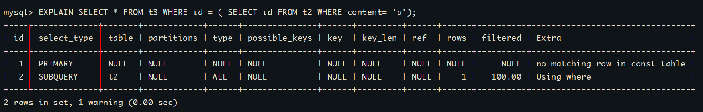
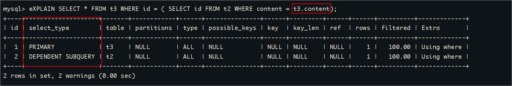
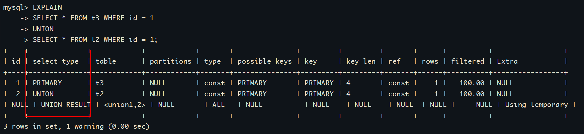
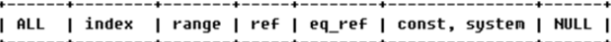
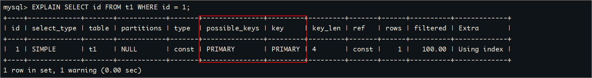
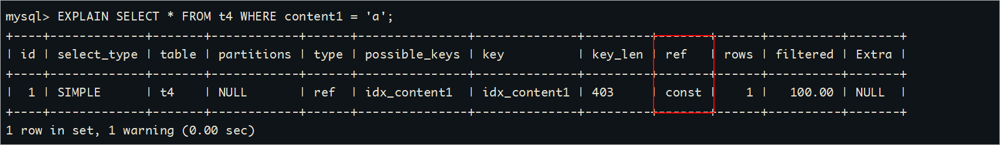
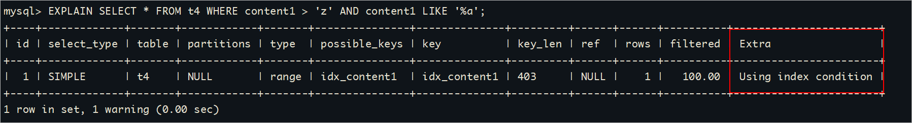

## 创建索引

### 随表一起创建索引

```sql
CREATE TABLE customer (
  id INT UNSIGNED AUTO_INCREMENT,
  customer_no VARCHAR(200),
  customer_name VARCHAR(200),
  PRIMARY KEY(id), -- 主键索引：列设定为主键后会自动建立索引，唯一且不能为空。
  UNIQUE INDEX uk_no (customer_no), -- 唯一索引：索引列值必须唯一，允许有NULL值，且NULL可能会出现多次。
  KEY idx_name (customer_name), -- 普通索引：既不是主键，列值也不需要唯一，单纯的为了提高查询速度而创建。
  KEY idx_no_name (customer_no,customer_name) -- 复合索引：即一个索引包含多个列。
);
```

### 单独建创索引

```sql
CREATE TABLE customer1 (
  id INT UNSIGNED,
  customer_no VARCHAR(200),
  customer_name VARCHAR(200)
);
-- 建表后创建索引
ALTER TABLE customer1 ADD PRIMARY KEY customer1(id); -- 主键索引
CREATE UNIQUE INDEX uk_no ON customer1(customer_no); -- 唯一索引
CREATE INDEX idx_name ON customer1(customer_name);  -- 普通索引
CREATE INDEX idx_no_name ON customer1(customer_no,customer_name); -- 复合索引
ALTER TABLE customer1 MODIFY id INT UNSIGNED AUTO_INCREMENT, ADD PRIMARY KEY customer1(id); -- 创建自增的主键索引
```

### 使用ALTER命令

```sql
ALTER TABLE customer1 ADD PRIMARY KEY (id); -- 主键索引
ALTER TABLE customer1 ADD UNIQUE INDEX uk_no (customer_no); -- 唯一索引
ALTER TABLE customer1 ADD INDEX idx_name (customer_name);   -- 普通索引
ALTER TABLE customer1 ADD INDEX idx_no_name (customer_no,customer_name);  -- 复合索引
```

## 查看索引

```sql
SHOW INDEX FROM customer;
```

## 删除索引

```sql
DROP INDEX idx_name ON customer; -- 删除单值、唯一、复合索引
ALTER TABLE customer MODIFY id INT UNSIGNED, DROP PRIMARY KEY; -- 删除主键索引(有主键自增)
ALTER TABLE customer1 DROP PRIMARY KEY;  -- 删除主键索引(没有主键自增)
```

## MySQL索引使用场景

**哪些情况适合创建索引：**

1、频繁作为WHERE查询条件的字段

```sql
select * from t1 where age=20;-- 经常
select * from t1 where age=30;-- 经常
select * from t1 where age=100;-- 经常
```

2、经常ORDER BY的列

```sql
select * from t1 order by age=20;-- 经常
select * from t1 order by age=30;-- 经常
select * from t1 order by age=100;-- 经常
```

3、值的唯一性强字段

```sql
select * from user where phone='1111111'-- 经常
select * from user where card='1111111'-- 经常
select * from user where email='1111111'-- 经常
select * from user where birthdate='1111111'-- 经常
select * from user where sex="男"-- 不适合--唯一性不强的字段就不适合。
```

4、多表JOIN时，对连接字段创建索引。

5、对于需要在指定范围内快速查询的数据列。因为索引已经排序，其指定的范围是连续的，查询可以利用索引的排序，加快查询的时间。

7、有序的字段适合创建索引，有序的字段在插入数据库的过程中，仍能保持B+树的索引结构，不需要频繁更新索引文件，性能更好。例如，在订单表中，订单创建时间会有序递增，因此适合创建索引。

> 全表扫描：全表扫描不会走主键索引。直接是从叶子节点进行遍历查询。

**哪些情况不要创建索引：**

1、WHERE、ORDER BY里用不到的字段不创建索引

2、表的数据记录太少

3、对经常增删改的表不建议创建索引。

> 因为在更新字段的过程中，需要维护B+树结构，会频繁更新索引文件，降低SQL性能。例如，在文章表中，阅读量会频繁更新，就不适合创建索引。

- 过长的字段不适合创建索引。

> 过长的字段会占用更多的空间，不适合创建索引。
>
> 例如，在商品表中，商品详情可能很长，不适合创建索引。

4、过滤性不好的不适合建索引【唯一性比较差，重复性比较高】

```sql
select * from user where sex="男"-- 不适合--唯一性不强的字段就不适合。
```

> **针对于第四条也可以用索引的选择性来解释**
>
> 索引的选择性是指：索引列中不同值的数目和表的记录数的比值。假如表里面有1000条数据，表索引列有980个不同的值，这时候索引的选择性就是980/1000=0.98 。索引的选择性越接近1，这个索引的效率很高。
>
> 性别可以认为是3种，男，女，其他。如果创建索引，查询语句 性别=‘男'的数据，索引的选择性就是3/1000=0.003。索引的选择性值很低，对查询提升不大，所以性别建索引意义不大。

# MySQL优化（索引优化）

## 性能分析（EXPLAIN）

### 数据准备

```sql
CREATE TABLE t1(id INT(10) AUTO_INCREMENT, content VARCHAR(100) NULL, PRIMARY KEY (id));
CREATE TABLE t2(id INT(10) AUTO_INCREMENT, content VARCHAR(100) NULL, PRIMARY KEY (id));
CREATE TABLE t3(id INT(10) AUTO_INCREMENT, content VARCHAR(100) NULL, PRIMARY KEY (id));
CREATE TABLE t4(id INT(10) AUTO_INCREMENT, content1 VARCHAR(100) NULL, content2 VARCHAR(100) NULL, PRIMARY KEY (id));
CREATE INDEX idx_content1 ON t4(content1);  -- 创建普通索引
# 以下新增sql多执行几次，以便演示
INSERT INTO t1(content) VALUES(CONCAT('t1_',FLOOR(1+RAND()*1000)));
INSERT INTO t2(content) VALUES(CONCAT('t2_',FLOOR(1+RAND()*1000)));
INSERT INTO t3(content) VALUES(CONCAT('t3_',FLOOR(1+RAND()*1000)));
INSERT INTO t4(content1, content2) VALUES(CONCAT('t4_',FLOOR(1+RAND()*1000)), CONCAT('t4_',FLOOR(1+RAND()*1000)));
```

### EXPLAIN结果字段说明

#### id

在一个完整的查询语句中，每个SELECT关键字，都对应一个唯一的id。同时通过id也可以知道操作表的顺序。

**id相同：** 一个SELECT，id都是1 

```sql
EXPLAIN SELECT * FROM t1, t2, t3;
```


**id不同：**三个SELECT，id是1、2、3

```sql
EXPLAIN SELECT t1.id FROM t1 WHERE t1.id =(
  SELECT t2.id FROM t2 WHERE t2.id =(
    SELECT t3.id FROM t3 WHERE t3.content = 't3_479'
  )
);
```


**注意**：如果t3表查询无结果，则table列t1和t2处为NULL


**注意：**查询优化器可能对涉及子查询的语句进行优化，**转为连接查询**

```sql
EXPLAIN SELECT * FROM t1 WHERE content IN (SELECT content FROM t2 WHERE content = 'a');
```


**id为NULL：** 把t1和t2的查询结果合并，并创建名为<union1,2>的临时表，然后对结果去重 把t1和t2的查询结果合并

```sql
EXPLAIN SELECT * FROM t1 UNION SELECT * FROM t2;
```


因此包含UNION ALL的执行计划中就没有这条记录

```sql
EXPLAIN SELECT * FROM t1 UNION ALL SELECT * FROM t2;
```


1. UNION：使用UNION操作符时，会将多个SELECT语句的结果集合并，并去除重复的行。即，如果多个SELECT语句返回了相同的行，则只保留一行。

2. UNION ALL：使用UNION ALL操作符时，也会将多个SELECT语句的结果集合并，但不去除重复的行。即，如果多个SELECT语句返回了相同的行，则全部保留。

**小结：**

- id如果相同，可以认为是一组，`从上往下顺序执行`

- id如果不同，代表不是同一组，那么`id值越大，越先执行`

- 关注点：每个id号码，表示一次独立的查询, `一个sql的查询趟数越少越好`

#### table

单表：显示这一行的数据是关于哪张表

```sql
EXPLAIN SELECT * FROM t1;
```



#### select_type

查询的类型，主要是用于区别普通查询、联合查询、子查询等的复杂查询。

**1）SIMPLE：**简单查询，查询中不包含子查询或者联合查询。

```sql
EXPLAIN SELECT * FROM t1;
```


**2）PRIMARY：**主查询，查询中若包含子查询，则最外层查询被标记为PRIMARY。 

**3）SUBQUERY：**子查询，在SELECT或WHERE或者FROM列表中包含了子查询。

```sql
EXPLAIN SELECT * FROM t3 WHERE id = ( SELECT id FROM t2 WHERE content= 'a');
or
EXPLAIN SELECT * FROM  (select * from t3 ) as  a WHERE id = ( SELECT id FROM t2 WHERE content= 'a');
```



 **4）DEPENDENT SUBQUREY：**如果包含了子查询，并且子查询的条件值是基于外部查询的数据列），那么该子查询就是DEPENDENT SUBQUREY。

```sql
EXPLAIN SELECT * FROM t3 WHERE id = ( SELECT id FROM t2 WHERE content = t3.content);
```



**5）UNCACHEABLE SUBQUREY**： 当使用了 @@ 来引用系统变量的时候，不会使用缓存。

注意这里面的缓存不是我们前面讲的把查询结果缓存起来的缓存，在MySQL中很多地方为了提高性能，也用到了缓存，比如将一些系统变量的值缓存起来。

```sql
EXPLAIN SELECT * FROM t3 WHERE id = ( SELECT id FROM t2 WHERE content = @@character_set_server);
```


**6）UNION：** 对于包含UNION或者UNION ALL的查询语句，除了最左边的查询是PRIMARY，其余的查询都是UNION。 

**7）UNION RESULT：** UNION会对查询结果进行查询去重，MYSQL会使用临时表来完成UNION查询的去重工作，针对这个临时表的查询就是"UNION RESULT"。 

```sql
EXPLAIN 
SELECT * FROM t3 WHERE id = 1 
UNION  
SELECT * FROM t2 WHERE id = 1;
```



**8）DERIVED：** 子查询在from子句中的查询所对应的表，就叫做派生表。但是从5.7之后，MySQL就对派生表进行了合并。

> 由于MySQL5.7默认是打开的。因此我们将其手动关闭
>
> set session optimizer_switch='derived_merge=off';

比如这样：

```sql
select * from (select * from t1) as aa;
```

对派生表合并之后：

```sql
select * from t1;
```

这里的**<derived2>**就是在id为2的查询中产生的派生表。


#### <strong style="color:red">type※</strong>

type字段表示了查询操作的**访问类型**，用于描述查询引擎在执行查询时使用的访问方法。



**访问类型排列**

type显示的是访问类型，是较为重要的一个指标，结果值**从最好到最坏依次是**： 

<strong style="color:red">system </strong>> <strong style="color:red">const</strong>> <strong style="color:red">eq_ref</strong> > <strong style="color:red">ref</strong> > fulltext > ref_or_null > index_merge > unique_subquery > index_subquery ><strong style="color:red"> range</strong> > <strong style="color:red">index</strong> > <strong style="color:red">ALL</strong>

system>const>eq_ref><strong style="color:green">ref</strong>><strong style="color:green">range</strong>>index>ALL

一般来说，得保证查询至少达到**range**级别，最好能达到**ref**。

##### **ALL**

全表扫描，Full Table Scan，将遍历全表以找到匹配的行

```sql
EXPLAIN SELECT * FROM t1;
```


##### index

表示全索引扫描，即遍历整个索引树来获取结果，而**不需要回表**查找数据。

```sql
EXPLAIN SELECT id FROM t1;
```


##### **range**

 只检索给定范围的行，使用一个索引来选择行。key 列显示使用了哪个索引，一般就是在你的where语句中出现了between、<、>、in等的查询。一般情况下这种范围扫描索引扫描比全表扫描要好，因为它只需要开始于索引的某一点，而结束于另一点，不用扫描全部索引。 

```sql
EXPLAIN SELECT * FROM t1 WHERE id > 2;
```


##### **ref**

 表示使用了非唯一索引进行的等值比较，可能返回多个匹配的行。

```sql
alter  table  t4  add index idx_content(content)
EXPLAIN SELECT * FROM t4 WHERE content1 = 'a';
或者
EXPLAIN SELECT * FROM t3, t4 WHERE t3.content = t4.content;
```


##### **eq_ref**

表示使用了连接查询，并且连接条件是通过唯一索引进行的等值比较。

```sql
EXPLAIN SELECT * FROM t1, t2 WHERE t1.id = t2.id;
```


> eq_ref和ref的区别：
>
> **先说eq_ref:**  
>
> ​      表t1包含列（id,context）,其中id是主键。表t2具有相同的列（id,content）,其中id是主键.
>
> ​    表A包含以下数据；
>
> ​     1 263
>
> ​     2 857
>
> ​    表B包含以下数据
>
> ​     1 334
>
> ​     2 665
>
> ​     而eq_ref为t1 t2之间的join:
>
> ​     select * from t1,t2 where t1.id=t2.id;
>
> ​     因为对于表t1中扫描的每一行，表t2中只能有一行满足。**因为t2.id是独一无二的。 **
>
> **再谈ref:**
>
> ​    对于上面一张表t1, 给content建立索引但**非UNQIE**
>
> 1  263
>
> 2  263
>
> 那么ref为t1 t2之间的join:
>
> select * from t1,t2 where t1.content=t2.content
>
> ​    这个join就没有eq_ref的快，因为对于t1中扫描的的**每一行**，t2表中有几个可能的行与之匹配，**因为t2.content不是唯一的**。

6）**constant:**

**该表最多有一个匹配的行**，在查询开始时读取。因为只有一行，所以优化器的其他部分可以将这一行中的列的值视为常量。

```sql
explain select * from t1 where id = 1;
```


- 表示通过索引一次就找到了,const用于primary key或者unique索引。
- 因为只匹配一行数据，所以很快.。 如将主键或者唯一索引置于where列表中，MySQL就能将该查询转换为一个常量级别的查询。

##### **system**

表示只有一行数据的表，且存储引擎还是MyISAM。这是最快的访问方式。

```sql
CREATE TABLE t(i int) Engine=MyISAM;
INSERT INTO t VALUES(1);
EXPLAIN SELECT * FROM t;
```


#### possible_keys 和 key

1、possible_keys表示执行查询时可能用到的索引，一个或多个。 查询涉及到的字段上若存在索引，则该索引将被列出，但不一定被查询实际使用。

2、keys表示<strong style="color:red">实际使用的索引</strong>。如果为NULL，则没有使用索引。

```sql
EXPLAIN SELECT id FROM t1 WHERE id = 1;
```



#### key_len 

表示索引使用的字节数，根据这个值可以判断索引的使用情况，`检查是否充分利用了索引，针对联合索引值越大越好。`

**如何计算：**

1、先看索引上字段的类型。比如：int=4 ; varchar(20) =20 ; char(20) =20

2、如果是varchar或者char这种字符串字段，视字符集要乘不同的值，比如utf8要乘 3(MySQL5.7)，如果是utf8mb4要乘4，GBK要乘2

3、varchar这种动态字符串要加2个字节

4、允许为空的字段要加1个字节

```sql
CREATE TABLE `t_emp` (
  `id` INT(11) NOT NULL AUTO_INCREMENT,
  `empno` INT NOT NULL ,					
  `name` VARCHAR(20) DEFAULT NULL,  		
  `age` INT(3) DEFAULT NULL,				
  `deptId` INT(11) DEFAULT NULL,			
  PRIMARY KEY (`id`)
) ENGINE=INNODB AUTO_INCREMENT=1;


INSERT INTO t_emp(NAME,age,deptId,empno) VALUES('风清扬',90,1,100001);
INSERT INTO t_emp(NAME,age,deptId,empno) VALUES('岳不群',50,1,100002);
INSERT INTO t_emp(NAME,age,deptId,empno) VALUES('令狐冲',24,1,100003);
INSERT INTO t_emp(NAME,age,deptId,empno) VALUES('洪七公',70,2,100004);
INSERT INTO t_emp(NAME,age,deptId,empno) VALUES('乔峰',35,2,100005);
INSERT INTO t_emp(NAME,age,deptId,empno) VALUES('灭绝师太',70,3,100006);
INSERT INTO t_emp(NAME,age,deptId,empno) VALUES('周芷若',20,3,100007);
INSERT INTO t_emp(NAME,age,deptId,empno) VALUES('张三丰',100,4,100008);
INSERT INTO t_emp(NAME,age,deptId,empno) VALUES('张无忌',25,5,100009);
INSERT INTO t_emp(NAME,age,deptId,empno) VALUES('韦小宝',18,null,100010);
-- 创建索引
CREATE INDEX idx_age_name ON t_emp(age, `name`);

-- 测试1
EXPLAIN SELECT * FROM t_emp WHERE age = 30 AND `name` = 'ab%';

-- 测试2
EXPLAIN SELECT * FROM t_emp WHERE age = 30;
```


#### ref

ref字段表示连接操作中使用的索引列。

**const：**  与索引列进行等值比较的东西是啥，const表示一个常数

```sql
alter  table  t4  add index idx_content(content)
EXPLAIN SELECT * FROM t4 WHERE content1 = 'a';
```



**ref=atguigudb.t1.id**   关联查询时出现，t2表和t1表的哪一列进行关联

```sql
EXPLAIN SELECT * FROM t1, t2 WHERE t1.id = t2.id;
```


#### rows

rows字段的值是一个估计值，表示查询操作在执行时**可能会扫描的行数**。这个估计值是根据统计信息和查询优化器的算法得出的，并不是实际执行时的准确值。它可以用来帮助我们评估查询的性能和效率。rows字段的值越小越好!

```sql
-- 如果是全表扫描，rows的值就是表中数据的估计行数
EXPLAIN SELECT * FROM t4 WHERE content2 = 't4_354';
-- 如果是使用索引查询，rows的值就是预计扫描索引记录行数
EXPLAIN SELECT * FROM t4 WHERE content1 = 't4_354';
```


#### filtered

最后查询出来的数据占所有服务器端（server）检查行数（rows）的百分比。值越大越好。

> 一句话：通过查询条件获取的最终记录行数/通过type字段指明的搜索方式搜索出来的记录行数(rows)的百分比。

#### Extra

Extra字段提供了一些与查询操作相关的**附加信息**，帮助我们更好地理解查询的执行过程和性能特点。MySQL提供的额外信息有好几十个，这里只挑比较重要的介绍。

**Impossible WHERE**：where子句的值总是false

```sql
EXPLAIN SELECT * FROM t_emp WHERE 1 != 1;
```


**Using where：** 使用了where，但在where上有字段没有创建索引。也可以理解为如果数据从引擎层被返回到server层进行过滤，那么就是Using where。

```sql
EXPLAIN SELECT * FROM t_emp WHERE `name` = '风清扬';
```


**Using filesort**：在对查询结果中的记录进行排序时，是可以使用索引的，如下所示：

```sql
EXPLAIN SELECT * FROM t1 ORDER BY id;
```


如果排序操作无法使用到索引，只能在内存中（记录较少时）或者磁盘中（记录较多时）进行排序（filesort），如下所示：

```sql
EXPLAIN SELECT * FROM t1 ORDER BY content;
```


**Using index：** **使用了覆盖索引**，表示直接访问索引就足够获取到所需要的数据，不需要通过索引回表

```sql
 EXPLAIN SELECT id, content1 FROM t4;
```


**Using index condition**: 叫作Index Condition Pushdown Optimization （**索引下推优化**）

```sql
-- content1列上有索引idx_content1
EXPLAIN SELECT * FROM t4 WHERE content1 > 'z' AND content1 LIKE '%a';
```

>1、`如果没有索引下推（ICP）`，那么MySQL在存储引擎层找到满足`content1 > 'z'`条件的第一条二级索引记录。`主键值进行回表`，返回完整的记录给server层，server层再判断其他的搜索条件是否成立。如果成立则保留该记录，否则跳过该记录。
>
>2、`如果使用了索引下推（ICP）`，那么MySQL在存储引擎层找到满足`content1 > 'z'`条件的第一条二级索引记录。`不着急执行回表`，而是在这条记录上先判断一下所有关于`idx_content1`索引中包含的条件是否成立，也就是`content1 > 'z' AND content1 LIKE '%a'`是否成立。如果这些条件不成立，则直接跳过该二级索引记录，去找下一条二级索引记录；如果这些条件成立，则执行回表操作，返回完整的记录给server层。



**注意：** 如果这里的查询条件`只有content1 > 'z'`，那么找到满足条件的索引后也会进行一次索引下推的操作，判断content1 > 'z'是否成立（这是源码中为了编程方便做的冗余判断）


## 常见的优化方案

MySQL性能调优是指通过对MySQL数据库系统进行优化，以**提高其执行速度、响应时间和资源利用率**的过程。MySQL是一种常用的关系型数据库管理系统，因此针对MySQL的性能调优主要集中在以下几个方面：

1、查询索引优化：通过分析和优化查询语句，包括使用合适的索引、避免全表扫描、创建复合索引、删除不必要的索引等优化JOIN操作等，以提高查询性能。

2、配置优化：调整MySQL的配置参数，如缓冲区大小、并发连接数、线程池大小等，以适应不同的工作负载和硬件环境。

3、内存管理：合理配置MySQL的内存使用，包括设置合适的缓冲池大小、排序缓冲区大小、临时表空间大小等，以提高内存利用率和减少磁盘IO。

4、存储引擎选择：根据应用需求选择合适的存储引擎，如InnoDB、MyISAM等，并针对不同存储引擎进行相应的优化。

5、数据库设计优化：合理设计数据库表结构、字段类型和关系，以减少数据冗余和提高查询效率。

以上只是MySQL性能调优的一些常见方面，具体的调优策略和方法需要根据具体情况进行分析和优化。通过综合考虑硬件、操作系统、网络和应用程序等因素，可以全面提升MySQL数据库的性能和可伸缩性。