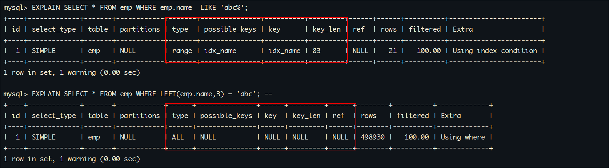
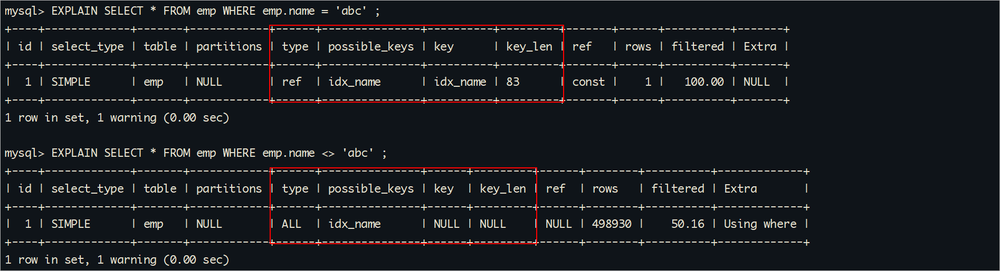
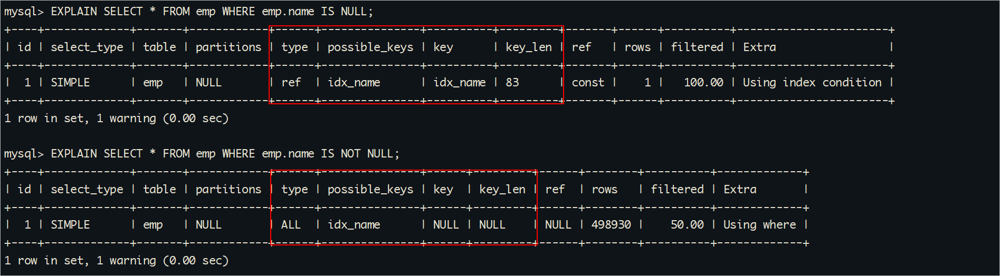

# 1 MySQL索引失效场景

## 数据准备

### 表结构说明

在做优化之前，要准备大量数据。接下来创建两张表，并往员工表里插入50W数据，部门表中插入1W条数据。

怎么快速插入50w条数据呢? 

1、使用jdbc程序

2、使用存储过程

怎么保证插入的数据不重复? 函数

```sql
CREATE TABLE `dept` (
  `id` INT(11) NOT NULL AUTO_INCREMENT,
  `deptName` VARCHAR(30) DEFAULT NULL,		
  `address` VARCHAR(40) DEFAULT NULL,		
  ceo INT NULL ,							-- 1-50w之间的任意数字
  PRIMARY KEY (`id`)
) ENGINE=INNODB AUTO_INCREMENT=1;

CREATE TABLE `emp` (
  `id` INT(11) NOT NULL AUTO_INCREMENT,
  `empno` INT NOT NULL ,					
  `name` VARCHAR(20) DEFAULT NULL,  		
  `age` INT(3) DEFAULT NULL,		
  `deptId` INT(11) DEFAULT NULL,			-- 1-1w之间随机数
  PRIMARY KEY (`id`)
) ENGINE=INNODB AUTO_INCREMENT=1;
```

总结： 需要产生随机字符串和区间随机数的函数。 

### 随机函数

```sql
SELECT RAND(); 				-- 返回一个0到1之间的随机浮点数
SELECT FLOOR(RAND() * 10); 	-- 返回一个0到9之间的随机整数
SELECT UUID(); 				-- 返回一个随机的唯一标识符
```

自定义生成随机数的函数：

```sql
-- 查看mysql是否允许创建函数：
SHOW VARIABLES LIKE 'log_bin_trust_function_creators';

SET GLOBAL log_bin_trust_function_creators=1; 				-- 命令开启：允许创建函数设置：（global-所有session都生效）

-- 随机产生字符串
DELIMITER $$  -- 将分隔符设置为"$$"，以便在自定义函数中使用多个语句。
CREATE FUNCTION rand_string(n INT) RETURNS VARCHAR(255)  -- n表示的随机字符串的长度 
BEGIN    
  DECLARE chars_str VARCHAR(100) DEFAULT 'abcdefghijklmnopqrstuvwxyzABCDEFJHIJKLMNOPQRSTUVWXYZ';
  DECLARE return_str VARCHAR(255) DEFAULT '';
  DECLARE i INT DEFAULT 0;
  WHILE i < n DO  
    SET return_str = CONCAT(return_str,SUBSTRING(chars_str,FLOOR(1+RAND()*52),1));  
    SET i = i + 1;
  END WHILE;
  RETURN return_str;
END $$

-- 假如要删除
 drop function rand_string;


-- 用于随机产生区间数字
DELIMITER $$
CREATE FUNCTION rand_num (from_num INT ,to_num INT) RETURNS INT(11)
BEGIN   
 DECLARE i INT DEFAULT 0;  
 SET i = FLOOR(from_num +RAND()*(to_num - from_num + 1));
RETURN i;  
END$$

-- 假如要删除
 drop function rand_num;
```

### 存储过程

#### 存储过程简介：

简单来说，存储过程就是一组SQL语句集，功能强大，可以实现一些比较复杂的逻辑功能，类似于JAVA语言中的方法。因此，存储过程就是数据库 SQL 语言层面的代码封装与重用。

#### 创建存储过程

```sql
-- 插入员工数据
DELIMITER $$			-- 将分隔符设置为"$$"，以便在存储过程中使用多个语句。
CREATE PROCEDURE insert_emp(START INT, max_num INT)
BEGIN  
  DECLARE i INT DEFAULT 0;   
  SET autocommit = 0;   -- 将自动提交事务的选项设置为0，即关闭自动提交。
  REPEAT  				-- REPEAT ... END REPEAT; ：开始一个循环，循环结束条件是`i = max_num`，每次循环`i`递增1。
    SET i = i + 1;  
    INSERT INTO emp (empno, NAME, age, deptid ) VALUES ((START+i) ,rand_string(6), rand_num(30,50), rand_num(1,10000));  
    UNTIL i = max_num  
  END REPEAT;  
COMMIT;   --将事务修改为手动提交
END$$
 
-- 删除
-- drop PROCEDURE insert_emp;


-- 插入部门数据
DELIMITER $$
CREATE PROCEDURE insert_dept(max_num INT)
BEGIN  
  DECLARE i INT DEFAULT 0;   
  SET autocommit = 0;    
  REPEAT  
    SET i = i + 1;  
    INSERT INTO dept ( deptname,address,ceo ) VALUES (rand_string(8),rand_string(10),rand_num(1,500000));  
    UNTIL i = max_num  
  END REPEAT;  
  COMMIT;  
END$$
 
-- 删除
-- DELIMITER ;
-- drop PROCEDURE insert_dept;
```

#### 调用存储过程

```sql
-- 执行存储过程，往dept表添加1万条数据
CALL insert_dept(10000); ---一定要在容器的MySQL客户端执行，不要在可视化的工具中执行

-- 执行存储过程，往emp表添加50万条数据，编号从100000开始
CALL insert_emp(100000,500000); ---一定要在容器的MySQL客户端执行，不要在可视化的工具中执行
```

#### 开启SQL执行时间的显示

为了方便后面的测试中随时查看SQL运行的时间，测试索引优化后的效果，我们开启profiling

```sql
-- 显示sql语句执行时间
SET profiling = 1;
SHOW VARIABLES  LIKE '%profiling%';
SHOW PROFILES;
```

### 批量删除表索引

**1.创建批量删除索引的存储过程**

```sql
-- 批量删除某个表上的所有索引
DELIMITER $$
CREATE  PROCEDURE `proc_drop_index`(dbname VARCHAR(200),tablename VARCHAR(200))
BEGIN
       #定义游标处理完毕的状态
       DECLARE done INT DEFAULT 0;
       DECLARE _index VARCHAR(200) DEFAULT '';	
       #定义游标
       DECLARE _cur CURSOR FOR  SELECT   index_name   FROM information_schema.STATISTICS   WHERE table_schema=dbname AND table_name=tablename AND seq_in_index=1 AND    index_name <>'PRIMARY' ;
       #执行过程中出现异常时 游标状态被置为2，不在执行后面的游标。
       DECLARE  CONTINUE HANDLER FOR NOT FOUND set done=2 ;      
       OPEN _cur;#打开游标
       FETCH _cur INTO _index;#获取第一层游标变量并将其传给本地变量
       WHILE  _index<>'' DO #执行循环
               SET @str = CONCAT("drop index " , _index , " on " , tablename ); 
               PREPARE sql_str FROM @str ;
               EXECUTE  sql_str;
               DEALLOCATE PREPARE sql_str;
               SET _index=''; 
               #获取下一层游标，并继续循环
               FETCH _cur INTO _index; 
        END WHILE;
   CLOSE _cur;
END$$
```


```sql
-- 执行批量删除：dbname 库名称, tablename 表名称
CALL proc_drop_index("dbname","tablename"); 
```

**2.调用批量删除索引的存储过程**

- 调用之前先测试一下。

```SQL
#分別给name、age、deptId建立3个索引 
create  index idx_name on emp(name);   
create  index idx_age on emp(age);   
create  index idx_deptId_age on emp(deptId,age);   
```


调用批量删除索引存储函数

```sql
CALL proc_drop_index("mydb","emp");
CALL proc_drop_index("mydb","dept");
```


# 2 单表索引优化

## 全值匹配我最爱

系统中我们经常出现这样的sql语句：

```sql
EXPLAIN SELECT SQL_NO_CACHE * FROM emp WHERE emp.age=30 and deptid=4 AND emp.name = 'abcd';
```

并且我们来查询一下这条sql执行大致需要花费时间


那么针对这条sql我们该怎么建立索引进行优化呢。

CREATE INDEX idx_age ON emp(age);

CREATE INDEX idx_age_deptid ON emp(age,deptid);

**CREATE INDEX idx_age_deptid_name ON emp(age,deptid,NAME);**

建立age_deptid_name之后，查询效率。


那么如果我的条件变化了呢，比如像下面的SQL语句，还会用到我们建立的idx_age_deptid_name 索引嘛。

**思考：以下sql语句会不会用到索引**？

```sql
#一组：
#age deptid   name 
EXPLAIN SELECT SQL_NO_CACHE * FROM emp WHERE emp.age=30 and deptid=4 AND emp.name = 'abcd';
#age  name deptid   
EXPLAIN SELECT SQL_NO_CACHE * FROM emp WHERE emp.age=30 AND emp.name = 'abcd' and deptid=4;

#二组：	
# deptId age  name
EXPLAIN SELECT SQL_NO_CACHE * FROM emp WHERE  deptid=4 AND emp.age=30 and emp.name = 'abcd';
# deptId   name age
EXPLAIN SELECT SQL_NO_CACHE * FROM emp WHERE  deptid=4  and emp.name = 'abcd' and age=30;

#三组:
# name age  deptId
EXPLAIN SELECT SQL_NO_CACHE * FROM emp WHERE  emp.name = 'abcd' and  emp.age=30 and deptid=4;
# name deptId age
EXPLAIN SELECT SQL_NO_CACHE * FROM emp WHERE  emp.name = 'abcd' and deptid=4 and  emp.age=30 ; 

```


我们不难发现，以上6条sql语句虽然说where条件的字段有的和索引列顺序不一致，但是在查询的时候依然都能用到全部索引列。原因在哪里呢。 因为查询优化器会对where后的字段进行一个优化，使其达到和索引顺序一致。

**<strong style='color:red'>思考</strong>：那么查询优化器为何能优化。**

<strong style='color:red'>原因:</strong>  因为对于where条件来说条件字段写在and前和后业务的结果都是一致的。

<strong style='color:red'>因此</strong>:  尽量用给定的where条件去创建满足这些条件的索引。而对于一条sql语句中的全部的条件都能满足建立的索引列这种特点，我们称之为全值匹配模式。

## 最佳左前缀法则

系统中我们经常出现这样的sql语句：

```sql
explain SELECT *  FROM emp WHERE emp.age=30 AND emp.deptId=1000 ;
或者
explain SELECT  * FROM emp WHERE emp.age=30 AND emp.name = 'abcd' ;
或者
explain SELECT  * FROM emp WHERE emp.deptId=1 AND emp.name = 'abcd'; 
```

那上面我们建立的复合索引**idx_age_deptid_name**还能不能用？

```sql
explain SELECT SQL_NO_CACHE * FROM emp WHERE emp.age=30 AND emp.deptId=1000 ;
```


```sql
SELECT SQL_NO_CACHE * FROM emp WHERE emp.age=30 AND emp.name = 'abcd' ;
```


```SQL
EXPLAIN SELECT SQL_NO_CACHE * FROM emp WHERE emp.deptid=1 AND emp.name = 'abcd'; 
```


<strong style='color:red'>思考1</strong>：为什么最多只会用到索引列的两列。

<strong style='color:red'>原因：</strong>因为给定的where条件就只有两列，因此即使全用到索引列，也只能用到其中两列。

<strong style='color:red'>思考2</strong>：为什么给定的条件中断掉了索引的中间列时，就只能使用到最左边的那一个索引列？。

<strong style='color:red'>原因：</strong>对于三个索引列的索引树来说，每一组索引列的值都是排好序的，如果在断掉这三个索引列的中间那一列（也即中间那一列都不知道大小）的情况下，后面的那一列的顺序性是无法利用的。断掉第一列也是同理。

<strong style='color:red'>因此</strong>：如果索引中有多列，那么查询条件一定要**遵守索引列的最左前缀**。记住一个小口诀，**带头大哥不能死，中间兄弟不能断。**

## 范围查询不够帅

系统中我们经常出现在这样的sql语句

```sql
EXPLAIN SELECT  * FROM emp WHERE emp.age=30 AND emp.deptId>20 AND emp.name = 'abc' ;  
```


那么索引 idx_age_deptid_name这个索引还能正常使用么？


**结论**： 不能，范围右边的列不能使用到索引。

<strong style='color:red'>思考</strong>: 为什么只用到了2个?

**思考：那么我们能不能将范围的条件放到最后。**

```sql
EXPLAIN SELECT SQL_NO_CACHE * FROM emp WHERE emp.age=30  AND emp.name = 'abc' AND emp.deptId>20 ;  
```


索引也不能全部用到，只能用到age、deptId.

**注意**

- 虽然where条件不是按照索引的顺序，但是当所有条件都在索引中时，查询优化器依然会将你的条件列的顺序调整和索引列一致。

**那么如果有范围查询的情况下，我就想让我的条件列全部用到建立的索引，怎么办呢。**

如果在你的业务中这种sql出现的真的比较多，我们就可以创建这样的索引，把范围查询列放到索引最后。

```sql
drop index   idx_age_deptid_name on  emp 
create index idx_age_name_deptid on emp(age,name,deptid);
```


```sql
EXPLAIN SELECT  SQL_NO_CACHE * FROM emp WHERE emp.age=30  AND emp.name = 'abc' AND emp.deptId>20 ;

EXPLAIN SELECT  SQL_NO_CACHE * FROM emp WHERE emp.age=30  AND emp.deptId>20 
AND emp.name = 'abc' ；

```


**友情提示**：

在开发中当有需要范围查询时，例如： 金额查询，日期查询往往都是范围查询。应将查询条件放置where语句最后，然后在此顺序的基础之上建立索引。

<strong style='color:red'>因此</strong>：一句话**，为了索引全部匹配上，尽量将范围查询条件放置索引最后**


------


# 3 单表索引失效案例

MySQL中提高性能的一个最有效的方式是对数据表**设计合理的索引**。索引提供了高效访问数据的方法，并且加快查询的速度，因此索引对查询的速度有着至关重要的影响。

我们创建索引后，用不用索引，最终是优化器说了算。**优化器会基于开销选择索引，怎么开销小就怎么来**。不是基于规则，也不是基于语义。

另外SQL语句是否使用索引，和数据库的版本、数据量、数据选择度（查询中选择的列数）运行环境都有关系，比如以下的一些情况，就会导致索引失效。

```sql
--删除原来索引
drop index   idx_age_name_deptid on  emp 
-- 创建索引
CREATE INDEX idx_name ON emp(`name`);
```

## 计算、函数导致索引失效

**索引列上做计算：**

```sql
explain  select * from emp where id=2;
```


```sql
explain SELECT SQL_NO_CACHE * FROM emp WHERE id-1=1;
```


**解决办法**：避免在索引列上使用运算符，可以使用其他方式实现相同的逻辑。

**索引列上使用函数：**

```sql
-- 显示查询分析
EXPLAIN SELECT * FROM emp WHERE emp.name  LIKE 'abc%';
EXPLAIN SELECT * FROM emp WHERE LEFT(emp.name,3) = 'abc'; -- 索引失效
```

执行结果如下所示：



**解决办法**：尽量不要在索引列上做函数运算。

**比如：**

```sql
--错误示例：
SELECT * FROM table WHERE YEAR(birth_date) = 2023;
--正确示例：
SELECT * FROM table WHERE datebirth_date_column >= '2023-01-01' AND birth_date < '2023-01-01';
```

## LIKE以%开头索引失效

```sql
EXPLAIN SELECT * FROM emp WHERE name LIKE '%ab%'; -- 索引失效
```

执行结果如下所示：


注意：Alibaba《Java开发手册》【强制】页面搜索严禁左模糊或者全模糊，如果需要请走搜索引擎来解决。

**解决办法**：尽量避免使用通配符开头的模糊查询，可以考虑全文搜索引擎或者将查询条件更改为name  like 'abc%。'

```sql
url ----idx_url 
www.baidu.com
www.jd.com
www.taobao.com
www.atguiu.cn
www.abc.top

moc.udiab.www
moc.dj.www
moc.oaboat.www

select * from emp where url like 'moc%';
```

## 不等于(!= 或者<>)索引失效

```sql
EXPLAIN SELECT * FROM emp WHERE emp.name = 'abc' ;
EXPLAIN SELECT * FROM emp WHERE emp.name <> 'abc' ; -- 索引失效
```

执行结果如下所示：



**解决办法**：尽量避免使用不等于操作符进行范围查询。

**比如**：

```sql
--错误示例：
SELECT * FROM emp WHERE id != 30;
--正确示例：
SELECT * FROM emp WHERE id > 30 OR id < 30;
```

## IS NOT NULL 和 IS NULL

```sql
EXPLAIN SELECT * FROM emp WHERE emp.name IS NULL;
EXPLAIN SELECT * FROM emp WHERE emp.name IS NOT NULL; -- 索引失效
```

执行结果如下所示：



**注意：** 

is null 会走索引，跟数据量没关系。

is not null 跟返回数据量有关，返回数据量少则走索引，大于总数据某个百分比不走索引。

**比如：**

```sql
-- 将 id>20000 的数据的 name 值改为 NULL
UPDATE emp SET `name` = NULL WHERE `id` > 20000;

-- 执行查询分析，可以发现 IS NOT NULL 使用了索引
-- 具体多少条记录的值为NULL可以使索引在IS NOT NULL的情况下生效，由查询优化器的算法决定
EXPLAIN SELECT * FROM emp WHERE emp.name IS NOT NULL;
```

执行结果如下所示：


**测试完将name的值改回来**

```sql
UPDATE emp SET `name` = rand_string(6) WHERE `id` > 20000;
```

## 类型不匹配导致索引失效

```sql
EXPLAIN SELECT  * FROM emp WHERE name = '123'; 
EXPLAIN SELECT  * FROM emp WHERE name = 123;  

```


```sql
EXPLAIN SELECT  * FROM emp WHERE age = 1;  
EXPLAIN SELECT  * FROM emp WHERE age = '1';  
```

我们在建表的时候 由于给name字段设定的类型是varchar.但是在查询的时候不去执行该类型。那么MySQLl就会给我们进行自动转换将。而索引字段一旦发生自动转换就会导致索引失效。

**注意：**

- 在 MySQL 中如果字段类型和参数类型不一致,并且字段类型或者参数类型中存在字符串,那么 MySQL 都会把字符串转换成其它类型。
- 在参数上发生转换，不会导致索引失效。因为底层没有调整索引树结构。
- 在给定条件的列上进行转换，都会让索引失效,因为你想利用索引的话必然要先改变索引树的结构,而这是一个很高的成本,并且当你转换完了之后索引树还可能是无序的，与其是这样,还不如全表扫描。
- 所以一定要保证条件列的类型和参数的类型一致。

## **OR操作符使用多列索引**

原因：使用OR操作符连接多列查询条件，导致索引失效。

**先去表中修改100个左右的age值为100，和age=10,然后在来测试。**

```sql
explain  select  * from  emp   where age =100  or  age =10;

```


```sh
explain  select  * from  emp   where age =100  or  deptId=2831;
```


------

> 结论：
>
> 当使用or的时候，or前面的索引列和or后面的索引列是一致的话，可能会失效，也可能不会失效，这和数据量有关系。查询优化器会考虑做索引+回表和表扫描的成本选择。
>
> 当使用or的时候，or前面的索引列和or后面的列（没有加索引）是不一致的话，那么这条sql语句一定会失效。
>
> 一定成立：
>
> 如果基于索引之后的结果还是很多，那么查询优化器有极大的可能不会走索引，而是直接走全表。
>
> 

# 4 MySQL关联查询优化

## 数据准备

创建两张表，并分插入16条和20条数据：

```sql
-- 分类
CREATE TABLE IF NOT EXISTS `class` (
`id` INT(10) UNSIGNED NOT NULL AUTO_INCREMENT,
`card` INT(10) UNSIGNED NOT NULL,
PRIMARY KEY (`id`)
);
-- 图书
CREATE TABLE IF NOT EXISTS `book` (
`bookid` INT(10) UNSIGNED NOT NULL AUTO_INCREMENT,
`card` INT(10) UNSIGNED NOT NULL,
PRIMARY KEY (`bookid`)
);
 
-- 插入16条记录
INSERT INTO class(card) VALUES(FLOOR(1 + (RAND() * 20)));
INSERT INTO class(card) VALUES(FLOOR(1 + (RAND() * 20)));
INSERT INTO class(card) VALUES(FLOOR(1 + (RAND() * 20)));
INSERT INTO class(card) VALUES(FLOOR(1 + (RAND() * 20)));
INSERT INTO class(card) VALUES(FLOOR(1 + (RAND() * 20)));
INSERT INTO class(card) VALUES(FLOOR(1 + (RAND() * 20)));
INSERT INTO class(card) VALUES(FLOOR(1 + (RAND() * 20)));
INSERT INTO class(card) VALUES(FLOOR(1 + (RAND() * 20)));
INSERT INTO class(card) VALUES(FLOOR(1 + (RAND() * 20)));
INSERT INTO class(card) VALUES(FLOOR(1 + (RAND() * 20)));
INSERT INTO class(card) VALUES(FLOOR(1 + (RAND() * 20)));
INSERT INTO class(card) VALUES(FLOOR(1 + (RAND() * 20)));
INSERT INTO class(card) VALUES(FLOOR(1 + (RAND() * 20)));
INSERT INTO class(card) VALUES(FLOOR(1 + (RAND() * 20)));
INSERT INTO class(card) VALUES(FLOOR(1 + (RAND() * 20)));
INSERT INTO class(card) VALUES(FLOOR(1 + (RAND() * 20)));
 
-- 插入20条记录
INSERT INTO book(card) VALUES(FLOOR(1 + (RAND() * 20)));
INSERT INTO book(card) VALUES(FLOOR(1 + (RAND() * 20)));
INSERT INTO book(card) VALUES(FLOOR(1 + (RAND() * 20)));
INSERT INTO book(card) VALUES(FLOOR(1 + (RAND() * 20)));
INSERT INTO book(card) VALUES(FLOOR(1 + (RAND() * 20)));
INSERT INTO book(card) VALUES(FLOOR(1 + (RAND() * 20)));
INSERT INTO book(card) VALUES(FLOOR(1 + (RAND() * 20)));
INSERT INTO book(card) VALUES(FLOOR(1 + (RAND() * 20)));
INSERT INTO book(card) VALUES(FLOOR(1 + (RAND() * 20)));
INSERT INTO book(card) VALUES(FLOOR(1 + (RAND() * 20)));
INSERT INTO book(card) VALUES(FLOOR(1 + (RAND() * 20)));
INSERT INTO book(card) VALUES(FLOOR(1 + (RAND() * 20)));
INSERT INTO book(card) VALUES(FLOOR(1 + (RAND() * 20)));
INSERT INTO book(card) VALUES(FLOOR(1 + (RAND() * 20)));
INSERT INTO book(card) VALUES(FLOOR(1 + (RAND() * 20)));
INSERT INTO book(card) VALUES(FLOOR(1 + (RAND() * 20)));
INSERT INTO book(card) VALUES(FLOOR(1 + (RAND() * 20)));
INSERT INTO book(card) VALUES(FLOOR(1 + (RAND() * 20)));
INSERT INTO book(card) VALUES(FLOOR(1 + (RAND() * 20)));
INSERT INTO book(card) VALUES(FLOOR(1 + (RAND() * 20)));
```

## left join

没有创建索引前的测试： 进行了进行了全表扫描，查询次数为16*20

```sql
EXPLAIN SELECT * FROM class LEFT JOIN book ON class.card = book.card;
-- 左表class：驱动表、右表book：被驱动表
```

执行结果如下所示：


**测试1：**在驱动表上创建索引：进行了全索引扫描，查询次数是16*20

```sql
-- 创建索引
CREATE INDEX idx_class_card ON class(card);
```

执行结果如下所示：


**测试2：** 在被驱动表上创建索引：可以避免全表扫描，查询次数是16*1

```sql
-- 首先删除之前创建的索引
drop index idx_class_card on class ;

-- 创建索引
CREATE INDEX idx_book_card ON book(card);
```

执行结果如下所示：


**测试3：**同时给两张表添加索引：充分利用了索引，查询次数是16*1

```sql
-- 已经有了book索引
CREATE INDEX idx_class_card ON class(card);
```

执行结果如下所示：


**class表有索引的情况下：** book表是驱动表

 **book表有索引的情况下**： class表是驱动表

 **结论：** 

1、发现即使交换表的位置，MySQL优化器也会自动选择驱动表。

2、自动选择驱动表的原则是：索引创建在被驱动表上。 

## 查询方式选择

**准备**：准备数据库表以及相关的数据

```sql
CREATE TABLE `t_dept` (
 `id` INT NOT NULL AUTO_INCREMENT,
 `deptName` VARCHAR(30) DEFAULT NULL,
 `address` VARCHAR(40) DEFAULT NULL,
 PRIMARY KEY (`id`)
);
 
CREATE TABLE `t_emp` (
 `id` INT NOT NULL AUTO_INCREMENT,
 `name` VARCHAR(20) DEFAULT NULL,
 `age` INT DEFAULT NULL,
 `deptId` INT DEFAULT NULL,
`empno` INT NOT NULL,
 PRIMARY KEY (`id`),
 KEY `idx_dept_id` (`deptId`)
 #CONSTRAINT `fk_dept_id` FOREIGN KEY (`deptId`) REFERENCES `t_dept` (`id`)
);

INSERT INTO t_dept(id,deptName,address) VALUES(1,'华山','华山');
INSERT INTO t_dept(id,deptName,address) VALUES(2,'丐帮','洛阳');
INSERT INTO t_dept(id,deptName,address) VALUES(3,'峨眉','峨眉山');
INSERT INTO t_dept(id,deptName,address) VALUES(4,'武当','武当山');
INSERT INTO t_dept(id,deptName,address) VALUES(5,'明教','光明顶');
INSERT INTO t_dept(id,deptName,address) VALUES(6,'少林','少林寺');

INSERT INTO t_emp(id,NAME,age,deptId,empno) VALUES(1,'风清扬',90,1,100001);
INSERT INTO t_emp(id,NAME,age,deptId,empno) VALUES(2,'岳不群',50,1,100002);
INSERT INTO t_emp(id,NAME,age,deptId,empno) VALUES(3,'令狐冲',24,1,100003);

INSERT INTO t_emp(id,NAME,age,deptId,empno) VALUES(4,'洪七公',70,2,100004);
INSERT INTO t_emp(id,NAME,age,deptId,empno) VALUES(5,'乔峰',35,2,100005);

INSERT INTO t_emp(id,NAME,age,deptId,empno) VALUES(6,'灭绝师太',70,3,100006);
INSERT INTO t_emp(id,NAME,age,deptId,empno) VALUES(7,'周芷若',20,3,100007);

INSERT INTO t_emp(id,NAME,age,deptId,empno) VALUES(8,'张三丰',100,4,100008);
INSERT INTO t_emp(id,NAME,age,deptId,empno) VALUES(9,'张无忌',25,5,100009);
INSERT INTO t_emp(id,NAME,age,deptId,empno) VALUES(10,'韦小宝',18,NULL,100010);

-- 给t_dept表添加ceo字段，该字段的值为t_emp表的id
ALTER TABLE t_dept ADD CEO INT(11);
UPDATE t_dept SET CEO=2 WHERE id=1;
UPDATE t_dept SET CEO=4 WHERE id=2;
UPDATE t_dept SET CEO=6 WHERE id=3;
UPDATE t_dept SET CEO=8 WHERE id=4;
UPDATE t_dept SET CEO=9 WHERE id=5;
```

需求：查询每一个人所对应的掌门人名称

**方式一：**三表左连接方式

```sql
-- 员工表(t_emp)、部门表(t_dept)、ceo(t_emp)表 关联查询
EXPLAIN SELECT emp.name, ceo.name AS ceoname 
FROM t_emp emp
LEFT JOIN t_dept dept ON emp.deptid = dept.id 
LEFT JOIN t_emp ceo ON dept.ceo = ceo.id;
```

执行结果如下所示：

 一趟查询，用到了主键索引，**效果最佳**

**方式二**：子查询方式

```sql
explain SELECT 
emp.name, 
(SELECT ceo.name FROM t_emp ceo WHERE ceo.id = dept.ceo) AS ceoname
FROM t_emp emp
LEFT JOIN t_dept dept ON emp.deptid = dept.id;
```

执行结果如下所示：


两趟查询，用到了主键索引，跟第一种比，效果稍微差点。

**方式三：**临时表连接方式1

```sql
EXPLAIN SELECT emp_with_ceo_id.name, emp.name AS ceoname FROM 
-- 查询所有员工及对应的ceo的id
( 
SELECT emp.name, dept.ceo 
FROM t_emp emp 
LEFT JOIN t_dept dept ON emp.deptid = dept.id 
) emp_with_ceo_id
LEFT JOIN t_emp emp ON emp_with_ceo_id.ceo = emp.id;
```

执行结果如下所示：

 查询一趟，**MySQL查询优化器将衍生表查询转换成了连接表查询**，速度堪比第一种方式

**方式三：**临时表连接方式2

```sql
explain SELECT emp.name, ceo.ceoname FROM t_emp emp LEFT JOIN
( 
SELECT emp.deptId AS deptId, emp.name AS ceoname 
FROM t_emp emp 
INNER JOIN t_dept dept ON emp.id = dept.ceo 
) ceo
ON emp.deptId = ceo.deptId;

-- 查询并创建临时表ceo：包含ceo的部门id和ceo的name
```

执行结果如下所示：

 查询一趟，MySQL查询优化器将衍生表查询转换成了连接表查询，但是只有一个表使用了索引，数据检索的次数稍多，性能最差。

**总结**：**能够直接多表关联的尽量直接关联，不用子查询。(减少查询的趟数)**

# 5 MySQL子查询优化

需求：查询非掌门人的信息

**方式一：**

```sql
-- 查询员工，这些员工的id没在（掌门人id列表中）
-- 【查询不是CEO的员工】
explain SELECT * FROM t_emp emp WHERE emp.id NOT IN 
(SELECT dept.ceo FROM t_dept dept WHERE dept.ceo IS NOT NULL);
```

执行结果如下所示：


**方式二：**

```sql
-- 推荐
explain SELECT emp.* FROM t_emp emp LEFT JOIN t_dept dept ON emp.id = dept.ceo WHERE dept.id IS NULL;
```

执行结果如下所示：


也可以为ceo添加一个索引字段：


**结论：** 尽量不要使用NOT IN 或者 NOT EXISTS，用LEFT JOIN xxx ON xx = xx WHERE xx IS NULL替代 

# 6 MySQL排序优化

## 排序索引失效情况

### 无过滤不索引

准备工作：

```sql
-- 删除emp表中的所有的索引
-- 创建新的索引结构
CREATE INDEX idx_age_deptid_name ON emp (age,deptid,`name`);
```

sql演示：

```sql
-- 没有使用索引：
EXPLAIN SELECT * FROM emp ORDER BY age,deptid;

-- 使用了索引：order by想使用索引，必须有过滤条件，索引才能生效，limit也可以看作是过滤条件
EXPLAIN SELECT * FROM emp ORDER BY age,deptid LIMIT 10; 
```

执行结果如下所示：


### 顺序错不索引

sql演示：

```sql
-- 排序使用了索引：
-- 注意：key_len = 5是where语句使用age索引的标记，order by语句使用索引不在key_len中体现。
-- order by语句如果没有使用索引，在extra中会出现using filesort。                  
EXPLAIN SELECT * FROM emp WHERE age=45 ORDER BY deptid;

-- 排序使用了索引：
EXPLAIN SELECT * FROM emp WHERE age=45 ORDER BY deptid, `name`; 

-- 排序使用索引
EXPLAIN SELECT * FROM emp WHERE age=45 ORDER BY deptid, empno;

-- 排序使用索引
EXPLAIN SELECT * FROM emp WHERE age=45 ORDER BY `name`, deptid;

-- 排序没有使用索引：出现的顺序要和复合索引中的列的顺序一致！   -----> 排序在条件过滤之后进行执行，条件过滤没有遵循最左前缀法则
EXPLAIN SELECT * FROM emp WHERE deptid=45 ORDER BY age;
```

sql演示：

```sql
-- 排序使用了索引：排序条件和索引一致，并方向相同，可以使用索引
EXPLAIN SELECT * FROM emp WHERE age=45 ORDER BY deptid DESC, `name` DESC;

-- 排序使用了索引
EXPLAIN SELECT * FROM emp WHERE age=45 ORDER BY deptid ASC, `name` DESC;
```

## 索引优化案例

排序优化的目的是，去掉 Extra 中的 using filesort

**准备**：

```sql
-- 删除emp表中之前所创建的所有的索引
-- 这个例子结合 show profiles; 查看运行时间
SET profiling = 1;
```

**需求：** 查询 年龄为30岁的，且员工编号小于101000的用户，按用户名称排序 

**测试1：** 很显然，type 是 ALL，即最坏的情况。Extra 里还出现了 Using filesort,也是最坏的情况。优化是必须的。

sql演示：

```sql
-- 查询 年龄为30岁的，且员工编号小于101000的用户，按用户名称排序 
explain select * from  emp where emp.age = 30 and emp.empno < 101000 order BY emp.`name` ;
```

性能测试结果：


执行计划结果如下所示：


**优化思路：** 尽量让where的过滤条件和排序使用上索引

**step1：** 我们建一个三个字段的组合索引可否?

```sql
CREATE INDEX idx_age_empno_name ON emp (age,empno,`name`);
```

最后的name索引没有用到，出现了Using filesort。原因是，因为empno是一个范围过滤，所以索引后面的字段不会再使用索引了。所以我们建一个3值索引是没有意义的。

性能测试结果：


执行计划结果如下所示：


**step2：** 那么我们先删掉这个索引：

```sql
DROP INDEX idx_age_empno_name ON emp;
```

为了去掉filesort我们可以把索引建成，也就是说empno 和name这个两个字段我只能二选其一。

```sql
CREATE INDEX idx_age_name ON emp(age,`name`);
```

这样我们优化掉了 using filesort。但是经过测试，性能反而下降

性能测试：


执行计划结果如下所示：


**step3：**如果我们选择那个范围过滤，而放弃排序上的索引呢? 

```sql
DROP INDEX idx_age_name ON emp;
CREATE INDEX idx_age_empno ON emp(age,empno);
```

性能测试：


执行计划结果如下所示：


执行原始的sql语句，查看性能，结果竟然有 filesort的 sql 运行速度，超过了已经优化掉 filesort的 sql，何故？

**原因：** 所有的**排序都是在条件过滤之后才执行的**，所以，如果条件过滤掉大部分数据的话，剩下几百几千条数据进行排序其实并不是很消耗性能，即使索引优化了排序，但实际提升性能很有限。  相对的**empno < 101000** 这个条件，如果没有用到索引的话，要对几万条的数据进行扫描，这是非常消耗性能的，所以索引放在这个字段上性价比最高，是最优选择。

**结论：** 当【范围条件】和【group by 或者 order by】的字段出现二选一时，**优先观察条件字段的过滤数量，如果过滤的数据足够多，而需要排序的数据并不多时，优先把索引放在范围字段上**。也可以将选择权交给MySQL：索引同时存在，mysql自动选择最优的方案：（对于这个例子，mysql选择idx_age_empno），但是，随着数据量的变化，选择的索引也会随之变化的。

## 双路排序和单路排序

（**了解即可**）

如果排序没有使用索引，引起了filesort，那么filesort有两种算法

1、双路排序

2、单路排序

### 双路排序


原理：**第一遍扫描出需要排序的字段，然后进行排序后，根据排序结果，第二遍再扫描一下需要select的列数据。**这样会引起大量的随机IO，效率不高，但是节约内存。排序使用quick sort，但是如果内存不够则会按照block进行排序，将排序结果写入磁盘文件，然后再将结果合并。

具体过程：

1、读取所有满足条件的记录。

2、对于每一行，存储一对值到缓冲区（排序列，行记录指针），一个是排序的索引列的值，即order by用到的列值，和指向该行数据的行指针。

3、当缓冲区满后，运行一个快速排序（qsort）来将缓冲区中数据排序，并将排序完的数据存储到一个临时文件，并保存一个存储块的指针，当然如果缓冲区不满，则不会创建临时文件了。

4、重复以上步骤，直到将所有行读完，并建立相应的有序的临时文件。

5、对块级进行排序，这个类似于归并排序算法，只通过两个临时文件的指针来不断交换数据，最终达到两个文件，都是有序的。

6、重复5直到所有的数据都排序完毕。

7、采取顺序读的方式，将每行数据读入内存，并取出数据传到客户端，这里读取数据时并不是一行一行读，读取缓存大小由read_rnd_buffer_size来指定。特点采取的方法为：快速排序 + 归并排序。

但有一个问题，就是，一行数据会**被读两次**，第一次是排序之前，第二个是排完序后还得用行指针去读一次，一个优化的方法是，直接读入数据，排序的时候也根据这个排序，排序完成后，就直接发送到客户端了。

### 单路排序

在MySQL4.1版本之前只有第一种排序算法双路排序，第二种算法是从MySQL4.1开始的改进算法，主要目的是为了减少第一次算法中需要两次访问表数据的IO操作，将两次变成了一次，但相应也会耗用更多的sort buffer空间。当然，MySQL4.1开始的以后所有版本同时也支持第一种算法。


具体过程：

1、读取满足条件的记录

2、对于每一行，记录排序的key和数据行指针，并且把要查询的列也读出来

3、根据索引key排序

4、读取排序完成的文件，并直接根据数据位置读取数据返回客户端，而不是去访问表

特点：

1、单路排序一次性将结果读取出来，然后在sort buffer中排序，避免了双路排序的两次读的随机IO。

2、这也有一个问题：当获取的列很多的时候，排序起来就**很占空间**

**结论及引申出的问题**

1、单路比多路要多占用更多内存空间

2、因为单路是把所有字段都取出，所以有可能取出的数据的总大小超出了**sort_buffer_size**的容量，导致每次只能取sort_buffer_size容量大小的数据，进行排序（创建tmp文件，多路合并），排完再取sort_buffer容量大小，再排……从而多次I/O。

3、单路本来想省一次I/O操作，反而导致了大量的I/O操作，反而得不偿失。

## 排序优化策略

优化策略：

1、减少select 后面的查询的字段：**order by时select * 是一个大忌**。

2、查询字段过多会占用sort_buffer_size的容量。**增大sort_buffer_size参数的设置**：当然，要根据系统的能力去提高，因为这个参数是针对每个进程（connection）的 1M-8M之间调整。 MySQL8.0，InnoDB存储引擎默认值是1048576字节，1MB。

```sql
SHOW VARIABLES LIKE '%sort_buffer_size%'; -- 默认1MB
```

查看结果如下所示：


3、增大**max_length_for_sort_data**参数的设置：MySQL根据max_length_for_sort_data变量来确定使用哪种算法，默认值是4096字节，如果需要返回的列的总长度**大于max_length_for_sort_data，使用双路排序算法**，否则使用单路排序算法。

```sql
SHOW VARIABLES LIKE '%max_length_for_sort_data%'; -- 默认4K
```

查看结果如下所示：


**举例：**

1、如果数据总量很小（单路一次就可以读取所有数据），单条记录大小很大（大于4K，默认会使用双路排序），此时，可以增加max_length_for_sort_data的值，增加sort_buffer_size的值，让服务器默认使用单路排序。

2、如果数据总量很大（单路很多次IO才可以），单条记录大小很小（小于4K，默认会使用单路排序），此时，可以减小max_length_for_sort_data的值，让服务器默认使用双路排序。


# 7 MySQL分组优化

1、group by 使用索引的原则几乎跟order by一致。但是**group by 即使没有过滤条件用到索引，也可以直接使用索引**（Order By 必须有过滤条件才能使用上索引）。

```sql
select deptId from temp group by deptId;
默认自带了一个过滤条件
```

2、包含了order by、group by、distinct这些查询的语句，where条件过滤出来的结果集请保持在1000行以内，否则SQL会很慢。

# 8 视图

## 是什么？

-  将一段查询sql封装为一个虚拟的表。 
-  这个虚拟表只保存了sql逻辑，其实视图里面不存放数据的，数据还是放在基本表里面。

##  作用

-  封装复杂sql语句，提高复用性
-  逻辑放在数据库上面，更新不需要发布程序，面对频繁的需求变更更灵活

## 使用

**创建**

```sql
CREATE VIEW view_name 
AS SELECT column_name(s) FROM table_name WHERE condition

```

**使用**

```sql
查询
select * from view_name 
更新
CREATE OR REPLACE VIEW view_name 
AS SELECT column_name(s) FROM table_name WHERE condition
删除
drop view view_name;
```

**案例**

```sql
CREATE VIEW v_ceo AS
SELECT emp.name, ceo.name AS ceoname 
FROM t_emp emp
LEFT JOIN t_dept dept ON emp.deptid = dept.id 
LEFT JOIN t_emp ceo ON dept.ceo = ceo.id;
```

```
INSERT INTO t_emp (NAME,age,deptId,empno) VALUES ('岳灵珊',18,1,100011);
```

**结果**：**mysql** **视图会随着表中的数据变化而动态变化！**

