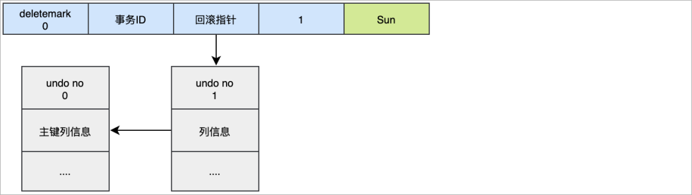

# 1 MySQL基础日志

## 日志分类

在任何一种数据库中，都会有各种各样的日志，记录着数据库工作的方方面面，以帮助数据库管理员追踪数据库曾经发生过的各种事件。MySQL有多种类型的日志，用于记录数据库的操作和状态。以下是一些常见的MySQL日志：

1、错误日志（Error Log）：记录MySQL服务器在启动、运行过程中发生的错误和异常情况，如启动错误、语法错误等。

```sh
默认错误日志的位置：/var/lib/mysql
自定义位置：修改配置文件，在配置文件中指定。
```

2、查询日志（Query Log）：记录所有执行的查询语句，包括SELECT、INSERT、UPDATE、DELETE等操作。可以用于分析查询性能和调试问题，但需要注意对于高负载的系统，开启查询日志可能会对性能产生影响。

```
查询错误日志的位置：/var/lib/mysql
自定义位置：修改配置文件，在配置文件中指定。
```

3、慢查询日志（Slow Query Log）：记录执行时间超过指定阈值的查询语句。慢查询日志可以帮助你找出执行时间较长的查询，以便进行性能优化。

```
慢查询日志的位置：/var/lib/mysql
自定义位置：修改配置文件，在配置文件中指定。
```

4、二进制日志（Binary Log）：记录所有对数据库的更改操作，包括数据修改、表结构变更等。二进制日志可以用于数据恢复、主从复制等场景。

5、事务日志（Transaction Log）：也称为重做日志（Redo Log），记录正在进行的事务的更改操作。事务日志用于保证数据库的ACID特性，并支持崩溃恢复。

## 慢查询日志

慢查询日志记录了所有执行时间超过参数 long_query_time 设置值，long_query_time 默认为 10 秒，最小为 0， 精度可以到微秒。

### 日志参数配置

默认情况下，MySQL数据库没有开启慢查询日志，需要我们手动来设置这个参数。当然，如果不是调优需要的话，一般不建议启动该参数，因为开启慢查询日志会或多或少带来一定的性能影响。

慢查询日志默认是关闭的 。可以通过两个参数来控制慢查询日志 ：

```shell
# 该参数用来控制慢查询日志是否开启， 可取值： 1 和 0 ， 1 代表开启， 0 代表关闭
SET GLOBAL slow_query_log=1; 


# 该选项用来配置查询的时间限制， 超过这个时间将认为值慢查询， 将需要进行日志记录， 默认10s
SET long_query_time =0.1;
```

重启mysql进行测试。

### 日志内容读取

和错误日志、查询日志一样，慢查询日志记录的格式也是纯文本，可以被直接读取。

1、查询慢查询是否开启以及日志文件位置

```sql
SHOW VARIABLES LIKE '%slow_query_log%'; 
```

2、查询long_query_time 的值。

```sql
SHOW VARIABLES LIKE '%long_query_time%'; -- 查看值：默认10秒
```

3、执行查询操作

```sql
 select * from t_emp ;
```

由于在查询的执行时间小于10s，因此该查询不会记录到慢查询日志中。

模拟慢查询效果：

```sql
 select * from t_emp where id = 10 and sleep(11) ;   -- 使用SLEEP函数可以让查询暂停指定的时间
```

查看慢查询日志内容：


> 正常业务的sql语句都要求在200-500ms之间。
>
> 特殊的业务（数据备份和恢复）sql语句的时间就可以调整的高一些。10s种----【100-200w】

**mysqldumpslow：**

在生产环境中，如果要手工分析日志，查找、分析SQL，显然是个体力活，MySQL提供了日志分析工具mysqldumpslow。

**注意：**默认情况下，传统rpm方式安装的MySQL环境自带mysqldumpslow工具，直接使用即可。docker下安装的MySQL环境没有mysqldumpslow工具。

> 如果是使用rp方式安装就不需要。

退出mysql命令行，执行以下命令：

```sql
-- 查看mysqldumpslow的帮助信息
mysqldumpslow --help

-- 工作常用参考
-- 1.得到返回记录集最多的10个SQL
mysqldumpslow -s r -t 10 /var/lib/mysql/atguigu-slow.log
-- 2.得到访问次数最多的10个SQL
mysqldumpslow -s c -t 10 /var/lib/mysql/atguigu-slow.log
-- 3.得到按照时间排序的前10条里面含有左连接的查询语句
mysqldumpslow -s t -t 10 -g "left join" /var/lib/mysql/atguigu-slow.log
-- 4.另外建议在使用这些命令时结合 | 和more 使用 ，否则语句过多有可能出现爆屏情况
mysqldumpslow -s r -t 10 /var/lib/mysql/atguigu-slow.log | more
```

- -a: 不将数字抽象成N，字符串抽象成S

- -s: 是表示按照何种方式排序；
  - c: sql语句的访问次数
  - l: 锁定时间
  - r: 返回数据记录集的总数量
  - t: 查询时间

  - al:平均锁定时间
  - ar:平均返回记录数
  - at:平均查询时间

- -t: 即为返回前面多少条的数据；

- -g: 后边搭配一个正则匹配模式，大小写不敏感的；

# 2 MySQL事务日志

> 事务日志：
>
> redolog
>
> undolog
>
> 为什么要有这些日志：原因是要保证数据库的事务的特性。ACID
>
> A:原子性。
>
> 使用undolog保证。
>
> C:一致性。
>
> 只需要保证A和D就能够保证C。
>
> I:隔离性
>
> MVCC来保证/锁
>
> D:持久性
>
> 使用的redolog日志保证。
>
> 概述：就是由多个操作组成的一个逻辑单元，组成这个逻辑单元的多个操作要么都成功要么都失败。

作用：保证数据的一致性

举例：转账

## 2.2 ACID四大特性

**A：原子性(Atomicity)**

一个事务(transaction)中的所有操作，要么全部完成，要么全部不完成，不会结束在中间某个环节。事务在执行过程中发生错误，会被回滚（Rollback）到事务开始前的状态，就像这个事务从来没有执行过一样。

**C：一致性(Consistency)**

事务的一致性指的是在一个事务执行之前和执行之后数据库都必须处于一致性状态。

如果事务成功地完成，那么系统中所有变化将正确地应用，系统处于有效状态。

如果在事务中出现错误，那么系统中的所有变化将自动地回滚，系统返回到原始状态。

**I：隔离性(Isolation)**

指的是在并发环境中，当不同的事务同时操纵相同的数据时，每个事务都有各自的完整数据空间。由并发事务所做的修改必须与任何其他并发事务所做的修改隔离。

事务查看数据更新时，数据所处的状态要么是另一事务修改它之前的状态，要么是另一事务修改它之后的状态，事务不会查看到中间状态的数据。

**D：持久性(Durability)**

指的是只要事务成功结束，它对数据库所做的更新就必须保存下来。即使发生系统崩溃，重新启动数据库系统后，数据库还能恢复到事务成功结束时的状态。

注意：

1、事务的隔离性由 **锁机制** 实现。

2、而事务的原子性、一致性和持久性由事务的 **redo日志**和**undo日志**来保证。

* redo log称为重做日志 ，它记录了对数据库进行修改的操作，包括插入、更新和删除等。Redo日志的主要作用是保证数据库的持久性和恢复能力。

* undo log称为回滚日志 ，它记录了对数据库进行修改的操作的**逆操作**，用于实现事务的回滚和MVCC（多版本并发控制）。

## redo日志

### innodb写数据过程

innodb存储引擎是以**页为单位**来管理存储空间的。在真正访问页面之前，需要把磁盘上的页缓存到内存【**Buffer Pool**】之后在可以访问。所有的变更必须**先更新缓存池**中的数据。然后缓存池中的**脏页**会以一定的频率被刷到磁盘，通过缓存池来优化CPU和磁盘之间的鸿沟，这样就保证了整体的性能不会下降太快。

### redo日志的意义

#### 没有redo log存在的问题

缓冲池可以帮助我们消除CPU和磁盘之间的鸿沟，checkpoint机制可以保证数据的最终落盘，然而由于checkpoint **并不是每次变更的时候就触发的**，而是后台线程隔一段时间去处理的。所以最坏的情况就是事务提交后，刚写完缓冲池，数据库宕机了，那么这段数据就是丢失的，无法恢复。

> checkPoint机制主要的作用是将缓冲池中的脏页刷新到磁盘，

#### 事务的持久性怎么保证

事务包含持久性的特性，就是说对于一个已经提交的事务，在事务提交后即使系统发生了崩溃，这个事务对数据库中所做的更改也不能丢失。

##### 方案一

在事务提交完成之前把该事务所修改的所有页面都刷新到磁盘，但是这个简单粗暴的做法有些问题

**1、修改量与刷新磁盘工作量严重不成比例**

有的时候我们仅仅修改了一个页中的某一个字节，但是我们都知道在innodb中是以页为单位来进行磁盘io的，也就是说我们在进行事务提交的时候不得不将一个完整的页面从内存刷到磁盘，我们都知道一个页面是16KB，只修改了一个字节就需要刷新16KB的数据到磁盘显然有点大题小做。

**2、随机IO刷新较慢**

一个事务可能包含很多个语句，而且一条语句可能也**会修改很多页面**，假如该事务修改的这些页面可能并不相邻，这就意味着在将某个事务修改的Buffer Pool的页刷新到磁盘时，需要进行很多的磁盘IO，而随机IO比顺序IO慢。

##### 方案二

我们只是想让已经提交了的事务对数据库中数据所做的修改永久生效，即使后来系统崩溃，在重启后也能把这种修改恢复出来。所以我们其实没有必要在每次事务提交前就把该事务在内存中修改过的全部页面刷新到磁盘，只需要把**修改了哪些东西记录一下**就好。比如，某个事务将系统表空间中 第10号 页面中偏移量为 100 处的那个字节的值 1 改成 2 。我们只需要记录一下：将第0号表 空间的10号页面的偏移量为100处的值更新为2。Innodb引擎采用的就是方案二。

Innodb引擎采用的是WAL技术(write-ahead logging) , 这种技术就是先写日志，在刷磁盘，只有日志写入成功，才算事务提交成功，这里的日志就是redo log。？

> redolog:写前日志：
>
> 要修改内存中某一条数据的时候，先将这个修改的数据记录到日志文件中，完事之后，才来修改内存。
>
> ```sql
> update set c=2 where id=1;---c=1
> ```
>
> AOF:写后日志
> 要修改内存中某一条数据的时候，先在内存中做数据的修改，完事之后 ，才将数据写入到日志文件。

redo log可以简单分为以下两个部分：

1、重做日志的缓冲 (**redo log buffer**) ，保存在内存中，是易失的。redo log buffer 大小，默认 16M ，最大值是4096M，最小值为1M。

```sql
show variables like '%innodb_log_buffer_size%';
```

2、重做日志文件 (**redo log file**) ，保存在硬盘中，是持久的。redo log日志文件如下所示：

 整体写数据的流程如下所示：

 整体流程说明：

第1步：先将原始数据从磁盘中读入内存中来，修改数据的内存拷贝 

第2步：生成一条重做日志并写入redo log buffer，记录的是数据被修改后的值 

第3步：当事务commit前，将redo log buffer中的内容刷新到 redo log file，且对redo log file采用追加写的方式 

第4步：定期将内存中修改的数据刷新到磁盘中，而当发生宕机即便数据未刷新到磁盘去，但是redolog日志文件中已经记录上了，因此仍然可以通过redo log来恢复，从而保证了ACID中的D，这就是redo log的作用。


### redo log的优点

**优点：**

1、redo日志降低了数据刷盘频率。 

2、redo日志占用的空间非常小。

### redo log的刷盘策略

redo log的写入并不是直接写入磁盘的，InnoDB引擎会在写redo log的时候先写redo log buffer，之后以一定策略将redo log buffer刷入到真正的redo log file 中。这里的策略这就是我们要说的刷盘策略。


**注意**：redo log buffer刷盘到redo log file的过程并不是真正的刷到磁盘中去，只是刷入到 **文件系统缓存（page cache）**中去（这是现代操作系统为了提高文件写入效率做的一个优化），真正的写入会**交给系统自己来决定**（比如page cache足够大了）。那么对于InnoDB来说就存在一个问题，如果交给系统来同步，同样如果系统宕机，那么数据也丢失了（虽然整个系统宕机的概率还是比较小的）。

针对这种情况，InnoDB给出 **innodb_flush_log_at_trx_commit** 参数，该参数控制 commit提交事务时，如何将 redo log buffer 中的日志刷新到 redo log file 中。

```sql
-- 查看innodb_flush_log_at_trx_commit变量的值
SHOW VARIABLES LIKE '%innodb_flush_log_at_trx_commit%';
```

它支持三种策略：

1、**设置为0** ：表示每次事务提交(commit)**前**都不进行刷盘操作【page cache】。（系统默认每隔1s写入page cache并异步刷盘）。**性能最高、数据安全性最低。**

**特点：延迟写。**

**MySQL宕机了或者服务器宕机了  都只会丢失1s的数据。**


2、**设置为1** ：表示每次事务提交（commit）**前**都将执行刷盘操作。（ 默认值 ）。**数据安全性最高(真正保证持久性)、性能最低。**

**特点：实时写，<strong style='color:red'>实</strong>时刷**


3、**设置为2** ：表示每次事务提交前都只把 **redo log buffer 内容写入 page cache**，

，具体刷盘时间有操作系统决定。**性能较高，数据安全性较高。**

**特点：实时写，<strong style='color:red'>延</strong>迟刷**

 


------


<strong style='color:red'>思考</strong>：通过分析，似乎发现策略0和2非常像。那么这两种策略到底有没有区别呢。

**innodb_flush_log_at_trx_commit**设置为2和设置为0的区别：

**1、性能上的区别：**

虽然为策略值为2时，多了一步写数据到`page cahce` 但是这个速度也是非常的迅速，几乎不会花时间。因此 将这个参数设置成`2`跟设置成`0`其实在性能上差不多。

而两者最主要的区别是在数据安全性上：

**2、数据安全上的区别：**

**若为0**：MySQL异常在重启、MySQL所在服务器异常重启，数据都会丢失。**风险太大**。

**若为2**：MySQL异常在重启，不会丢失数据，而MySQL所在的服务器异常重启，数据会丢失。**风险降低了很多**，因为服务器的操作系统出故障的可能性比较小。


------


## undo日志

<strong style='color:red'>思考:</strong>对于事务的`ACID`来说，`redolog`保证了`D`（持久性），那么`A`(原子性)该如何保证呢。难道也会像`D`一样，通过日志来保证？

没错，对于`A`（持久性），MySQL底层依然使用的是日志来实现。这个日志就是我们接下来的主角`undolog`。

### undo日志简介

事务需要保证 **原子性** ，也就是事务**中**的操作要么 全部都做完，要么全部都没做。但有时候事务在执行到一半会出现一些情况，比如： 

**state1**：事务执行过程中可能遇到各种错误，比如服本身的错误 ，服务所在的机器错误，甚至是突然断电导致的错误。 

**state2**：程序员可以在事务执行过程中手动输入ROLLBACK 语句,而主动结束当前事务的执行。

一旦以上情况出现，就不满足了事务的原子性，（因为有的动作是成功的，有的是失败的）。那么为了保证事务事物的原子性，我们需要把成功动作（若改了数据）在改回原先的样子。那么我们把这个过程称之为 **回滚** 。

而回滚仿佛可以给我们造成一个假象：这个事务看起来好像什么都没做一样。当然首先回滚保证了原子性。

<strong style='color:red'>思考</strong>：为什么回滚能够保证原子性呢，保证原子性的底层到底是什么呢。

我们要对一条记录做改动时(INSERT、DELETE、UPDATE)，都需要**留一手** -------- 要把改动的东西记下来。

**比如：**

1、你**插入一条记录**时，至少要把这条记录的**主键值记录**下来，这样之后出错要回滚的时候只需要根据这个主键值把对应的**记录删除**掉就好了(因此对于INSERT，INNODB存储引擎会默默完成一个DELETE)。

2、你**删除一条记录**时，至少把这条记录的**内容都记录**下来，这样之后出错回滚时再把这些内容组成的**记录插入**到表中就好了(因此对于每个DELETE，INNODB存储引擎会执行一个INSERT)。

3、你**修改一条记录**时，至少要把修改这条记录前的**旧值都记录**下来，这样之后回滚时把这条**记录更新**为旧值就好了(因此对于每个UPDATE,INNODB存储引擎会执行一个反向的UPDATE)。

MySQL把这些为了回滚而记录的这些内容称之为**撤销日志**或者**回滚日志**(undo log)。

在事务中**更新数据**（增,删，改）的**前置操作**其实是要先写入一个undo log。

比如下图：


undo日志作用：

1、回滚数据

2、MVCC

------


### undo log存储结构

#### 回滚段与undo页

InnoDB对undo log的管理采用段的方式，也就是回滚段（**rollback segment**） 。每个回滚段记录了 1024 个 **undo log segment** ，而在每个undo log segment段中进行 **undo页** (存储的就是回滚记录)的申请。 在 InnoDB1.1版本之前 （不包括1.1版本），只有一个rollback segment，因此支持同时在线的事务限制为 1024 。虽然对绝大多数的应用来说都已经够用。 从1.1版本开始InnoDB支持最大 128个rollback segment ，故其支持同时在线的事务限制提高到 了 128*1024 。


```shell
# 通过如下的SQL语句查询回滚段的大小
mysql> SHOW VARIABLES LIKE 'innodb_rollback_segments';
+--------------------------+-------+
| Variable_name            | Value |
+--------------------------+-------+
| innodb_rollback_segments | 128   |
+--------------------------+-------+
1 row in set (0.00 sec)
```

#### undo页的重用

Undo页是用于实现事务的回滚和MVCC（多版本并发控制）机制的关键组成部分。当一个事务执行更新操作时，旧的数据会被写入到undo页中，以便在事务回滚时能够恢复到之前的状态。而在MVCC中，每个事务都可以看到不同版本的数据，这些不同版本的数据也是通过undo页来实现。

在MySQL中，undo页的重用是指当事务提交或回滚后，**之前使用的undo页可以被重新利用**来存储新的事务的undo信息。这个过程称为undo页的重用。

**当一个事务提交或回滚后，其对应的undo页就不再需要了**。为了节省空间和提高性能，MySQL会将这些不再需要的undo页标记为可重用状态，并将它们添加到一个undo页的空闲链表中。当新的事务需要分配undo页时，MySQL会首先尝试从空闲链表中获取可重用的undo页，而不是分配新的页。

通过重用undo页，可以减少对磁盘空间的需求，提高系统性能。然而，如果系统中存在长时间运行的只读事务，可能会导致undo页无法及时重用，从而增加了undo段的大小和磁盘空间的占用。

### undo log类型

在InnoDB存储引擎中，undo log分为：insert undo log和update undo log

#### insert undo log

Insert undo log（插入撤销日志）是数据库中用于记录**插入操作**的一种撤销日志。因为insert操作的记录，只对事务本身可见，对其他事务不可见(这是事务的隔离性的要求)，因此 undo log可以在**事务提交之后删除**。

#### update undo log

Update undo log（更新撤销日志）是数据库中用于记录**更新操作(delete、update)**的一种撤销日志。该undo log可能需要提供MVCC机制，因此不能在**在事务提交后就进行删除。提交后放入undo log链表，等待purge线程进行最后的删除。**

### undo log的生命周期

#### undo log生成过程

##### 简要生成过程

假设有2个数值，分别为A=1和B=2, 然后将A修改为3，B修改为4

```shell
1、start transaction ;
2、记录A=1到undo log  ;
3、update A = 3		;
4、记录A=3到redo log  ;

5、记录B=2到undo log  ;
6、update B = 4 ;
7、记录B=4到redo log  ;
8、将redo log刷新到磁盘；（刷盘策略是默认'1'）
9、commit
```

异常情况分析：

1、在1~8步骤的任意一步系统宕机，事务未提交，该事务就不会对磁盘上的数据做任何影响。

2、如果在8~9之间宕机，恢复之后可以选择回滚，也可以选择继续完成事务提交，因为此时redo log已经持久化。

3、若在9之后系统宕机，内存中变更的数据还来不及刷回磁盘，那么系统恢复之后，可以根据redo log把数据刷回磁盘。

**只有Buffer Pool没有Redo Log和Undo log的流程：**


**有了Redo Log和Undo Log之后：**


在更新Buffer Pool中数据之前，我们需要先将该数据事务开始之前的状态写入Undo log中。假设更新到一半出错了，我们就可以通过Undo log来回滚到事务开始前。

##### 详细生成过程

对于InnoDB引擎来说，每个行记录除了记录本身的数据之外，还有几个隐藏的列：

1、DB_ROW_ID: 如果没有为表显式的定义主键，并且表中也没有定义唯一索引，那么InnoDB会自动为表添加一个row_id的隐藏列作为主键。

2、DB_TRX_ID: 每个事物都会分配一个事务的ID，当对某条记录发生变更时，就会将这个事务的事务ID写入trx_id中。

3、DB_ROLL_PTR: 回滚指针，本质上就是指向undo log的指针。


当我们执行INSERT时：

```sql
begin;
INSERT INTO user (name) VALUES ("Tom");
```

插入的数据都会生成一条insert undo log , 并且数据的回滚指针会指向它。undo log会记录undo log的序号，插入主键的列和值...., 那么在进行rollback的时候，通过主键直接把对应的数据删除即可。


当我们执行UPDATE时：

对于更新的操作会产生update undo log，会分更新主键的和不更新主键的。

假设现在执行非主键更新：

```sql 
update user set name = 'Sun' where id = 1 ;
```



这时会把老的记录写入新的undo log，让回滚指针指向新的undo log，它的undo log是1，并且新的undo log会指向老的undo log(undo no = 0)。

假设现在执行主键更新：

```sql
update user set id = 2 where id = 1 ;
```


对于更新主键的操作，会先**把原来的数据deletemark标识打开**，这时并没有真正的删除数据，真正的删除会交给**清理线程**去判断，然后在后面插入一条新的数据，新数据也会产生undo log，并且undo log的序号会递增。

可以发现每次对数据的变更都会产生一个undo log，当一条记录被变更多次时，那么就会产生多条undo log，undo log记录的是变更前的日志，并且每个undo log的序号是递增的，那么要当回滚的时候，按照序号依次向前，这样就会找到原始数据了。

#### 回滚流程

以上面的例子来说，假设执行rollback，那么对应的流程应该是这样：

1、通过undo no=3的日志把id=2的数据删除 

2、通过undo no=2的日志把id=1的数据的deletemark还原成0 

3、通过undo no=1的日志把id=1的数据的name还原成Tom 

4、通过undo no=0的日志把id=1的数据删除