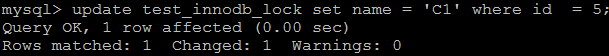
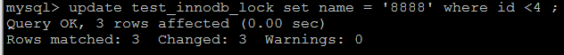

# MySQL锁

事务的 **隔离性** 由这章讲述的 **锁** 来实现。

## 锁概述

**锁**是计算机协调多个进程或者线程**并发访问某一个资源**的机制。在程序开发中会存在多线程同步的问题，当多个线程并发访问某一个数据的时候，尤其针对一些敏感的数据(比如订单、金额等)，我们就需要保证这个数据在任何时刻**最多只有一个线程**在访问，从而保证数据的完整性和一致性。在开发过程中加锁是为了保证数据的一致性，这个思想在数据库领域中同样很重要。

在数据库中，除传统的计算资源（如CPU、RAM、I/O等）的争用以外，数据也是一种供许多用户共享的资源。为保证数据的一致性，**需要对并发操作进行控制** ，因此产生了锁 。同时锁机制也为实现MySQL的各个隔离级别提供了保证。

## 并发事务带来的问题

在典型的应用程序中，多个事务并发运行，经常会操作相同的数据来完成各自的任务（多个用户对同一数据进行操作），因此在并发情况下事务的操作可能会导致以下的问题。

**丢失修改（Lost to modify）**：指在一个事务读取一个数据时，另外一个事务也访问了该数据，那么在第一个事务中修改了这个数据后，第二个事务也修改了这个数据。这样第一个事务内的修改结果就被丢失，因此称为丢失修改。


**脏读（Dirty read）**: 当一个事务正在访问数据并且对数据进行了修改，而这种修改还没有提交到数据库中，这时另外一个事务也访问了这个数据，然后还使用了这个数据。因为这个数据是还没有提交的数据，那么另外一个事务读到的这个数据是“脏数据”，依据“脏数据”所做的操作可能是不正确的。


**不可重复读（Unrepeatableread）**：指在一个事务(T1)内多次读同一数据。在这个事务还没有结束时，另一个事务（T2）修改了该数据。那么，在第一个事务中的两次读数据之间，由于第二个事务(T2)的修改导致第一个事务（T1）两次读取的数据可能不太一样。这就发生了在一个事务内两次读到的数据是不一样的情况，因此称为不可重复读。


**幻读（Phantom read）**：幻读与不可重复读类似。它发生在一个事务（T1）读取了几行数据，接着另一个事务（T2）插入了一些数据时。在随后的查询中，第一个事务（T1）就会发现多了一些原本不存在的记录，就好像发生了幻觉一样，所以称为幻读。


## 并发事务的解决方案

> 隔离级别越高，并发越低。
>
> 隔离级别越低，并发最高。
>
> 读未提交：
>
> 1、脏读、不可重复读、幻读
>
> 读已提交：
>
> 1、不可重复读 幻读
>
> **可重复读：**（默认）
>
> 1、幻读（可能）
>
> MySQL来说，并没有完全解决幻读问题。
>
> 使用了Gap+MVCC解决了大多数幻读---读
>
> 不能利用到MVCC的机制的解决不了幻读。---修改
>
> 串行化：
>
> 完全可以解决幻读问题。

解决方案：对事务进行隔离。

MySQL的四种隔离级别如下:

**读未提交(READ UNCOMMITTED)**：这个隔离级别下,其他事务可以看到本事务没有提交的部分修改。因此会造成脏读的问题(读取到了其他事务未提交的部分,而之后该事务进行了回滚)。这个级别的性能没有足够大的优势,但是又有很多的问题,因此很少使用。

sql演示：

```sql
# 创建数据库表
create table goods_innodb(
	id int NOT NULL AUTO_INCREMENT,
	name varchar(20) NOT NULL,
    primary key(id)
)ENGINE=innodb DEFAULT CHARSET=utf8;

# 插入数据
insert into goods_innodb(name) values('华为');
insert into goods_innodb(name) values('小米');

# 会话一
set session transaction isolation level read uncommitted ;		# 设置事务的隔离级别为read uncommitted
start transaction;												# 开启事务
select * from goods_innodb;									# 查询数据

# 会话二
set session transaction isolation level read uncommitted ;		# 设置事务的隔离级别为read uncommitted
start transaction ;												# 开启事务
update goods_innodb set name = '中兴' where id = 2 ;			   # 修改数据

# 会话一
select * from goods_innodb ;									# 查询数据
```

**读已提交(READ COMMITTED)**：其他事务只能读取到本事务已经提交的部分。这个隔离级别有不可重复读的问题，在同一个事务内的两次读取,拿到的结果竟然不一样,因为另外一个事务对数据进行了修改。

sql演示：

```sql
# 会话一
set session transaction isolation level read committed;		# 设置事务的隔离级别为read committed
start transaction;												# 开启事务
select * from goods_innodb;									# 查询数据

# 会话二
set session transaction isolation level read committed ;		# 设置事务的隔离级别为read committed
start transaction;												# 开启事务
update goods_innodb set name = '小米' where id = 2;			   # 修改数据

# 会话一
select * from goods_innodb;									# 查询数据

# 会话二
commit;															# 提交事务

# 会话一
select * from goods_innodb;									# 查询数据
```

**REPEATABLE READ(可重复读)**：可重复读隔离级别解决了上面不可重复读的问题(看名字也知道)，但是不能完全解决幻读。MySQL默认的事务隔离级别就是：**REPEATABLE READ**

```sql
SELECT @@global.transaction_isolation ;
```

sql演示(解决不可重复读)：

```sql
# 会话一
set session transaction isolation level REPEATABLE READ;
start transaction;												 # 开启事务
select * from goods_innodb;									     # 查询数据

# 会话二
set session transaction isolation level REPEATABLE READ ;
start transaction;												# 开启事务
update goods_innodb set name = '荣耀' where id = 1;			   # 修改数据

# 会话一
select * from goods_innodb;									    # 查询数据

# 会话二
commit;															# 提交事务

# 会话一
select * from goods_innodb;									    # 查询数据
```

sql演示(测试不会出现幻读的情况)：

```sql
# 会话一
set session transaction isolation level REPEATABLE READ;
start transaction;												# 开启事务
select * from goods_innodb;									    # 查询数据

# 会话二
set session transaction isolation level REPEATABLE READ;
start transaction;												# 开启事务
insert into goods_innodb(name) values('小米');			   	   # 插入数据
commit;															# 提交事务

# 会话一
select * from goods_innodb;									# 查询数据
```

sql演示(测试出现幻读的情况)：

```sql
# 表结构进行修改
ALTER TABLE goods_innodb ADD version int(10) NULL;

# 会话一
set session transaction isolation level REPEATABLE READ;
start transaction ;												# 开启事务
select * from goods_innodb where version = 1;					# 查询一条不满足条件的数据

# 会话二
set session transaction isolation level REPEATABLE READ;
start transaction ;												# 开启事务
insert into goods_innodb(name, version) values('vivo', 1);	    # 插入一条满足条件的数据 
commit;															# 提交事务

# 会话一
update goods_innodb set name = '金立' where version = 1; 		   # 将version为1的数据更改为'金立'
select * from goods_innodb where version = 1;					# 查询一条不满足条件的数据
```

**SERIALIZABLE(可串行化)**：这是最高的隔离级别,可以解决上面提到的所有问题,因为他强制将所以的操作串行执行,这会导致并发性能极速下降,因此也不是很常用。

> 注意：
>
> 隔离级别越高，并发越低。
>
> 隔离级别越低，并发越高。

## 并发事务访问情况说明

并发事务访问相同记录的情况大致可以划分为3种：读-读情况、写-写情况、读-写或写-读情况

### 读-读情况

**读-读**情况，即并发事务相继**读取相同的记录** 。读取操作本身不会对记录有任何影响，并不会引起什么问题，所以允许这种情况的发生。

### 写-写情况

写-写 情况，即并发事务相继对相同的记录做出改动。 在这种情况下会发生 **脏写(比如脏写覆盖)** 的问题，任何一种隔离级别都不允许这种问题的发生。所以在多个未提交事务相继对一条记录做改动时，需要让它们排队执行 ，这个排队的过程其实是通过**锁**来实现的。这个所谓 的锁其实是一个 内存中的结构 ，在事务执行前本来是没有锁的，也就是说一开始是没有锁结构 和记录进行关联的，如图所示：

 当一个事务想对这条记录做改动时，首先会看看内存中有没有与这条记录关联的**锁结构** ，当没有的时候 就会在内存中生成一个 锁结构 与之关联。比如，事务 T1 要对这条记录做改动，就需要生成一个 锁结构 与之关联：


在锁结构中存在很多的信息，为了简化理解，只把两个比较重要的属性拿出来：

1、trx信息：代表这个锁结构是哪一个事务生成的

2、is_waiting: 代表当前事务是否在线等待

当事务T1改动了这条记录后，就生成了一个锁结构与该条记录关联，因为之前没有别的事务为这条记录加锁，所以is_waiting属性就是false，我们把这个场景就称之为获取锁成功，或者加锁成功。然后就可以继续进行操作了。

在事务T1提交之前，另外一个事务T2也想对该记录做更改，那么先看看有没有锁结构与该条记录关联，发现有一个锁结构与之关联，然后也生成了一个锁结构与这条记录关联，不过锁结构的is_waiting属性就是true，表示当前事务需要等待，我们把这个场景就称之为获取锁失败，或者加锁失败。如

下图所示：

 

------


当事务T1提交之后，就会把该事务生成的**锁结构释放掉**，然后看看有没有别的事务在等待获取锁，发现了事务T2还在等待获取锁，所以把**事务T2对应的锁结构的is_waiting属性设置为false**，然后把该事务对应的线程唤醒，让他继续执行，此时事务T2就算获取到了锁，效果如下所示：


小结几种说法： 

1、**不加锁** 意思就是不需要在内存中生成对应的锁结构 ，可以直接执行操作。 

2、**获取锁成功，或者加锁成功** 意思就是在内存中生成了对应的锁结构 ，而且锁结构的 is_waiting 属性为 false ，也就是事务可以继续执行操作。 

3、**获取锁失败，或者加锁失败**，或者没有获取到锁 意思就是在内存中生成了对应的锁结构 不过锁结构的is_waiting 属性为 true ，也就是事务需要等待，不可以继续执行操作。

### 读-写情况

读-写 或 写-读 ，即一个事务进行读取操作，另一个进行改动操作。这种情况下可能发生脏读 、 不可重复读 、 幻读的问题。

要想解决这些问题就需要使用到到事务的隔离级别，而事务的隔离性的实现原理有两种：

1、使用**MVCC**：读操作利用多版本并发控制（ MVCC ），写操作进行加锁 。

> 普通的SELECT语句在READ COMMITTED和REPEATABLE READ隔离级别下会使用到MVCC读取记录。
>
> 1、在 READ COMMITTED 隔离级别下，一个事务在执行过程中**每次**执行SELECT操作时都会生成一 个**ReadView**，ReadView的存在本身就保证了事务不可以读取到未提交的事务所做的更改 ，也就是避免了脏读现象； 
>
> 2、在 REPEATABLE READ 隔离级别下，一个事务在执行过程中只有 **第一次**执SELECT操作 才会 生成一个**ReadView**，之后的SELECT操作都 复用 这个ReadView，这样也就避免了不可重复读 和部分幻读的问题。

2、读、写操作都采用加锁的方式。（比如串行化）

> MVCC:的作用是解决我们读写并发的问题。
>
> 读读---不写
>
> 读写----：
>
> 1、MVCC
>
> 2、加锁
>
> 写写----：
>
> 加锁

<strong style='color:red'>细节</strong>：

对比发现： 

1、采用 MVCC 方式的话， 读-写操作彼此并不冲突， 性能更高 。 

2、采用加锁方式的话， 读-写操作彼此需要排队执行 ，影响性能。 

3、MVCC也不能完全解决幻读，要想完全解决幻读，只能通过加锁实现。

一般情况下我们当然愿意采用 MVCC 来解决 读-写操作并发执行的问题，但是业务在某些特殊情况 下，要求必须采用加锁的方式执行。

## 锁的分类

从对数据操作的粒度分 ： 

1） 表锁：操作时，会锁定整个表。

2） 页锁：操作时，会锁定某一页的数据。

3） 行锁：操作时，会锁定当前操作行。

从对数据操作的类型分：

1） 读锁（共享锁）：针对同一份数据，多个读操作可以同时进行而不会互相影响。

2） 写锁（排它锁）：当前操作没有完成之前，它会阻断其他写锁和读锁。

相对其他数据库而言，MySQL的锁机制比较简单，其最显著的特点是不同的存储引擎支持不同的锁机制。下表中罗列出了各存储引擎对锁的支持情况：

| 存储引擎 | 表级锁 | 行级锁 | 页面锁 |
| -------- | ------ | ------ | ------ |
| MyISAM   | 支持   | 不支持 | 不支持 |
| InnoDB   | 支持   | 支持   | 不支持 |
| MEMORY   | 支持   | 不支持 | 不支持 |

MySQL这3种锁的特性可大致归纳如下 ：

| 锁类型 | 特点                                                         |
| ------ | ------------------------------------------------------------ |
| 表级锁 | 偏向MyISAM 存储引擎，开销小，加锁快；不会出现死锁；锁定粒度大，发生锁冲突的概率最高,并发度最低。 |
| 行级锁 | 偏向InnoDB 存储引擎，开销大，加锁慢；会出现死锁；锁定粒度最小，发生锁冲突的概率最低,并发度也最高。 |

从上述特点可见，很难笼统地说哪种锁更好，只能就具体应用的特点来说哪种锁更合适！仅从锁的角度来说：表级锁更适合于以查询为主，只有少量按索引条件更新数据的应用，如Web 应用；而行级锁则更适合于有大量按索引条件并发更新少量不同数据，同时又有并查询的应用。

## MyISAM表锁

MyISAM 存储引擎只支持表锁，这也是MySQL开始几个版本中唯一支持的锁类型。

### 加锁特点

MyISAM 在执行查询语句（SELECT）前，**会自动给涉及的所有表加读锁**，在执行更新操作（UPDATE、DELETE、INSERT 等）前，**会自动给涉及的表加写锁**，这个过程并不需要程序员干预，因此，用户一般不需要直接用 LOCK TABLE 命令给 MyISAM 表显式加锁。

显示加表锁语法：

```sql
加读锁 ： lock table table_name read;
加写锁 ： lock table table_name write；
```

### 读锁案例

准备环境

```SQL
create database demo_03 default charset=utf8mb4;

use demo_03;

CREATE TABLE `tb_book` (
  `id` INT(11) auto_increment,
  `name` VARCHAR(50) DEFAULT NULL,
  `publish_time` DATE DEFAULT NULL,
  `status` CHAR(1) DEFAULT NULL,
  PRIMARY KEY (`id`)
) ENGINE=myisam DEFAULT CHARSET=utf8 ;

INSERT INTO tb_book (id, name, publish_time, status) VALUES(NULL,'java编程思想','2088-08-01','1');
INSERT INTO tb_book (id, name, publish_time, status) VALUES(NULL,'solr编程思想','2088-08-08','0');


CREATE TABLE `tb_user` (
  `id` INT(11) auto_increment,
  `name` VARCHAR(50) DEFAULT NULL,
  PRIMARY KEY (`id`)
) ENGINE=myisam DEFAULT CHARSET=utf8 ;

INSERT INTO tb_user (id, name) VALUES(NULL,'令狐冲');
INSERT INTO tb_user (id, name) VALUES(NULL,'田伯光');
```

客户端 一 ：

1）获得tb_book 表的读锁 

```sql
lock table tb_book read;
```

2） 执行查询操作

```sql
select * from tb_book;
```


可以正常执行 ， 查询出数据。

客户端 二 ：

3） 执行查询操作

```sql
select * from tb_book;
```

 客户端 一 ：

4）查询未锁定的表

```sql
select name from tb_user;
```

  查询不出未锁定的表；

客户端 二 ：

5）查询未锁定的表

```sql
select name from tb_user;
```

 可以正常查询出未锁定的表；

客户端 一 ：

6） 执行插入操作 

```sql
insert into tb_book values(null,'Mysql高级','2088-01-01','1');
```

 执行插入， 直接报错 ， 由于当前tb_book 获得的是读锁， 不能执行更新操作。

客户端 二 ：

7） 执行插入操作 

```sql
insert into tb_book values(null,'Mysql高级','2088-01-01','1');
```

 当在客户端一中释放锁指令 **unlock tables**  后 ， 客户端二中的 inesrt 语句 ， 立即执行 ；

**tips:**

1、加读锁的这个事务可以读 加读锁的表，但是不能读其他的表。

2、加读锁的这个事务不能update、insert、delete加读锁的表。

3、其他事务可以读加读锁的表，也可以读其他表。

4、其他事务update、insert、delete加读锁的表会一直处于等待锁的状态，直到锁被释放后才会update成功。

5、其他事务可以update、insert、delete未加读锁的表。

### 写锁案例

客户端 一 :

1）获得tb_book 表的写锁 

```sql
lock table tb_book write ;
```

2）执行查询操作

```sql
select * from tb_book ;
```


查询操作执行成功；

3）执行更新操作

```sql
update tb_book set name = 'java编程思想（第二版）' where id = 1;
```


更新操作执行成功 ；

客户端 二 :

4）执行查询操作

```sql
select * from tb_book ;
```


当在客户端一中释放锁指令 unlock tables  后 ， 客户端二中的 select 语句 ， 立即执行 ；


**结果:**

当前session窗口，测试锁住表的查询（select）、插入（insert）、修改（update）、删除（delete）均不受影响。但是锁不住的表，均不能操作。

打开其它session窗口，测试增删改查均在等待中。

> 尽量不用这两种方式去加锁，因为InnoDB的优点就是行锁，所以尽量使用行锁，性能更高。

### 结论

锁模式的相互兼容性如表中所示：


由上表可见： 

1、 对MyISAM 表的读操作，不会阻塞其他用户对同一表的读请求，但会阻塞对同一表的写请求；

2、对MyISAM 表的写操作，则会阻塞其他用户对同一表的读和写操作；

简而言之，就是**读锁会阻塞写，但是不会阻塞读。而写锁，则既会阻塞读，又会阻塞写**。

> 行锁：对满足条件的行记录加锁.不会给范围的间隙加锁。---读已提交隔离级别使用的是行锁。
>
> ```sql
> select * from t1 where id=1;//普通，不加任何锁
> select * from t1 where id>=1  lock  in  share mode;// 给满足条件的记录加读锁
> 
> select * from t1 where id>=1  for  update;// 给满足条件的记录加写锁
> update t1 set  age =18 where id>=1 ;//delete  insert 
> ```
>
> 间隙锁：---没有独立使用
>
> 只会对条件中的间隙加锁，记录是不加锁。
>
> id   name  age
>
> 1    a      10
>
> 3   b       11
>
> 4    c       12
>
> 5   d        13
>
> 临键锁。---使用场景在可重复读（默认）隔离级别下使用的就是这个玩意。
>
> 行锁+间隙锁
>
> ```sql
> select * from t1 where id>=1  for  update;// 给满足条件的记录加写锁
> update t1 set  age =18 where id>=1 ;//delete  insert 
> ```
>

## InnoDB行锁

### 加锁特点

行锁特点 ：偏向InnoDB 存储引擎，开销大，加锁慢；会出现死锁；锁定粒度最小，发生锁冲突的概率最低,并发度也最高。

InnoDB 与 MyISAM 的最大不同有两点：一是支持事务；二是采用了行级锁。

InnoDB  实现了以下两种类型的行锁。

1、共享锁（S）：又称为读锁，简称S锁，共享锁就是多个事务对于同一数据可以共享一把锁，都能访问到数据，但是只能读不能修改。

2、排他锁（X）：又称为写锁，简称X锁，排他锁就是不能与其他锁并存，如一个事务获取了一个数据行的排他锁，其他事务就不能再获取该行的其他锁，包括共享锁和排他锁，但是获取排他锁的事务是可以对数据进行读取和修改。

**对于UPDATE、DELETE和INSERT语句，InnoDB会自动给涉及数据集加排他锁（X)；**

**对于普通SELECT语句，InnoDB不会加任何锁；**

可以通过以下语句显示给记录集加共享锁或排他锁 。

```sql
共享锁（S）：SELECT * FROM table_name WHERE ... LOCK IN SHARE MODE
排他锁（X) ：SELECT * FROM table_name WHERE ... FOR UPDATE
```

### 案例准备工作

```sql
create table test_innodb_lock(
	id int(11),
	name varchar(16),
	sex varchar(1)
)engine = innodb default charset=utf8;

insert into test_innodb_lock values(1,'100','1');
insert into test_innodb_lock values(3,'3','1');
insert into test_innodb_lock values(4,'400','0');
insert into test_innodb_lock values(5,'500','1');
insert into test_innodb_lock values(6,'600','0');
insert into test_innodb_lock values(7,'700','0');
insert into test_innodb_lock values(8,'800','1');
insert into test_innodb_lock values(9,'900','1');
insert into test_innodb_lock values(1,'200','0');

create index idx_test_innodb_lock_id on test_innodb_lock(id);
create index idx_test_innodb_lock_name on test_innodb_lock(name);
```

### 行锁基本演示

| Session-1                                                    | Session-2                                                    |
| ------------------------------------------------------------ | ------------------------------------------------------------ |
|       关闭自动提交功能 |   关闭自动提交功能 |
|  可以正常的查询出全部的数据 |  可以正常的查询出全部的数据 |
| 查询id 为3的数据 ； | 获取id为3的数据 ； |
|  更新id为3的数据，但是不提交； |  更新id为3 的数据， 出于等待状态 |
|  通过commit， 提交事务 |  解除阻塞，更新正常进行 |
| 以上， 操作的都是同一行的数据，接下来，演示不同行的数据 ：   |                                                              |
|  更新id为3数据，正常的获取到行锁 ， 执行更新 ； |  由于与Session-1 操作不是同一行，获取当前行锁，执行更新； |

### 无索引行锁升级为表锁

**如果不通过索引条件检索数据，那么InnoDB将对表中的所有记录加锁，实际效果跟表锁一样。**一定需要注意索引失效的问题。

查看当前表的索引 ： show  index  from test_innodb_lock ;


| Session-1                                                    | Session-2                                                    |
| ------------------------------------------------------------ | ------------------------------------------------------------ |
| 关闭事务的自动提交<br /> | 关闭事务的自动提交<br /> |
| 执行更新语句 ： | 执行更新语句， 但处于阻塞状态： |
| 提交事务：<br /> | 解除阻塞，执行更新成功 ： |
|                                                              | 执行提交操作 ：<br /> |

由于 执行更新时 ， name字段本来为varchar类型， 我们是作为数字类型使用，存在类型转换，索引失效，最终行锁变为表锁 ；

### 间隙锁危害

当我们用范围条件，而不是使用相等条件检索数据，并请求共享或排他锁时，InnoDB会给符合条件的已有数据进行加锁； **对于键值在条件范围内但并不存在的记录**，叫做 "间隙（GAP）" ， InnoDB也会对这个 "间隙" 加锁，这种锁机制就是所谓的 间隙锁（Next-Key锁） 。

示例 ： 

| Session-1                                                    | Session-2                                                    |
| ------------------------------------------------------------ | ------------------------------------------------------------ |
| 关闭事务自动提交<br />  | 关闭事务自动提交<br /> |
| 根据id范围更新数据 |                                                              |
|                                                              | 插入id为2的记录， 出于阻塞状态 |
| 提交事务 ；<br /> |                                                              |
|                                                              | 解除阻塞 ， 执行插入操作 ： |
|                                                              | 提交事务 ：                                                  |

### InnoDB 行锁争用情况

```sql
show status like 'innodb_row_lock%';
```


```properties
Innodb_row_lock_current_waits: 当前正在等待锁定的数量
Innodb_row_lock_time: 从系统启动到现在锁定总时间长度
Innodb_row_lock_time_avg:每次等待所花平均时长
Innodb_row_lock_time_max:从系统启动到现在等待最长的一次所花的时间
Innodb_row_lock_waits: 系统启动后到现在总共等待的次数

当等待的次数很高，而且每次等待的时长也不小的时候，我们就需要分析系统中为什么会有如此多的等待，然后根据分析结果着手制定优化计划。
```

### 总结

InnoDB存储引擎由于实现了行级锁定，虽然在锁定机制的实现方面带来了性能损耗可能比表锁会更高一些，但是在整体并发处理能力方面要远远高于MyISAM的表锁的。当系统并发量较高的时候，InnoDB的整体性能和MyISAM相比就会有比较明显的优势。

但是，InnoDB的行级锁同样也有其脆弱的一面，当我们使用不当的时候，可能会让InnoDB的整体性能表现不仅不能比MyISAM高，甚至可能会更差。

**优化建议：**

1、尽可能让所有数据检索都能通过索引来完成，避免无索引行锁升级为表锁。

2、合理设计索引，尽量缩小锁的范围

3、尽量控制事务大小，减少锁定资源量和时间长度

5、尽可使用低级别事务隔离（但是需要业务层面满足需求）

#### 悲观锁


悲观锁用的就是数据库的行锁，认为数据库会发生并发冲突，直接上来就把数据锁住，其他事务不能修改，直至提交了当前事务。

#### 乐观锁

乐观锁其实是一种思想，认为不会锁定的情况下去更新数据，如果发现不对劲，才不更新。在数据库中往往添加一个version字段来实现。

```sql
update   t_stock  set t_stock_num=#{t_stock_num}-1,t_lock_stock_num=#{t_lock_stock_num}+1,version=#{version}+1 where order_id=#{id} and version=#{version}
```

## 死锁

session1:

```sql
mysql> begin;
Query OK, 0 rows affected (0.00 sec)

mysql> select * from t1 where a =1 for update; -- 1
+---+------+------+------+------+
| a | b    | c    | d    | e    |
+---+------+------+------+------+
| 1 |    1 |    1 |    1 | 1    |
+---+------+------+------+------+
1 row in set (0.00 sec)

mysql> update t1 set c = 2 where a = 4; -- 3,一开始会阻塞
ERROR 1213 (40001): Deadlock found when trying to get lock; try restarting transaction
```

session2:

```sql
mysql> begin;
Query OK, 0 rows affected (0.00 sec)

mysql> delete from t1 where a = 4;  -- 2
Query OK, 1 row affected (0.00 sec)

mysql> delete from t1 where a = 1; -- 4,那道理会阻塞，并产生死锁，但是mysql有死锁检查机制让死锁中断。
mysql> delete from t1 where a = 1;
Query OK, 1 row affected (0.01 sec)
```


