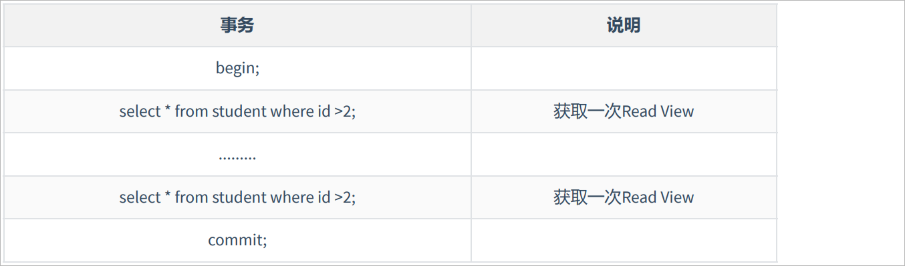

# MySQL中的MVCC

## MVCC概述

在数据库中，对数据的操作主要有2种，分别是读和写，而在并发场景下，就可能出现以下三种情况：

> 读-读并发
>
> 写-写并发
>
> 读-写并发

一想到并发控制，很多人第一反应就是加锁，的确，加锁确实是解决并发问题最常见的方案。但是，其实除了加锁以外，在数据库领域，还有一种无锁的方案可以来实现并发控制，那就是大名鼎鼎的MVCC。

MVCC （Multiversion Concurrency Control），多版本并发控制。顾名思义，MVCC 是通过**数据行的多个版本管理来实现数据库的并发控制** 。

这项技术使得在InnoDB的事务隔离级别下执行 **一致性读** 操作有了保证。换言之，就是为了查询一些正在被另一个事务更新的行，并且可以看到它们被更新之前的值，这样在做查询的时候就不用等待另一个事务释放锁。

我们都知道，在没有写的情况下发读-读并是不会出现问题的，而写-写并发这种情况比较常用的就是通过加锁的方式实现。那么，**读-写并发则可以通过MVCC的机制解决。**

**最终：MVCC的作用就是保证了数据的安全性有提高了并发读写的能力。**

## MVCC的好处

1. 在并发读写数据库时，可以做到在读操作时不用阻塞写操作，写操作也不用阻塞读操作，提高了数据库并发读写的性能
2. 同时还可以解决脏读，幻读，不可重复读等事务隔离问题，但不能解决更新丢失问题

# MVCC的实现原理

MVCC 的目的就是多版本并发控制，在数据库中的实现，就是为了解决`读写冲突`，它的实现原理主要是依赖记录中的 **`3个隐式字段`**，**`undo日志`** ，**` Read View`** 来实现的。所以我们先来看看这个三个概念。

## 隐藏字段

对于使用 InnoDB 存储引擎的表来说，每行记录除了我们自定义的字段外，还有数据库隐式定义的 `DB_TRX_ID`, `DB_ROLL_PTR`, `DB_ROW_ID` 等字段。

`DB_TRX_ID`

6 byte，最近修改(`修改/插入`)事务 ID：记录创建这条记录/修改该记录的事务 id。

`DB_ROLL_PTR`

7 byte，回滚指针，指向这条记录的上一个版本,可以通过它来找到该记录修改前的信息。

`DB_ROW_ID`

6 byte，隐含的自增 ID（隐藏主键），如果数据表没有主键或者唯一键，InnoDB 会自动以`DB_ROW_ID`作为主键并产生一个聚簇索引。

​     **user表的某条记录**


如上图，`DB_ROW_ID` 是数据库默认为该行记录生成的唯一隐式主键(假设已经有了主键)，`DB_TRX_ID` 是当前操作该记录的事务 ID ,而 `DB_ROLL_PTR` 是一个回滚指针，用于配合 undo日志，指向上一个旧版本。

## undo日志

undo log 主要分为两种：

**insert undo log**
代表事务在 insert 新记录时产生的 undo log, 只在事务回滚时需要，并且在事务提交后可以被立即丢弃。

**update undo log**
事务在进行 update 或 delete 时产生的 undo log ; 不仅在事务回滚时需要，在快照读时也需要；所以不能随便删除，只有在快速读或事务回滚不涉及该日志时，对应的日志才会被 purge 线程统一清除。

对 MVCC 有帮助的实质是 `update undo log` ，`undo log` 实际上就是存在 `rollback segment` 中，**它的执行流程如下**。

1）假设 trx_id = 100 的事务 A **插入一条行**记录（id = 1, name = "huzhongkui"），那么，这行记录的两个隐藏字段 trx_id = 100 和 roll_pointer指向一个存主键列信息的 undo log，因为在这之前并没有事务操作 id = 1 的这行记录。如图所示：


2）然后，id = 110的事务B修改了这条行记录，把 name 从 Huzhongkui 修改成了leifengyang ，于是，这条行记录的 trx_id就变成了 110，roll_pointer就指向事务 A 生成的 undo log ：

- 在事务B修改该行(记录)数据时，数据库会先对该行加排他锁
- 然后把该行数据拷贝到 undo log 中，作为旧记录，既在 undo log 中有当前行的拷贝副本
- 拷贝完毕后，修改该行name为leifengyang，并且修改隐藏字段的事务 Id为当前事务 110 的 Id, 之后回滚指针指向拷贝到 undo log 的副本记录，既表示我的上一个版本就是它。
- 事务提交后，释放锁。


3）接着，id = 120 的事务 C 再次修改了这条行记录，把 name 从 leifengyang 修改成了 zhouyang。

- 在事务C修改该行数据时，数据库也先为该行加锁
- 然后把该行数据拷贝到 undo log 中，作为旧记录，发现该行记录已经有 undo log 了，那么最新的旧数据作为链表的表头，插在该行记录的 undo log 最前面。
- 修改该行 name为 zhouyang，并且修改隐藏字段的事务 ID 为当前事务 C 的 ID, 那就是 120 ，回滚指针指向刚刚拷贝到 undo log 的副本记录。
- 事务提交，释放锁


从上面，我们就可以看出，不同事务或者相同事务的对同一记录的修改，会导致该记录的undo log成为一条记录版本线性表，既链表，undo log 的链首就是最新的旧记录，链尾就是最早的旧记录。MVCC 这个机制，其实就是靠 update undo log 实现的。

那么，一条记录在同一时刻可能有多个事务在执行，那么，undo log会有一条记录的多个版本，那么在这一时刻发生SELECT要进行读的时候，要读版本链中的哪个版本呢？

## Read View 读视图

### 什么是 Read View?

> 一句话：Read View，选择读取undo  log版本链中的具体版本的记录。
>
> 该对象中有一个属性叫做mids,是一个数组类型：mids[].该数值中未来为记录系统中当前活跃的事务ID号。
>
> 活跃的事务：在select语句执行的时候，当前系统中还没有提交的事务，这就叫做活跃事务。
>
> 而且每一个事务id都是递增的。
>
> 后开的事务的事务一定比前面开的事务id的id号要大。
>
> 注意：begin/start tansaction是开启一个事务之后，这个事务id的值还没有被赋值上任何东西。暂时为null.而之有当在该事务中去进一步执行增删改的时候，才会对trx_id赋上一个系统给我生成的id.

 Read View 就是事务进行读操作的时候生产的读视图 (Read View)，在该事务执行读的那一刻，会生成数据库系统当前的一个快照，**记录并维护系统<strong style='color:red'>当前活跃事务的 ID</strong>** (当每个事务开启时，都会被分配一个 ID , 这个 ID 是递增的，所以最新的事务，ID 值越大)，主要是用来做可见性判断的, 即当我们某个事务执行读的时候，对该记录创建一个 `Read View` 读视图，把它比作条件用来判断当前事务能够看到哪个版本的数据，既可能是当前最新的数据，也有可能是该行记录的`undo log`里面的某个版本的数据。

**注意：**begin/start transaction 命令并不是一个事务的起点，在执行到它们之后的第一个修改操作InnoDB表的语句，事务才真正启动，才会向MySQL申请事务ID，MySQL内部是严格按照事务的启动顺序来分配事务ID的。

### ReadView中3个重要字段

1、mids，生成 ReadView 时有哪些事务在执行但是还没提交的（称为 ”**活跃事务**“），这些活跃事务的 id 就存在这个字段里。

2、up_limit_id【min_trx_id】：m_ids 里最小的值。

3、low_limit_id【max_trx_id】：生成 ReadView 时 InnoDB 将**分配给下一个事务的 ID 的值**，也就是 **目前已出现过的事务 ID 的最大值 + 1**。

max_trx_id是系统最大的事务id值，这里要注意是系统中的事务id，并不是正在活跃的事务Id最大值。

> **一定要注意**：max_trx_id并不是trx_ids中的最大值，事务id是递增分配的。比如，现在有id为1， 2，3这三个事务，之后id为3的事务提交了。那么一个新的读事务在生成ReadView时， m_ids就包括1和2，min_trx_id的值就是1，max_trx_id的值就是4。

### Read View可见性算法

在InnoDB中，创建一个新事务后，执行第一个select语句的时候，InnoDB会创建一个（Read View）并且会保存当前不应该被本事务看到的其他活跃事务ID列表，即（trx_ids）。

当用户在这个事务中读取某个记录行的时候，InnoDB会将该记录行的DB_TRX_ID与该Read view中的一些变量值进行比较，如果 DB_TRX_ID 跟 Read View 的属性做了某些比较，不符合可见性，那就通过 DB_ROLL_PTR 回滚指针去取出 Undo Log 中的 DB_TRX_ID 再比较，即遍历链表的 DB_TRX_ID（从链首到链尾，即从最近的一次修改查起），直到找到满足特定条件的 DB_TRX_ID , 那么这个 DB_TRX_ID 所在的记录就是当前事务能看见的最新老版本。

具体算法是怎么样呢，如下：**(理解MVCC最关键的部分)**

<strong style='color:red'>step1</strong>:  如果trx_id<up_limit_id，那么表明“最新修改该行的事务”在“当前事务”创建快照之前就提交了，所以该记录行的值对当前事务是可见的，将该可见行的值返回。

<strong style='color:red'>step2</strong>:  如果trx_id>low_limit_id，那么表明“最新修改该行的事务”在“当前事务”创建快照之后才修改该行，所以该记录行的值对当前事务不可见，跳到步step4。

**<strong style='color:red'>step3</strong> :**  如果up_limit_id<=trx_id<=low_limit_id，表明“最新修改改行的事务”在“当前事务”创建快照的时候可能处于“活动状态”或者“已提交状态“；所以就要对活跃事务列表trx_ids进行查找。

（1）如果在活跃事务列表mids中能找到id为trx_id的事务，表明或者在“当前事务”创建快照前，“该记录行的值”被“id为trx_id的事务”修改了，但没有提交，或者在“当前事务”创建快照后，“该记录行的值”被"id为trx_id的事务“修改了（不管有无提交）；在这些情况下，这个记录行的值对当前事务都是不可见的，跳到Step4。

（2）在活跃事务列表中找不到，则表明"id为trx_id的事务”在修改“该记录行的值”后，在“当前事务”创建快照前就已经提交了，所以记录行对当前事务可见，将该可见行的值返回。

<strong style='color:red'>step4</strong>:  在该记录行的DB_ROLL_PTR指针所指向的undo log回滚段中，取出最新的旧事务号DB_TRX_ID，将它赋给trx_id，然后跳到步骤1重新开始判断。

"**已提交状态**"---如何理解，因为实在是抽象，所以我在下面在继续举个例子,模拟一下。

假设当前事务 ID 为 2 对某行数据执行了读，数据库为该行数据生成一个Read View读视图，并且假设此时还有事务1和事务3在活跃中，事务 4 在事务2 读 **前一刻 **提交更新了，所以 Read View 记录了系统当前活跃事务 1，3 的 ID，维护在一个列表中，mids[1，3]。


Read View 不仅仅会通过一个列表 mids 【】来维护事务2执行读那刻系统正活跃的事务 ID 列表，还会有两个属性 up_limit_id（ mids[] 列表中事务最小的 ID ），low_limit_id ( 读的时刻系统尚未分配的下一个事务 ID ，也就是目前已出现过的事务ID的最大值 + 1 所以在这里例子中 up_limit_id 就是1，low_limit_id 就是 4 + 1 = 5，mids[] 集合的值是 [1, 3]，Read View 如下图。


在这个例子中，我们只有事务4修改过该行记录，并在是事务 2 执行读之前前，就提交了事务，所以当前该行数据的 undo log 如下图所示；我们的事务 2 在快照读该行记录的时候，就会拿该行记录的 DB_TRX_ID 去跟 up_limit_id , low_limit_id 和活跃事务 ID 列表( mids[] )进行比较，判断当前事务2能看到该记录的版本是哪个。


- 所以先拿该记录 DB_TRX_ID 字段记录的事务 ID 4 去跟 Read View 的 up_limit_id 比较，看 4 是否小于 up_limit_id( 1 )，所以不符合条件。

- 接着继续判断 4 是否大于等于 low_limit_id( 5 )，也不符合条件。

- 最后判断 4 是否处于 mids 中的活跃事务, 最后发现事务 ID 为 4 的事务不在当前活跃事务列表中, 符合可见性条件，所以事务 4**修改后提交**的最新结果对事务2 的读是可见的，所以事务 2 能读到的最新数据记录是事务**4所<strong style='color:red'>提交</strong>**的版本。

总结：

> MVCC主要服务于两种隔离级别：
>
> 1、读已提交
>
> 2、可重复读
>
> 0、读未提交----不需要接祖任何帮助。
>
> 4、串行化---加锁的方式。
>
> 对于读已提交读来说，MVCC的ReadView对象的生成时机是在每一次查询的时候都会创建一个新的。然后把每一次执行普通查询这一时刻的系统中处于活跃事务的id赋值给对象的mids属性。
>
> 对于可重复读来说，MVCC的ReadView对象的生成时机只在第一查询的时候去创建，并且给改对象mids属性赋值。后续在该事务中的所有查询，都是会复用第一次创建的ReadView，因此mids和第一次ReadView中的一样。
>
> 对于两种隔离级别在MVCC上的区别就是ReadView对象的生成时机不同，其它都一样。

### MVCC整体操作流程

了解了这些概念之后，我们来看下当查询一条记录的时候，系统如何通过MVCC找到它： 

1、首先获取事务自己的版本号，也就是事务 ID； 

2、获取 ReadView； 

3、查询得到的数据，然后与 ReadView 中的事务版本号进行比较； 

4、如果不符合 ReadView 规则，就需要从 Undo Log 中获取历史快照；

最后返回符合规则的数据。 在隔离级别为读已提交（Read Committed）时，一个事务中的每一次 SELECT 查询都会重新获取一次 Read View。



注意：此时同样的查询语句都会重新获取一次 Read View，这时如果 Read View 不同，就可能产生不可重复读或者幻读的情况。

当隔离级别为可重复读的时候，就避免了不可重复读，这是因为一个事务只在第一次 SELECT 的时候会 获取一次 Read View，而后面所有的 SELECT 都会复用这个 Read View，如下表所示：


### MVCC总结

MVCC（Multi-Version Concurrency Control ，多版本并发控制）指的就是在使用READ COMMITTD、REPEATABLE READ这两种隔离级别的事务在执行普通的SEELCT操作时访问记录的版本链的过程。可以使不同事务的读-写、写-读操作并发执行，从而提升系统性能。READ COMMITTD、REPEATABLE READ这两个隔离级别的一个很大不同就是：生成ReadView的时机不同，READ COMMITTD在每一次进行普通SELECT操作前都会生成一个ReadView，而REPEATABLE READ只在第一次进行普通SELECT操作前生成一个ReadView，之后的查询操作都重复使用这个ReadView就好了。

# 快照读和当前读

MVCC在MySQL InnoDB中的实现主要是为了提高数据库并发性能，用更好的方式去处理 读-写冲突 ，做到即使有**读写冲突**时，也能做到 **不加锁 ，非阻塞并发读** ，而这个读指的就是快照读 , 而非当前读 。当前读实际上是一种加锁的操作，是悲观锁的实现。而MVCC本质是采用乐观锁思想的一种方式。

##  快照读

快照读又叫**一致性读**，读取的是快照数据。**不加锁的简单的 SELECT 都属于快照读**，即不加锁的非阻塞读；比如这样：

```SQL
SELECT * FROM xx_table WHERE ...
```

之所以出现快照读的情况，是基于提高并发性能的考虑，快照读的实现是基于MVCC，它在很多情况下， 避免了加锁操作，降低了开销。 既然是基于多版本，那么**快照读可能读到的并不一定是数据的最新版本，而有可能是之前的历史版本**。 快照读的前提是隔离级别不是串行级别，串行级别下的快照读会退化成当前读。

## 当前读

和快照读相对应的另外一个概念叫做当前读，**当前读读取的是记录的最新版本**（最新数据，而不是历史版本的数据），读取时还要保证其他并发事务不能修改当前记录，会对读取的记录进行加锁。**加锁的 SELECT，或者对数据进行增删改都会进行当前读**。比如：

```sql
SELECT * FROM xx_table LOCK IN SHARE MODE;  # 共享锁
SELECT * FROM xx_table FOR UPDATE;			# 排它锁

INSERT INTO xx_table ...					# 排它锁
DELETE FROM xx_table ...					# 排它锁
UPDATE xx_table ...							# 排它锁
```

