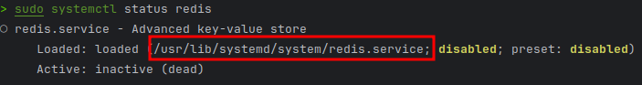

### Install with ArchLinux
```shell
sudo pacman -S redis
```

### 常用命令

````shell
查看状态
sudo systemctl status redis
````

根据显示的信息，可以知道redis服务加载文件位置
通过`cat /usr/lib/systemd/system/redis.service`就可以知道redis配置文件和相关命令所在目录


protected-mode no
daemonize yes
bind 127.0.0.1
requirepass