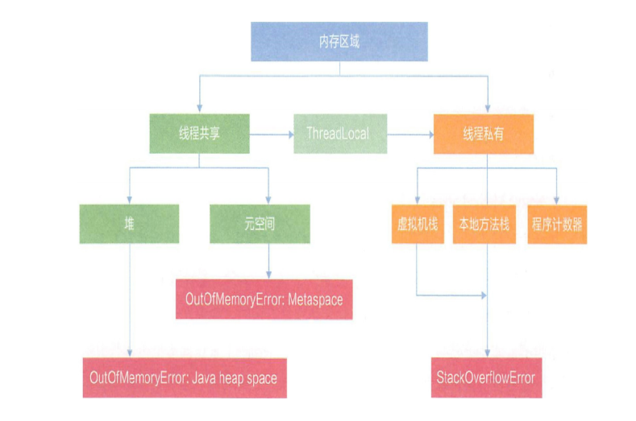
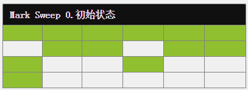

[TOC]


# 1、JVM讲解

从**面试**开始：

1. 请谈谈你对JVM 的理解？java8 的虚拟机有什么更新？
2. 什么是OOM ？什么是StackOverflowError？有哪些方法分析？
3. JVM 的常用参数调优你知道哪些？
4. 谈谈JVM中，对**类加载器**你的认识？【重点】
5. 如何理解双亲委派机制，以及怎么去打破双亲委派机制。【重点】
6. 如何自定义一个类加载器。
7. Tomcat:自定义线程池 打破双亲委派。

## 1.1JVM是什么：

​      它是java运行环境的一部分，是一个虚构出来的计算机.是通过在实际的计算机上模拟各种计算功能来实现的.JVM有着自己完善的架构，例如处理器、堆栈、寄存器等，还具有相应的指令系统.

## 1.2JVM位置：

**JVM**是**JRE**（Java Runtime Environment）的一部分，<strong style='color:red'>安装了JRE其实也就是相当于安装了JVM</strong>，可以运行Java程序了，并且**JVM**是运行在操作系统之上的，它与硬件没有直接的交互。


## 1.3JVM作用：

JVM在运行时负责将Java程序的**.class文件****解释成特定的**机器码**进行运行。


## 1.4机器码：

机器码是电脑 CPU 直接读取运行的机器指令，运行速度最快，但是不好编写。

## 1.5字节码：

> 字节码指令包含了操作数和操作码。
>
> 1+1;

字节码是一种中间状态（中间码）的二进制代码（文件）。需要直译器转译后才能成为机器码。为什么叫字节码？因为这种类型的代码以一个字节8bit为最小单位储存。

## 1.6编译器：

编译是从源代码到能直接被计算机或虚拟机执行的目标代码（通常为低级语言或机器语言）的翻译过程。javac.exe可以简单看成是Java编译器.

## **1.7解释器**：

将相对高级的程序代码解释成电脑可以直接运行的机器码,但是解释器是一条指令一条指令的将字节码解析成机器码，解释到哪就执行到哪。

> 一句话描述编译与解释
>
> 编译 Compile：把整个程序源代码翻译成另外一种代码，然后等待被执行，发生在运行之前，产物是「另一种形式的代码」比如对Java来说即字节码。
> 解释 Interpret：把另一种形式的代码一条指令一条指令的读懂然后执行，发生在运行时，产物是机器码【运行结果】。

example:

电脑是不能直接执行Java程序的，一个.java程序要想被执行，首先需要JVM编译器（前端编译）将高级的.java程序文件编译成.class字节码片段，字节码经过JVM(解释器)或者JIT即时编译器的处理后生成电脑可以直接执行的机器码，至此java程序才能得以正确运行。


> 1、解释器和即时编译器：
>
> - 当程序需要迅速启动和执行的时候，解释器可以首先发挥作用。一行一行代码的解释执行，因此效率低下。
> - 当程序启动后，随着时间的推移，即时编译器逐渐发挥作用， 把越来越多的代码编译成本地机器码，这样可以减少解释器的中间损耗，因此可以得到更高的执行效率。
>
> 2、解释器和即时编译器的区别：
>
> ​      翻译 .class （字节码文件） 的粒度和方式不同。
>
> ​     **解释器**:每次**只翻译一条**指令并执行，然后再翻译下一条指令.因此它的翻译粒度是一 条指令，而且是按需翻译，所以执行速度相对较慢。
>
> ​     **即时编译器**：根据热点探测的结果，会对整个方法进行静态分析和优化，并生成最优的机器码。因此它的翻译粒度是整个方法，提前翻译。执行速度相应就快。
>
> 3、即时编译器的说明：
>
> 即时编译器目前来说HotSpot虚拟机中内置了两个。Client Compiler和Server Compiler。简称C1和C2
>
> C1：一个简单快速的编译器，主要的关注点在于局部性的优化，开启的时间较早，应用启动后不久C1就开始进行编译。
>
> C2:是为长期运行的服务器端应用程序做性能调优的编译器,运行时间较晚，会等程序运行一段时候后才开始进行编译。

> 热点代码的查看：
>
> ```java
> #window下查看
> java -XX:+PrintFlagsFinal -version | findstr ReservedCodeCacheSize
> #linux下查看
> java -XX:+PrintFlagsFinal -version | grep ReservedCodeCacheSize
> ```
>
> 默认热点代码缓存的codeCache大小空间为240MB


------


# 2、JVM快速入门

## 2.1结构图	


## 2.2类的加载

### 2.2.1从一个类出发

```java
public class Math {
    public int compute() {
        int a = 1;
        int b = 2;
        int c = (a + b) * 10;
        return c;
    }
    public static void main(String[] args) {
        Math math = new Math();
        math.compute();
    }
}
```


当我们用java命令运行某个类的main函数启动程序时，首先需要通过**类加载器**把主类加载到JVM。

### 2.2.2类的加载过程

类的生命周期是由7个阶段组成，但是类的加载说的是前5个阶段

其中loadClass的类加载过程有如下几步：


------

### 2.2.3类加载器


#### 2.2.3.1类加载器的作用

负责加载class文件，class文件在文件开头有特定的文件标示，并且ClassLoader只负责class文件的加载，至于它是否可以运行，则由Execution Engine决定。


#### 2.2.3.2类加载器的分类

- 启动类加载器（Bootstrap）C++责加载$JAVA_HOME中jre/lib/下的某些jre包中的类【比如rt.jar】，该类加载器由C++实现，不是ClassLoader子类。

- 扩展类加载器（Extension）Java负责加载java平台中**扩展功能**的一些jar包，包括$JAVA_HOME中jre/lib/ext/*.jar或-Djava.ext.dirs指定目录下的jar包

- 应用程序类加载器（AppClassLoader）也叫系统类加载器，负责加载**classpath**中指定的jar包及目录中class。或-Djava.class.path目录下的jar包或者.class文件。

- 用户自定义加载器  Java.lang.ClassLoader的子类，用户可以定制类的加载方式

> 注意：各种类加载器之间存在着逻辑上的父子关系，但不是真正意义上的父子关系，因为它们直接没有从属关系。


写段代码演示各个加载器加载文件

```java
    public static void main(String[] args) {
        System.out.println(String.class.getClassLoader());
        System.out.println(com.sun.crypto.provider.DESKeyFactory.class.getClassLoader());
        System.out.println(TestJDKClassLoader.class.getClassLoader());

        ClassLoader systemClassLoader = ClassLoader.getSystemClassLoader();
        System.out.println(systemClassLoader);
        ClassLoader extClassloader = systemClassLoader.getParent();
        ClassLoader bootstrap = extClassloader.getParent();
        System.out.println(bootstrap);
        System.out.println(extClassloader);
        System.out.println();
        System.out.println("bootstrap加载以下文件");

        URL[] urLs = Launcher.getBootstrapClassPath().getURLs();
        for (int i = 0; i <urLs.length ; i++) {
            System.out.println(urLs[i]);

        }
        System.out.println("extClassLoader加载以下文件");
        System.out.println(System.getProperty("java.ext.dirs"));

        System.out.println("appClassloader加载以下文件");
        System.out.println(System.getProperty("java.class.path"));
    }
```


------


#### 2.2.3.3双亲委派模型


双亲委派机制是 Java 虚拟机加载一个类时为该类确定类加载器的一种机制。


简单的来说：如果一个类加载器收到了加载某个类的请求,则该类加载器并不会去加载该类,而是把这个请求委派给父类加载器,每一个层次的类加载器都是如此,因此所有的类加载请求最终都会传送到顶端的启动类加载器;只有当父类加载器在其搜索范围内无法找到所需的类,并将该结果反馈给子类加载器,子类加载器会尝试去自己加载。

具体的来说：例如有一个类 com.atguigu.classloader.Math需要加载，在双亲委派机制下流程是怎么样的呢？


- 首先 **应用类加载器** 会判断之前是否加载过这个类，如果加载过则返回，如果没有加载过，则会**向上**委托，也就是委托给**扩展类加载器**；
- **扩展类加载器**同样会去判断之前是否加载过这个类，如果加载过则返回，如果没有加载过，则继续**向上**委托，也就是委托给 **引导类加载器**；
- **引导类加载器**则会去 jre/lib 目录下去查询是否有这个类<strong style='color:red'>（注意：不会在问是否加载过）</strong>，如果有这个类则加载，如果没有就**向下**回传给扩展类加载器加载；	
- **扩展类加载器**去 jre/lib/ext 目录下去查询是否有这个类，如果有这个类则加载，如果没有这个类就**向下**回传给应用类加载器；
- **应用类加载器**会去项目的类路径下 （classPath） 下去查询是否有这个类，如果有这个类则加载，如果没有这个类就会抛出经典的 **ClassNotFoundException**。


**debug断点验证流程双亲委派机制**

```java
 protected Class<?> loadClass(String name, boolean resolve)
        throws ClassNotFoundException
    {
        synchronized (getClassLoadingLock(name)) {
            // First, check if the class has already been loaded
            // 先判断这个类是不是已经加载过
            Class<?> c = findLoadedClass(name);// c++实现
            if (c == null) {
                // 没加载过
                long t0 = System.nanoTime();
                try {
                    // 委托该类的父加载器有无【注意不是有无父类】
                    if (parent != null) {
                        // 若有父加载器，委托父加载器加载，递归进入。
                        c = parent.loadClass(name, false);
                    } else {
                        // 父类加载器为null，委托给启动类加载器加载
                        c = findBootstrapClassOrNull(name);//c++实现
                    }
                } catch (ClassNotFoundException e) {
                    // ClassNotFoundException thrown if class not found
                    // from the non-null parent class loader
                     // 如果父类加载器抛出ClassNotFoundException异常，表明父类无法完成加载请求
                }

                if (c == null) {
                    // If still not found, then invoke findClass in order
                    // to find the class.
                    long t1 = System.nanoTime();
                     // 若仍然没有找到则调用findClass()方法查找 
                    c = findClass(name);//c++实现

                    // this is the defining class loader; record the stats
                    sun.misc.PerfCounter.getParentDelegationTime().addTime(t1 - t0);
                    sun.misc.PerfCounter.getFindClassTime().addElapsedTimeFrom(t1);
                    sun.misc.PerfCounter.getFindClasses().increment();
                }
            }
            if (resolve) {
                resolveClass(c);
            }
            // 如果加载过 直接返回
            return c;
        }
    }

```


------


#### 2.2.3.5自定义类加载器

手写一个自定义类加载器，见课上代码


#### 2.2.3.6打破双亲委派

打破双亲委派的意思其实就是不向上委派、而是向下委派

打破双亲委派例子：

参考下面代码

```java
public class BreakParentModel {
    static class MyClassLoader extends ClassLoader {
        private String classPath;

        public MyClassLoader(String classPath) {
            this.classPath = classPath;
        }

        @Override
        protected Class<?> findClass(String name) throws ClassNotFoundException {

            byte[] bytes = loadByte(name);

            return defineClass(name, bytes, 0, bytes.length);
        }

        private byte[] loadByte(String name) {
            name = name.replaceAll("\\.", "/");
            try {
                FileInputStream is = new FileInputStream(classPath + "/" + name + ".class");
                int length = is.available();
                byte[] bytes = new byte[length];
                is.read(bytes);
                is.close();
                return bytes;
            } catch (Exception e) {
                e.printStackTrace();
            }
            return null;
        }

        @Override
        protected Class<?> loadClass(String name, boolean resolve)
                throws ClassNotFoundException {
            synchronized (getClassLoadingLock(name)) {
                // First, check if the class has already been loaded
                Class<?> c = findLoadedClass(name);
                if (c == null) {
                    long t0 = System.nanoTime();


                    if (c == null) {
                        // If still not found, then invoke findClass in order
                        // to find the class.
                        long t1 = System.nanoTime();
                        if (!name.startsWith("com.atguigu.classloader.User")) {
                            c = this.getParent().loadClass(name);
                        }else{

                            c = findClass(name);
                        }

                        // this is the defining class loader; record the stats
                        sun.misc.PerfCounter.getParentDelegationTime().addTime(t1 - t0);
                        sun.misc.PerfCounter.getFindClassTime().addElapsedTimeFrom(t1);
                        sun.misc.PerfCounter.getFindClasses().increment();
                    }
                }
                if (resolve) {
                    resolveClass(c);
                }
                return c;
            }
        }

    }

    public static void main(String[] args) throws Exception {
        BreakParentModel.MyClassLoader myClassLoader = new BreakParentModel.MyClassLoader("D:/test");
        Class<?> clazz = myClassLoader.loadClass("com.atguigu.classloader.User");
        Object o = clazz.newInstance();
        Method method = clazz.getDeclaredMethod("test", null);
        method.invoke(o, null);
        System.out.println(clazz.getClassLoader().getClass().getName());

    }
}

```


## 2.3执行引擎Execution Engine


**Execution Engine**执行引擎负责解释命令。

执行引擎（Execution Engine) 的任务就是将[字节码](https://so.csdn.net/so/search?q=字节码&spm=1001.2101.3001.7020)指令解释/编译为对应平台上的本地机器指令。

## 2.4本地接口Native Interface

​		本地接口的作用是融合不同的编程语言为 Java 所用，它的初衷是融合 C/C++程序，Java 诞生的时候是 C/C++横行的时候，要想立足，必须有调用 C/C++程序，于是就在内存中专门开辟了一块区域处理标记为native的代码，它的具体做法是 Native Method Stack中登记 native方法，在Execution Engine 执行时加载native libraies。


## 2.5Native Method Stack

它的具体做法是Native Method Stack中登记native方法，在Execution Engine 执行时加载本地方法库。


------


## 2.6 PC寄存器

每个线程都有一个程序计数器，是**线程私有的**，就是一个指针，（**用来存储下一条将要执行的字节码指令的地址**），由执行引擎读取下一条指令，是一个非常小的内存空间，几乎可以忽略不记。

任何时间一个线程都只有一个方法在执行，也就是所谓的当前方法。程序计数器会存储当前线程正在执行的java方法的字节码指令地址。


	 1. 当程序是在执行java方法时，程序计数器中的值为下一条执行字节码指令的地址。
	 2. 当程序执行的时Native方法时，程序计数器中的值为空。
	 3. 程序计数器是不会发生OutMemoryError的区域。


------


## 2.7Method Area方法区

### 2.7.1方法区是什么

方法区只是**JVM规范**中定义的一个概念，在《深入理解Java虚拟机》书中对方法区（Method Aera）存储内容描述如下：它用于存储已被虚拟机加载的类的信息（类的名称、方法信息、字段信息）、常量、静态变量、即时编译器编译后的代码缓存等。

### 2.7.2方法区的基本理解

- 方法区（Method Area）与Java堆一样，是各个线程共享的内存区域。
- 方法区在JVM启动的时候创建的，并且他的实际物理内存空间和堆区一样可以是不连续的。
- 方法区的大小，跟堆空间一样，可选择固定大小，也可扩展。
- 方法区的大小决定了系统可以保存多少个类，如果系统定义了太多的类（加载大量第三方jar包、tomcat部署的工程过多、大量动态生成反射类），导致方法区溢出，虚拟机同样会抛出内存溢出错误：java.lang.OutOfMemoryError: PermGen space（jdk7以前）或者java.lang.OutOfMemoryError: Metaspace（jdk8以后）
- 关闭JVM就会释放这个区域的内存。

### 2.7.3方法区到底存储什么

#### 2.7.4.1类信息

JVM必须在方法区中存储以下类型信息：

- 这个类型的修饰符（public）
- 这个类的类型（class 、interface、enum、annotation）

- 这个类型的完整有效名称（全名=包名.类名）
- 这个类型直接父类的完整有效名（java/lang/Object.class）
- 直接父接口的权限定名(java/io/Serializable)

也就是 public  class ClassStruct extends Object implements Serializable这段描述的信息提取。


#### 2.7.4.2 属性信息

- 域修饰符（pirvate）

- 域的类型（java/lang/String.class）

- 域的名字（name）

  

也就是类似private String name;这段描述信息的提取


#### 2.7.4.3方法信息

- 方法的修饰符（public）
- 方法的返回值类型（java/lang/String.class）
- 方法的名字（getStr）
- 方法的参数数量以及参数类型
- 方法体的字节码(就是花括号里的内容)
- 异常信息(throws Exception）

也就是对方法public  String getStr ()throws Exception{业务代码}的字节码的提取。


#### 2.7.4.4 静态变量（类变量）

就是静态字段( public static String static_str="123";)

虚拟机在使用某个类之前，必须在方法区为这些类变量分配空间。


------


## 2.8stack栈

**Stack 栈是什么？**

​		栈也叫栈内存，**主管Java程序的运行，是在线程创建时创建**，它的生命期是跟随线程的生命期，线程结束栈内存也就释放，**对于栈来说不存在垃圾回收问题**，只要线程一结束该栈就Over，生命周期和线程一致，是线程私有的。**8种基本类型的变量+对象的引用变**+**returnAdress类型**都是在函数的栈内存中分配。

**栈存储什么?**

栈中的数据都是以**栈帧**（Stack Frame）的格式存在，栈帧是一个内存区块，是一个数据集，是一个有关方法(Method)和运行期数据的数据集。

栈帧中主要保存4类数据：

- 局部变量表（Local Variables）：输入参数和输出参数以及方法内的变量。
- 操作数栈（Operand Stack）：记录出栈、入栈的操作。
- 方法出口：当前方法执行完后，返回调用方的执行 位置。
- 动态链接：将符号引用转为直接引用的过程

**栈运行原理：**

当一个方法A被调用时就产生了一个栈帧 F1，并被压入到栈中，

A方法又调用了 B方法，于是产生栈帧 F2 也被压入栈，

B方法又调用了 C方法，于是产生栈帧 F3 也被压入栈，

……

执行完毕后，先弹出F3栈帧，再弹出F2栈帧，再弹出F1栈帧……


遵循“先进后出”或者“后进先出”原则。


图示在一个栈中有两个栈帧：

栈帧 2是最先被调用的方法，先入栈，

然后方法 2 又调用了方法1，栈帧 1处于栈顶的位置，

栈帧 2 处于栈底，执行完毕后，依次弹出栈帧 1和栈帧 2，

线程结束，栈释放。

每执行一个方法都会产生一个栈帧，保存到栈(后进先出)的**顶部，顶部栈就是当前的方法，该方法执行完毕
后会自动将此栈帧出栈。**


**常见问题栈溢出**：Exception in thread "main" java.lang.StackOverflowError

通常出现在递归调用时。

### 2.8.1栈的例子

```java
public class HelloWorld {

    public static void main(String[] args) {

        int  i=15;
        int j=8;
        int  k=i+j;
        return;

    }

}
```

### 2.8.2栈的深入理解

使用javap -verbose  HelloWorld.class进行反编译，产生的字节码指令如下：

javap是jdk自带的反汇编工具，可以通过该命令查看编译后的class文件的常量池、字段信息以及方法信息。

```java
D:\User\jvm\target\classes\com\atguigu\classloader>javap -verbose HelloWorld.class
Classfile /D:/User/jvm/target/classes/com/atguigu/classloader/HelloWorld.class
  Last modified 2022-7-14; size 519 bytes
  MD5 checksum 2cbf134369d8dfe9ccd37bd0e0a7a7dd
  Compiled from "HelloWorld.java"
public class com.atguigu.classloader.HelloWorld
  minor version: 0
  major version: 52
  flags: ACC_PUBLIC, ACC_SUPER
Constant pool:
   #1 = Methodref          #3.#22         // java/lang/Object."<init>":()V
   #2 = Class              #23            // com/atguigu/classloader/HelloWorld
   #3 = Class              #24            // java/lang/Object
   #4 = Utf8               <init>
   #5 = Utf8               ()V
   #6 = Utf8               Code
   #7 = Utf8               LineNumberTable
   #8 = Utf8               LocalVariableTable
   #9 = Utf8               this
  #10 = Utf8               Lcom/atguigu/classloader/HelloWorld;
  #11 = Utf8               main
  #12 = Utf8               ([Ljava/lang/String;)V
  #13 = Utf8               args
  #14 = Utf8               [Ljava/lang/String;
  #15 = Utf8               i
  #16 = Utf8               I
  #17 = Utf8               j
  #18 = Utf8               k
  #19 = Utf8               MethodParameters
  #20 = Utf8               SourceFile
  #21 = Utf8               HelloWorld.java
  #22 = NameAndType        #4:#5          // "<init>":()V
  #23 = Utf8               com/atguigu/classloader/HelloWorld
  #24 = Utf8               java/lang/Object
{
  public com.atguigu.classloader.HelloWorld();
    descriptor: ()V
    flags: ACC_PUBLIC
    Code:
      stack=1, locals=1, args_size=1 // 操作栈的深度是1 局部变量表是1  参数是this
         0: aload_0 // 从局部变量表中加载第 0 个 slot 中的对象引用到操作数栈的栈顶，这里的 0 表示第 0 个位置，也就是 this
         1: invokespecial #1                  // Method java/lang/Object."<init>":()V // 调用父类的构造器（因为 #1 符号引用指向对应的 init 方法）
         4: return
      LineNumberTable:
        line 7: 0
      LocalVariableTable:
        Start  Length  Slot  Name   Signature
            0       5     0  this   Lcom/atguigu/classloader/HelloWorld;

  public static void main(java.lang.String[]);
    descriptor: ([Ljava/lang/String;)V
    flags: ACC_PUBLIC, ACC_STATIC
    Code:
      stack=2, locals=4, args_size=1
         0: bipush        15
         2: istore_1
         3: bipush        8
         5: istore_2
         6: iload_1
         7: iload_2
         8: iadd
         9: istore_3
        10: return
      LineNumberTable:
        line 11: 0
        line 12: 3
        line 13: 6
        line 14: 10
      LocalVariableTable:
        Start  Length  Slot  Name   Signature
            0      11     0  args   [Ljava/lang/String;
            3       8     1     i   I
            6       5     2     j   I
           10       1     3     k   I
    MethodParameters:
      Name                           Flags
      args
}
SourceFile: "HelloWorld.java"

```

**主要关注这段code:**

```java
 Code:
      stack=2, locals=4, args_size=1
         0: bipush        15 // 将常量15压入操作数栈
         2: istore_1         // 将操作数栈中的数据15取出来 存放到局部变量表索引为1的位置
         3: bipush        8  // 将常量8压入操作数栈 
         5: istore_2         // 将操作数栈中的数据8取出来 存放到局部变量表索引为2的位置
         6: iload_1          // 将常量15从局部变量表索引为1的位置取出来 压入操作数栈
         7: iload_2          // 将常量8从局部变量表索引为2的位置取出来 压入操作数栈 这时                              // 操作数栈有两个数据 8和15
         8: iadd             // 将操作数栈中的两个数据出栈并且做一个求和运算 最后将结果23                              //压入操作数栈
         9: istore_3         // 将操作数栈中的数据23出栈并存放到局部变量表索引为3的位置
        10: return           // 只将该方法的操作数栈的栈顶元素返回，并压入调用者的方法的操作数栈的栈顶

```

`stack=2, locals=4, args_size=1` ： `stack=2`表示的是操作数栈的大小为`2`。`locals=4`表示的是局部变量表的长度是`4`。args_size：默认是1个参数，如果方法中增加其它的参数则该数量会增加。


> 指令1：bipush     15   
>
> ​           将常量15压入操作数栈


> 指令2：istore_1
>
> ​            将操作数栈中的数据15出栈 存放到局部变量表索引为1的位置


> 指令3:  bipush   8
>
> ​           将常量8压入操作数栈


> 指令4：istore_2
>
> ​             将操作数栈中的数据8取出来 存放到局部变量表索引为2的位置


> 指令5：iload_1
>
> ​             将常量15从局部变量表索引为1的位置取出来 压入操作数栈


> 指令6：iload_2
>
> ​             将常量8从局部变量表索引为2的位置取出来 压入操作数栈


> 指令7：iadd
>
> ​            将操作数栈中的两个数据出栈并且做一个求和运算 最后将结果23 压入操作数栈


> 指令8：istore_3
>
> ​             将操作数栈中的数据23出栈并存放到局部变量表索引为3的位置


**栈空间的大小**


windows下默认是1mb.

https://docs.oracle.com/javase/8/docs/technotes/tools/windows/java.html#BABCBGHF


### 2.8.3栈空间溢出

**StackOverflowError**示例：

```java
// JVM设置  -Xss128k(默认1M)
public class StatckOverflowTest1 {

    private static int count = 0;

    public static  void  redo(){
        count++;
        redo();
    }

    public static void main(String[] args) {
        try {
            redo();
        } catch (Throwable e) {
            e.printStackTrace();
            System.out.println("counter====="+count);
        }

    }
}
java.lang.StackOverflowError
	at com.atguigu.jvm.StatckOverflowTest1.redo(StatckOverflowTest1.java:13)
	at com.atguigu.jvm.StatckOverflowTest1.redo(StatckOverflowTest1.java:13)
	at com.atguigu.jvm.StatckOverflowTest1.redo(StatckOverflowTest1.java:13)
	at com.atguigu.jvm.StatckOverflowTest1.redo(StatckOverflowTest1.java:13)
	at com.atguigu.jvm.StatckOverflowTest1.redo(StatckOverflowTest1.java:13)
	at com.atguigu.jvm.StatckOverflowTest1.redo(StatckOverflowTest1.java:13)
	at com.atguigu.jvm.StatckOverflowTest1.redo(StatckOverflowTest1.java:13)
	at com.atguigu.jvm.StatckOverflowTest1.redo(StatckOverflowTest1.java:13)
counter=====10213
```


------


## 2.9heap堆

### 2.9.1堆是什么

一句话简而言之：是JVM管理的最大一块内存空间，在JVM启动的时候就被创建，空间大小确定，并且一个JVM实例只存在一个堆内存。

### 2.9.2堆的作用

堆内存用于存放由new创建的对象和数组。

数组和对象可能永远不会存储在栈上，在栈帧中保存引用，这个引用指向对象或者数组在堆中的位置。

### 2.9.3堆的特点

- 堆空间可以处理物理上不连续的空间，但是逻辑上应该连续。
- 所有线程共享堆
- 方法结束后，堆中对象不会马上移除。
- **堆中可能会出现大量的垃圾对象。GC主要的回收地方。**

### 2.9.4堆的内部结构（重点）

- java 7以及之前[堆内存](https://so.csdn.net/so/search?q=堆内存&spm=1001.2101.3001.7020)逻辑上分为：新生区+养老区+永久区
- java 8以及之后堆内存逻辑上分为：新生区+养老区+元空间

**Java7**之前


Java堆从GC角度还可以细分为新生代（Eden、From Survivor区、To Survivor区）和老年代。


堆内存逻辑角度：堆=新生代+老年代+永久代

堆内存物理角度：由新生代 ( Young )和老年代 ( Old )组成

堆内存内部空间所占比例：

新生代与老年代的默认比例： 1:2。

新生代区的默认比例是：8:1:1

> 对象：
>
> 对象头-----hashcode -----unused   锁表锁位   对象的年龄标识----0000-1111--【0,15】
>
> 进入到老年代的阈值只能调小，不能调大。最大是15.
>
> 实例数据
>
> 填充字段

####  2.9.4.1新生区

新生区是对象的诞生、成长、消亡的区域，一个对象在这里产生，应用，最后被垃圾回收器收集，结束生命。新生区又分为两部分： 伊甸区（Eden space）和幸存者区（Survivor pace） ，所有的对象都是在伊甸区被new出来的。幸存区有两个： From区（Survivor From space）和To区（Survivor To space）。当伊甸园的空间用完时，程序又需要创建对象，JVM的垃圾回收器将对伊甸园区进行垃圾回收(**Minor GC**)，将伊甸园区中的不再被其他对象所引用的对象进行销毁。然后将伊甸园中的剩余对象移动到幸存 From区。

MinorGC垃圾回收的过程如下：

1. eden、From 复制到 To，年龄+1 
   首先，当Eden区满的时候会触发第一次GC,把还活着的对象拷贝到Survivor From区，当Eden区再次触发GC的时候会扫描Eden区和From区域，对这两个区域进行垃圾回收，经过这次回收后还存活的对象，则直接复制到To区域（如果有对象的年龄已经达到了老年的标准，则赋值到老年代区），同时把这些对象的年龄+1

2. 清空 eden、Survivor From 
   然后，清空Eden和From中的对象

3. To和 From 互换 
   最后，To和From互换，原To成为下一次GC时的From区。部分对象会在From和To区域中复制来复制去,如此交换**15**次(由JVM参数MaxTenuringThreshold决定,这个参数默认是15)，最终如果还是存活,就存入到老年代。
4. 大对象特殊情况
   如果分配的新对象比较大Eden区放不下，但Old区可以放下时，对象会被直接分配到Old区（即没有晋升这一过程，直接到老年代了）

MinorGC的过程：**放入伊甸园区**->**复制** -> **清空** -> **(互换)**。


#### 2.9.4.2老年代

经历多次GC仍然存在的对象（默认是15次），老年代的对象比较稳定，不会频繁的GC

若养老区也满了，那么这个时候将产生**MajorGC（FullGC）**，进行养老区的内存清理。<font color='red'>若养老区执行了Full GC之后发现依然无法进行对象的保存，就会产生OOM异常“OutOfMemoryError”。</font>

如果出现<font color='red'>java.lang.OutOfMemoryError: Java heap space</font>异常，说明Java虚拟机的堆内存不够。原因有二：

**（1）Java虚拟机的堆内存设置不够，可以通过参数-Xms、-Xmx来调整。**

**（2）代码中创建了大量大对象，并且长时间不能被垃圾收集器收集（存在被引用）。**

#### 2.9.4.3永久代

​		永久存储区是一个常驻内存区域，用于存放JDK自身所携带的 Class、Interface 的元数据，也就是说它存储的是运行环境必须的类信息，被装载进此区域的数据是不会被垃圾回收器回收掉的，关闭 JVM 才会释放此区域所占用的内存。

​		对于HotSpot虚拟机，很多开发者习惯将方法区称之为“永久代(Parmanent Gen)” ，但严格本质上说两者不同，或者说使用永久代来实现方法区而已，永久代是方法区(相当于是一个接口interface)的一个实现。

​		实际而言，方法区（Method Area）和堆一样，是各个线程共享的内存区域，它用于存储虚拟机加载的：类信息+普通常量+静态常量+编译器编译后的代码等等，**虽然JVM规范将方法区描述为堆的一个逻辑部分，但它却还有一个别名叫做Non-Heap(非堆)，目的就是要和堆分开。**

如果出现<font color='red'>java.lang.OutOfMemoryError: PermGen space</font>，**说明是Java虚拟机对永久代Perm内存设置不够。一般出现这种情况，都是程序启动需要加载大量的第三方jar包。例如：在一个Tomcat下部署了太多的应用。或者大量动态反射生成的类不断被加载，最终导致Perm区被占满。** 

Jdk1.6及之前： 有永久代，常量池1.6在方法区

Jdk1.7：       	 有永久代，但已经逐步“去永久代”，字符串常量池1.7在堆

**Jdk1.8及之后： 无永久代，字符串常量池1.8在堆中**


------

**永久代与元空间的最大区别之处：**

**永久代使用的是jvm的堆内存**，但是java8以后的**元空间**并不在虚拟机中而是**使用本机物理内存**。因此，默认情况下，元空间的大小仅受本地内存限制。

------

### 堆栈方法区的关系（重点）


> User user=new   User ();=====类的类型放在类常量池中的。
>
> user:放在栈帧中
>
> new  User()：在堆中  new  User1()
>
> 最终在运行阶段会通过动态链接的过程去到运行时常量池中确定对象所对应类的类型。
>
> 


**HotSpot**是使用指针的方式来访问对象：

- Java堆中会存放访问**类元数据**的地址

- reference存储的就是对象的地址

  

[TOC]


# 1. 堆参数调优入门

**均以JDK1.8+HotSpot为例**

jdk1.7：


jdk1.8：


## 1.2 常用JVM参数

怎么对jvm进行调优？通过**参数配置**

| 参数                | 备注                                                   |
| ------------------- | ------------------------------------------------------ |
| -Xms                | 初始堆大小。只要启动，就占用的堆大小，默认是内存的1/64 |
| -Xmx                | 最大堆大小。默认是内存的1/4                            |
| -Xmn                | 新生区堆大小                                           |
| -XX:+PrintGCDetails | 输出详细的GC处理日志                                   |


java代码查看jvm堆的默认值大小：

```java
Runtime.getRuntime().maxMemory()   // 堆的最大值，大约是内存的1/4
Runtime.getRuntime().totalMemory()  // 堆的当前总大小，大约是内存的1/64
```

## 1.3 怎么设置JVM参数

如果是命令行运行：

```java
java -Xmx50m -Xms10m HeapDemo
```

idea运行时设置方式如下：


## 1.4 查看堆内存详情

```java
public class Demo2 {
    public static void main(String[] args) {

        System.out.print("最大堆大小：");
        System.out.println(Runtime.getRuntime().maxMemory() / 1024.0 / 1024 + "M");
        System.out.print("当前堆大小：");
        System.out.println(Runtime.getRuntime().totalMemory() / 1024.0 / 1024 + "M");
        System.out.println("==================================================");

    }
}
```


新生代和老年代的堆大小之和是Runtime.getRuntime().totalMemory()

------


> **MinorGC:轻GC.**
>
> 一、快：主要在两个方面：
>
> 1.速度快----每次回收时间非常快100ms.
>
> 2.频率快---每次间隔很短的时间触发回收。（10ms）
>
> 二、作用域：
>
> 主要作用域eden区，也能作用域eden+from区。
>
> **MajorGC:**
>
> 相比轻GC来说回收速度没有那么快，且频率也比较长。
>
> 作用域：只针对于老年代。
>
> 因为只要GC 就会触发STW.----用户线程不能干活了。对交互式的应用非常不友好。
>
> **FullGC:**也叫全GC.注意的是，并不是MinorGC+MajorGC。因为当方法区满的时候，也会触发FullGC.而且若出现FullGC，那么方法区也会被GC扫描。（是否有垃圾不去管，有则回收，无则扫描）。
>
> 且FullGC的回收速度和频率都比MajorGC还要低。
>
> 
>
> 因此调优，其实说白了就是来减少FullGC的发生次数。


> GC的触发时机：
>
> 1、MinorGC:
>
> 当eden满的时候，才会触发一次MinorGC。
>
> 2、FullGC：
>
> 1、手动调用了System.gc();---建议jvm去进行一次FullGC.`
>
> 2、当方法区（元空间）满的时候，会触发FullGC。
>
> 3、当老年代也满了，会触发一次FullGC。
>
> 3.1 当有大对象要进入eden区时，eden区不够，那么该对象就要被放到老年代，而老年代的空间也不够。会触发一次FullGC。
>
> 3.2 当MinorGC对eden区和from区进行回收之后，要将存活对象复制到to区，而to区空间也不够，进而要将存活的对象放进老年代，而老年代空间也不够，因此会触发一次FullGC。
>
> 


### 1.4.1 GC演示


```PRO
jdk8默认的垃圾回收器：ParallelGC

也可通过 java   -XX:+PrintCommandLineFlags  -version
```


```java
public class HeapDemo1 {

    public static void main(String[] args) {
        byte[] bytes=null;
        while (true) {
            bytes = new byte[5 * 1024 * 1024];
        }
    }
}

```

jvm参数设置成最大堆内存10M，当前堆内存10M：-Xmx10m -Xms10m -XX:+PrintGCDetails

再次运行，可以看到minor GC和full GC日志：


#### 1.4.1.1 对象优先在Eden分配

大多数情况下，对象在新生代Eden区中分配，当Eden区中没有足够的空间进行分配时，虚拟机将发起一次Minor GC。

代码示例：

```java
VM参数：-Xms20m -Xmx20m -Xmn10m -XX:+PrintGCDetails -XX:SurvivorRatio=8 
        -XX:+UseSerialGC
public class testAllocation {

    private static  final  int ONE_MB=1024*1024;
    public static void main(String[] args) {
        byte[] allocation1,allocation2,allocation3,allocation4;
        allocation1=new byte[2*ONE_MB];
        allocation2=new byte[2*ONE_MB];
        allocation3=new byte[2*ONE_MB];
        allocation4=new byte[4*ONE_MB];
}
}

```

在testAllocation（）方法中，尝试分配三个2MB大小和一个4MB大小的对象，在运行时通过-Xms20m、-Xmx20m、-Xmn10m这三个参数限制了Java堆大小为20m,不可扩展。其中10m 分配给了新生代，剩下10m分配给了老年代。-XX:SurvivorRatio=8决定了新生代Eden区与一个Survivor区的比例是8:1。从输出的结果也能看出“eden space 8192k、from space 1024k、to space 1024k”的信息。新生代总可用空间为9216K(Eden+1个Survivor区的总容量)。

> 执行testAllocation()中分配allocation4对象的语句发生一次MinorGC,这次回收的结果是新生代6777K变为1000K，而总内存占用量几乎没有减少。（因为allocation1、allocation2、allocation3三个对象都是存活的，虚拟机几乎没有找到可以回收的对象）。而产生这次GC的原因是因为allocation4分配内存时，发现Eden已被占用了6M,剩余空间已不足以分配allocation4所需要的4M内存，**因此发生了MinorGC**.并且垃圾回收期间虚拟机发现已有的三个2M的对象全部无法放入到Survivor空间（Survivor空间只有1M大小），转移到老年代去。
>
> ​      这次收集结束后，4M的allocation4对象顺利分配到Eden中，因此程序执行完后的结果是Eden占用了4M(被allocation4占用)，老年代占用了6MB(被allocation1、2、3占用)。通过GC日志可以证实这一点。

 GC日志显示


#### 1.4.1.2大对象直接进入到老年代

​    大对象就是指需要大量连续的内存空间的对象，最典型的就是那种很长的字符串，或者元素数量很庞大的数组。而byte[]数组就是一个典型的大对象。大对象对虚拟机内存空间来说就是一个不折不扣的坏消息。在虚拟机中要避免大对象，原因是在分配空间时，明明还有不少的空间时就需要提前触发垃圾收集。以获取足够的连续空间才能安置他们。除此之外，当复制对象时，大对象就意味着高额的内存复制开销。Hotspot虚拟机提供了-XX:PretenureSizeThreshold参数。指定大于该设置值的对象直接在老年代中分配，这样做的目的就避免了在Eden区以及两个Survivor区之间来回复制，产生大量的内存复制操作。

代码示例：

```java
VM参数：-Xms20m -Xmx20m -Xmn10m -XX:+PrintGCDetails
        -XX:PretenureSizeThreshold=3145728 
        -XX:+UseSerialGC
public class testPretenureSizeThreshold {
    private static final int ONE_MB = 1024 * 1024;
    public static void main(String[] args) {
      byte[] allocation;
      allocation=new byte[4*ONE_MB];
    }

}
```

> 注意：-XX:PretenureSizeThreshold参数只针对Serial和ParNew两款新生代收集器有效，Hotspot的其它新生代收集器如Parallel Scavenge并不支持这个参数。如果必须使用该参数进行调优，可考虑ParNew加CMS的收集器组合【-XX:+UseConcMarkSweepGC】
>
> -XX:PretenureSizeThreshold：没有默认值。	

GC日志打印：


从结果我们可以看到Eden空间几乎没有被使用，而老年代的10M空间被使用了40%，也就是4M的allocation对象直接就被分配到老年代，这是因为-XX:+PretenureSizeThreshold被设置为3MB(也就是3145728 这个参数不能与-Xmx子类的参数一样直接写3MB)，因此超过3M的对象都会直接在老年代中进行分配。


JVM参数打印：

```
java -XX:+PrintFlagsFinal -version
```


> 注意：一个方法一个栈帧，一个栈对应一个线程。栈的生命周期和线程一样长。
>
> 线程的生命周期就是任务完成时机。任务只要结束，做该任务的线程就会结束。
>
> 

### 1.4.2 OOM演示

看上课演示

#### JVM结构总结





# 2、GC垃圾回收

面试题：

- JVM内存模型以及分区，需要详细到每个区放什么。
- 堆里面的分区：Eden，survival from to，老年代，各自的特点。
- Minor GC与Full GC分别在什么时候发生。

### JVM复习


堆内存结构：


GC的特点：

- 次数上频繁收集Young区
- 次数上较少收集Old区
- 基本不动元空间区；

## 2.2 GC机制是什么

理解GC机制是什么，通俗一句话来说，就是三个什么，从“什么时候”，对“什么东西”

做“什么事”。

**什么时候**

- 主动触发

  调用system.gc()

- 被动触发

  系统自身决定GC触发时机

**什么东西**

垃圾，====何为垃圾？

**什么事**

回收不用的对象，释放堆内存空间。


JVM垃圾判定算法：（对象已死？）

- 引用计数法(Reference-Counting)
- 可达性分析算法（根搜索算法）

GC垃圾回收主要有四大算法：

- 复制算法(Copying)
- 标记清除(Mark-Sweep)（怎么找到已死对象并清除？）
- 标记压缩(Mark-Compact)，又称标记整理
- 分代收集算法(Generational-Collection）


## 2.3. 垃圾判定

### 2.3.1. 引用计数法(Reference-Counting)

引用计数算法是通过判断对象的**引用数量**来决定对象是否可以被回收。

给对象中添加一个引用计数器，每当有一个地方引用它时，计数器值就加1；当引用失效时，计数器值就减1；任何时刻计数器为0的对象就是不可能再被使用的。

优点：

- 简单，高效，现在的objective-c、python等用的就是这种算法。

缺点：

- 引用和去引用伴随着加减算法，影响性能

- 很难处理循环引用的两个对象则无法释放。---最主要的缺点。

**因此目前主流的Java虚拟机都摒弃掉了这种算法**。

代码演示：

```java
public class ReferenceCount {

    private static Object instance;

    /**
     * 前提是重写
     * 任意一个对象在回收的时候会调用该对象的finalize（）方法
     * @throws Throwable
     */
    @Override
    protected void finalize() throws Throwable {
        System.out.println("对象被回收了");
    }

    public static void main(String[] args) {

        // 定义一个a对象
        ReferenceCount a = new ReferenceCount();
        // 定义一个b对象
        ReferenceCount b = new ReferenceCount();
        //b对象被a对象引用
        a.instance=b;
        //a对象被b对象引用
        b.instance=a;

        // a b对象要被GC垃圾回收器回收掉
        a=null;
        b=null;

        System.gc();// 让jvm进行一次fullgc.
        try {
            Thread.sleep(200);//让System.gc()能够被执行到。
        } catch (InterruptedException e) {
            throw new RuntimeException(e);
        }

        // 因为现在java中没有用引用计数法，所以即使出现了对象的相互引用，依然可以让这些对象被回收掉。
    }
}

```


### 2.3.2. 可达性分析算法

这个算法的基本思想就是通过一系列的称为 **“GC Roots”** 的对象作为起点，从这些节点开始向下搜索，节点所走过的路径称为引用链，当一个对象到 GC Roots 没有任何引用链相连的话，则证明此对象是不可用的。


在Java语言中，可以作为GC Roots的对象包括下面几种：

- 虚拟机栈（栈帧中的本地变量表）中的引用对象。

- 方法区中的类静态属性引用的对象。

- 方法区中的常量引用的对象。 

  ```sql
  private  static final int a=1;
  private  static final String b="abc";//
  private  staic final Map map= new  HashMap(10);//
  ```

  

- 本地方法栈中JNI（Native方法）的引用对象---(知道即可)。


> 小技巧：
>
> 由于Root 采用栈方式存放指针，所以如果一个指针，它保存了堆里面的对象，但是自己又不存放在堆里面，那他就可以作为一个Root.


**注意：**

如果要使用可达性算法来判断是否可以回收，那么分析工作必须要在一个能保证一致性快照中进行。这点不满足的话分析结果的准确性就无法保证。

这点也是导致GC时进行必须“Stop the world”的一个重要原因。

- 即使号称不会发生停顿的CMS收集器中，枚举节点是也是要必须停顿的。

------


### 2.3.3.Finalization机制

即使在可达性算法中不可达的对象，也并非非死不可的，他们只是暂时处于缓刑状态，要真正宣告一个对象死亡，至少要经历再次标记过程。这个就是finalization机制。

- 当垃圾回收器发现没有引用指向一个对象：即：垃圾回收此对象之前，总会先调用这个对象的finalize()方法。
- finalize()方法允许被子类重写，并在对象回收时进行释放资源。通常在这个方法中进行一些资源释放和清理工作，比如关闭文件，套接字和数据连接等。
- 永远不要主动调用某个对象的finalize()方法，应交给垃圾回收器调用，理由如下：
  - 在finalize()时可能会导致对象的复活
  - finalize()方法执行时没有保障的，完全有GC线程决定，在极端情况下，若不发生GC,则finalize()方法没有执行机会
- 由于finalize()方法的存在，虚拟机中对象一般处于三种可能的状态：

如果从所有的根节点都无法访问某个对象，说明对象已经不再使用了，一般来说，此对象需要被回收，但事实上，这个对象也并非是“非死不可的”，这时候它们处于“缓刑”阶段。

**一个无法触及的对象有可能在某一个条件下“复活自己”**，如果是这样，那么对它的回收就是不合理的。为此，定义虚拟机中的对象可能的三种状态。

1. **可触及的，**从根节点开始，可以到达这个对象
2. **可复活的**，对象的所有引用都被释放，但是对象有可能在finalize()中复活
3. **不可触及的**，对象的finalize()被调用，并且没有复活，那么就进入不可触及的状态。不可触及的对象不能被复活的，因为finalize()只会被调用一次。

因此，由于finalize()的存在，进行区分，只有对象在不可触及时才可以被回收。

具体过程

> 判断一个对象objA是否可回收，至少经历两次标记过程：
>
> 1. 如果对象objA到GC Roots没有引用链，则进行第一次标记。
> 2. 进行筛选，判断此对象是否有必要执行finalize()方法
>    1. 如果对象objA没有重写finalize()方法，或者finalize()方法已经被虚拟机调用过，则虚拟机视为“没有必要执行”，objA判定为不可触及。
>    2. 如果对象objA重写了finalize()方法，并且尚未执行过，那么objA会被插入到F-QUEUE队列中，由一个虚拟机创建的，低优先级的finalizer线程去执行finalize()方法。
>    3. finalize()方法是对象逃脱死亡的最后机会，稍后GC会对F-QUEUE中的对象进行第二次标记。如果objA对象在finalize()方法中与引用链上的任意一个对象建立了联系，那么在第二次标记是，objA对象会被移除“即将回收”集合。之后，对象会在次出现没有引用的存在情况，在这个情况下，finalize()方法是不会被再次调用的，对象直接变为不可触及的状态，也就是说，一个对象的finalize()方法只会被调用一次。

例子：

```java
public class CanReliverObj {

    private  static  CanReliverObj obj;

    @Override
    protected void finalize() throws Throwable {
        super.finalize();
        obj=this;
        System.out.println("调用当前类重写的finalize()方法");
    }

    public static void main(String[] args) {

        try {
            obj=new CanReliverObj();
            obj=null;
            System.out.println("第1次 gc");
            System.gc();
            // 因为Finalizer线程优先级很低，暂停2秒，以等待它
            Thread.sleep(2000);
            if (obj == null) {
                System.out.println("obj is dead");
            } else {
                System.out.println("obj is still alive");
            }
            System.out.println("第二次gc");
            obj = null;
            System.gc();
            // 因为Finalizer线程优先级很低，暂停2秒，以等待它
            Thread.sleep(2000);
            if (obj == null) {
                System.out.println("obj is dead");
            } else {
                System.out.println("obj is still alive");
            }

        } catch (InterruptedException e) {
            e.printStackTrace();
        }
    }

}

```


### 2.3.4 四种引用

**强引用：**

​		类似于 Object obj = new Object(); 只要强引用还存在，垃圾收集器永远不会回收掉被引用的对象。

obj=null;

> 反射和new出来的对象都是强引用类型。


**软引用：**

​		SoftReference 类实现软引用。在系统要发生内存溢出异常之前，才会将这些对象列进回收范围之中进行二次回收。如果这次回收还没有足够的内存，才会抛出内存溢出异常。

> 软引用通常用来实现内存敏感的缓存。比如：高速缓存就有用到软引用。如果还有空闲内存，就可以暂时保留缓存，当内存不足时清理掉，这样就保证了使用缓存的同时，不会耗尽内存。

**弱引用：**

​		WeakReference 类实现弱引用。对象只能生存到下一次垃圾收集之前。在垃圾回收器工作时，无论内存是否足够都会回收掉只被弱引用关联的对象。


**虚引用：**

​	PhantomReference 类虚引用是所有类型中最弱的一个。一个持有虚引用的对象和没有引用几乎是一样的，随时可能被垃圾回收器回收。


```java
package com.atguigu.jvm;
import java.lang.ref.PhantomReference;
import java.lang.ref.ReferenceQueue;
import java.lang.ref.SoftReference;
import java.lang.ref.WeakReference;

/**
 * @Author huzhongkui
 * @Date 2022--07--25:22:55
 * 聪明出于勤奋,天才在于积累
 **/
public class WeakReferenceDemo {
    public static void main(String[] args) {
        softReference();// 软引用
        weakReferenceTest();// 弱引用
        phantomReference();// 虚引用

    }
    
    /**
     * 软引用测试
     * 会发现gc后，软引用对象的值获仍然能够获取到
     */
    private static void softReference() {
        String str = new String("hzk 666!!!");
        SoftReference<String> stringSoftReference = new SoftReference<>(str);
        System.out.println("软引用的值" + stringSoftReference.get());//没有进行gc前软引用能得到对象
        str = null;
        System.gc();
        stringSoftReference.get();
        System.out.println("软引用对象被垃圾回收了,软引用对象的值" + stringSoftReference.get());
    }

    /**
     * 弱引用测试
     * 会发现gc后，弱引用对象的值获取不到
     */
    private static void weakReferenceTest() {
        String str = new String("hzk 666!!!");
        WeakReference<String> stringWeakReference = new WeakReference<>(str);
        str = null;
        System.out.println("软引用的值" + stringWeakReference.get());//没有进行gc前软引用能得到对象
        System.gc();//进行垃圾回收
        stringWeakReference.get();
        System.out.println("软引用对象被垃圾回收了,软引用对象的值" + stringWeakReference.get());
    }

    /**
     * 虚引用测试
     * 会发现gc前，弱引用对象的值都获取不到
     */
    private static void phantomReference() {
        String helloWorldString = new String("hzk 666!!!");
        ReferenceQueue queue = new ReferenceQueue();
        PhantomReference ref = new PhantomReference(helloWorldString, queue);
        System.out.println(ref.get());
        System.gc();//进行垃圾回收
        System.out.println(ref.get());

    }

}

```


------


## 2.4垃圾回收算法

在介绍JVM垃圾回收算法前，先介绍一个概念：**Stop-the-World**（**STW**）

Stop-the-world意味着 JVM由于要执行GC而停止了应用程序的执行，并且这种情形会在任何一种GC算法中发生。当Stop-the-world发生时，除了GC所需的线程以外，所有线程都处于等待状态直到GC任务完成。事实上，**GC优化很多时候就是指减少Stop-the-world发生的时间，从而使系统具有高吞吐 、低停顿的特点。**

比如：你妈给你打扫房间，需要把你从房间赶出去，不然她一边打扫垃圾，你一边制造垃圾，没完没了了。那接下来可能要家法伺候了。


当我们通过可达性分析法来定位对象是否存活后，我们就需要通过某种策略把这些已死的对象进行清理、然后对存活的对象进行整理，这个过程就涉及到三种算法，分别为标记清除法、标记复制法、标记整理法。

### 2.4.1.标记-清除算法(Mark-Sweep)

“标记-清除”(Mark Sweep)算法是几种GC算法中最基础的算法，是因为后续的收集算法都是基于这种思路并对其不足进行改进而得到的。正如名字一样，算法分为2个阶段：

1. 标记出需要回收的对象，使用的标记算法均为**可达性分析算法**。

2. 回收被标记的对象。


缺点：

- 时间效率问题（如果需要标记的对象太多，效率不高）
- 空间效率问题（标记清除后会产生大量不连续的碎片。空间碎片太多可能会导致以后在程序运行过程中需要分配大对象时无法找到连续的内存而不得不提前触发另一次垃圾收集动作,因此又会降低性能）


------


### 2.4.2.标记-复制算法(Copying)

为了解决标记-清除算法面对大量可回收对象时执行效率低的问题，引出了标记-复制算法，该算法将内存平均分成两部分，然后每次只使用其中的一部分，当这部分内存满的时候，将内存中所有存活的对象复制到另一个内存中，然后将之前的内存清空，只使用这部分内存，循环下去。


内存整理前


内存整理后


优点：

- 实现简单
- **不产生内存碎片**（内存使用率高）
- 在垃圾多的情况下(新生代), 效率较高

缺点：

- 将内存缩小为原来的一半，浪费了一半的内存空间，代价太高
- 如果对象的存活率很高，我们可以极端一点，假设是100%存活，那么我们需要将所有对象都复制一遍。复制这一工作所花费的时间，在对象存活率达到一定程度时，将会变的不可忽视。 所以从以上描述不难看出，复制算法要想使用，最起码对象的存活率要非常低才行，而且最重要的是，我们必须要克服50%内存的浪费。
- 在存活对象较多的情况下(老年代), 效率较差


**年轻代中使用的是Minor GC，这种GC算法采用的是复制算法(Copying)。**

​		HotSpot JVM把年轻代分为了三部分：1个Eden区和2个Survivor区（分别叫from和to）。默认比例为8:1:1,一般情况下，新创建的对象都会被分配到Eden区。因为年轻代中的对象基本都是朝生夕死的(90%以上)，所以在年轻代的垃圾回收算法使用的是复制算法。

​		在GC开始的时候，对象只会存在于Eden区和名为“From”的Survivor区，Survivor区“To”是空的。紧接着进行GC，Eden区中所有存活的对象都会被复制到“To”，而在“From”区中，仍存活的对象会根据他们的年龄值来决定去向。对象在Survivor区中每熬过一次Minor GC，年龄就会增加1岁。年龄达到一定值(年龄阈值，可以通过-XX:MaxTenuringThreshold来设置)的对象会被移动到年老代中，没有达到阈值的对象会被复制到“To”区域。<font color='red'>经过这次GC后，Eden区和From区已经被清空。这个时候，“From”和“To”会交换他们的角色，也就是新的“To”就是上次GC前的“From”，新的“From”就是上次GC前的“To”。</font>不管怎样，都会保证名为To的Survivor区域是空的。


因为Eden区对象一般存活率较低，一般的，使用两块10%的内存作为空闲和活动区间，而另外80%的内存，则是用来给新建对象分配内存的。一旦发生GC，将10%的from活动区间与另外80%中存活的eden对象转移到10%的to空闲区间，接下来，将之前90%的内存全部释放，以此类推。 


### 2.4.3标记-压缩（整理）算法(Mark-Compact)

压缩：

标记清除的进阶版

标记-整理法是标记-清除法的一个改进版。同样，在标记阶段，该算法也将所有对象标记为存活和死亡两种状态；不同的是，在第二个阶段，该算法并没有直接对死亡的对象进行清理，而是通过**所有存活对像都向一端移动，然后直接清除边界以外的内存。**



**回收前**


**回收后**


优点：

​		标记/整理算法不仅可以弥补标记/清除算法当中，碎片化的优点，也消除了复制算法当中，内存减半的高额代价。

缺点：

​		如果存活的对象过多，整理阶段将会执行较多移动操作，也会算法效率进一步降低。

**老年代一般是由标记清除或者是标记清除与标记整理的混合实现。**


### 2.4.4分代收集算法(Generational-Collection)

时间效率：复制算法>标记清除算法>标记整理算法
内存整齐度：复制算法=标记整理算法>标记清除算法。 
内存利用率：标记整理算法=标记清除算法>复制算法。 

可以看出，时间效率上来说，复制算法是当之无愧的老大，但是从内存利用率来说，复制算法又浪费了一半的内存。


**难道就没有一种最优算法吗？** 

回答：无，没有最好的算法，只有最合适的算法。==========>**分代收集算法**。


分代回收算法实际上是把复制算法和标记整理法的结合，并不是真正一个新的算法，一般分为：老年代（Old Generation）和新生代（Young Generation），老年代就是很少垃圾需要进行回收的，新生代就是有很多的对象空间需要回收，所以不同代就采用不同的回收算法，以此来达到高效的回收算法。

**年轻代(Young Gen)**  

​		**年轻代特点是区域相对老年代较小，对象存活率低。**

​		这种情况复制算法的回收整理，速度是最快的。复制算法的效率只和当前存活对像大小有关，因而很适用于年轻代的回收。

**老年代(Tenure Gen)**

​		**老年代的特点是区域较大，对象存活率高。**

​		这种情况，存在大量存活率高的对象，复制算法明显变得不合适。一般是由标记清除或者是标记清除与标记整理的混合实现。


## 2.5垃圾收集器

> 如果说收集算法是内存回收的方法论，垃圾收集器就是内存回收的具体实现


在讲解垃圾回收器之前先了解一下  **串行、并行、并发**

串行：一个GC线程运行。

并行：多个GC线程同时（同一时刻）运行。

并发：（一）多个GC线程与多个用户线程同时（同一时间段）运行。


### 2.5.1Serial/**Serial Old**收集器

串行收集器是**最古老**，最·稳定以及**效率高**的收集器，可能会产生较长的停顿，**只使用一个线程去回收**。新生代、老年代使用串行回收；新生代复制算法、老年代标记-压缩；垃圾收集的过程中会Stop The World（服务暂停） 

它还有对应老年代的版本：**Serial Old**

**-XX:+UseSerialGC  -XX:+UseSerialOldGC**


> 单核不可能出现并行的现象，只会出现并发。
>
> 并发：强调的是同一时间段
>
> 并行：强调的是同一时刻。

### 2.5.2ParNew 收集器

ParNew收集器其实就是Serial收集器的多线程版本。新生代并行，老年代串行；新生代复制算法、老年代标记-压缩。

相关参数：

-XX:+UseParNewGC：强制指定使用ParNew

-XX:ParallelGCThreads：指定垃圾收集的线程数量


ParNew收集器收集器其实就是Serial收集器的多线程版本，除了使用多线程进行垃圾收集之外，其余行为包括Serial收集器可用的所有控制参数、收集算法、Stop The world、回收策略等都与Serial收集器完全一样，实现上这两种收集器也共用了相当多的代码。

·

------


### 2.5.3. Parallel Scavenge / Parallel Old 收集器 

Parallel Scavenge收集器类似ParNew收集器，Paralle**l收集器更关注系统的吞吐量**。可以通过参数来打开自适应调节策略，虚拟机会根据当前系统的运行情况收集性能监控信息，动态调整这些参数以提供最合适的停顿时间或最大的吞吐量；也可以通过参数控制GC的时间不大于多少毫秒或者比例；新生代复制算法、老年代标记-压缩。

吞吐量：也即尽快完成程序的运算任务。主要适合在后台运算而不需要太多交互的任务。

> 原来10秒收集一次、每次停顿100毫秒，现在变成5秒收集一次、每次停顿70毫秒。停顿时间的确在下降，但吞吐量也降下来了。(因为回收的频率升高了)
>
> 吞吐量：用户程序执行代码的时间/(用户程序执行代码的时间+垃圾回收的时间)
>
> 100ms----99ms（程序执行的代码时间）+1ms进行垃圾回收=99/100*100%=99%.
>
> 100ms----95ms（程序执行的代码时间）+5ms进行垃圾回收=95/100*100%=95%.

参数控制： `-XX:+UseParallelGC`


Parallel Old是Parallel Scavenge收集器的老年代版本，使用多线程和“标记－整理”算法。这个收集器是在JDK 1.6中才开始提供(**JDK8默认的新生代和老年代收集器**)。


参数控制： `-XX:+UseParallelOldGC` 

------


### 2.5.4CMS收集器

**CMS（Concurrent Mark Sweep）收集器是一种以获取最短回收停顿时间为目标的收集器。它非常符合在注重用户体验的应用上使用，它是HotSpot虚拟机第一款真正意义上的并发收集器，它第一次实现了让垃圾收集线程与用户线程（基本上）同时工作。**

从名字中的**Mark Sweep**这两个词可以看出，CMS收集器是一种 **“标记-清除”算法**实现的，它的运作过程相比于前面几种垃圾收集器来说更加复杂一些。整个过程分为四个步骤：

- 初始标记（CMS initial mark）
- 并发标记（CMS concurrent mark）
- 重新标记（CMS remark）
- 并发清理（CMS concurrent sweep）

> - 其中初始标记、重新标记这两个步骤仍然需要“Stop The World”。初始标记仅仅只是枚举全部的GC Roots对象，速度很快，并发标记阶段就是进行GC Roots Tracing的过程【采用三色标记算法】，**这个过程耗时较长但是不需要停顿用户线程， 可以与垃圾收集线程一起并发运行**。因为用户程序继续运行，可能会有导致已经**标记过的对象状态发生改变**。而重新标记阶段则是为了修正并发标记期间，因用户程序继续运作而导致标记产生变动的那一部分对象的标记记录，这个阶段的停顿时间一般会比初始标记阶段稍长一些，但远比并发标记的时间短。并发清理这个阶段、清理删除掉标记阶段判断已经死亡的对象，由于不需要移动存活对象，因此这个阶段可以与用户线程同时发生。
>
> 
>
> 初始标记：迄今为止在进行根节点枚举这一步骤都是需要暂停用户线程的，必须要保证在一个能够保证一致性的快照中得以进行。这里的一致性指的是，不会出现在分析过程中，根节点集合的对象的引用关系还在不断地变化。因为如果这点不能满足，那么分析结果就不能保证。
>
> 那么对于目前的Java应用来说，光是方法区的大小就有数百上千兆，里面的类或者常量更是恒河数沙，若是检查这里为起源的引用就需要消耗很多的时间，所以虚拟机自当是有办法直接得到哪些地方存在着对象的引用。在HotSpot虚拟机中，是使用的一组称为OopMap的数据结构来达存放这些引用。一旦类加载完成的时候，虚拟机就会把对象的偏移量数据计算出来。并且在JIT即时编译中也会在特定的位置记录下栈里的寄存器中存放哪些位置是引用。这样收集器在扫描的时候就可以得知这些信息了。并不需要真正的一个不漏的从方法区等GCROOT开始查找。


从它的名字就可以看出它是一款优秀的垃圾收集器，主要优点：**并发收集、低停顿**。但是它有下面几个明显的缺点：

- 对CPU资源敏感（会和服务抢资源，降低吞吐量）；当然，这是所有并发收集器的缺点
- 无法处理**浮动垃圾**(在并发标记和并发清理阶段又产生垃圾，这种浮动垃圾在本次收集中无法干掉他们，只能等到下一次gc再清理了，这一部分垃圾成为浮动垃圾)；
- 它使用的回收算法-**“标记-清除”算法**会导致收集结束时会有**大量空间碎片**产生


同样由于垃圾收集阶段用户程序还需要持续运行，那就还需要预留足够的空间给用户线程使用，因此CMS垃圾回收器不能像其他的收集器那样等待老年代几乎完全被填满在进行垃圾收集。如果CMS运行期间预留的内存无法满足程序分配新对象的空间，就会出现并发失败。这时候虚拟机就启动默认的备预案，冻结用户线程，临时启用·重新对老年代的垃圾收集。这样就导致停顿时间很长了，性能反而降低。


------

**相关参数：**

-XX：+UseConcMarkSweepGC：手动开启CMS收集器

-XX:+CMSIncrementalMode：设置为增量模式

-XX:CMSFullGCsBeforeCompaction：设定进行多少次CMS垃圾回收后，进行一次内存压缩

-XX:+CMSClassUnloadingEnabled：允许对类元数据进行回收

-XX:UseCMSInitiatingOccupancyOnly：表示只在到达阀值的时候，才进行CMS回收

-XX:CMSInitiatingOccupancyFraction：设置CMS收集器在老年代空间被使用多少后触发

-XX:+UseCMSCompactAtFullCollection：设置CMS收集器在完成垃圾收集后是否要进行一次内存碎片的整理

------


### 2.5.5. G1收集器（了解）

显然CMS收集器依然不是完美的，不然后面就不会出现G1、ZGC等。

**G1 (Garbage-First)是一款面向服务器的垃圾收集器,****主要针对配备多颗处理器及大容量内存的机器****. 以极高概率满足GC停顿时间要求的同时,还具备高吞吐量性能特征.**


------

上面提到的垃圾收集器，收集的范围都是整个新生代或者老年代，而G1不再是这样。使用G1收集器时，Java堆的内存布局与其他收集器有很大差别，它将整个Java堆划分为多个大小相等的独立区域（Region），虽然还保留有新生代和老年代的概念，但新生代和老年代不再是物理隔阂了，它们都是一部分（可以不连续）Region的集合。年轻代中的Eden和Survivor对应的region也跟之前一样，默认8:1:1，假设年轻代现在有1000个region，eden区对应800个，s0对应100个，s1对应100个。这些Region用的时候才被赋予角色：Eden、from、to、humongous。一个region只能是一个角色，不存在一个region既是Eden又是from。

每个region的大小可通过参数-XX:G1HeapRegionSize设置，取值范围是2-32M。

一个对象的大小超过region的一半则被认定为大对象，比如按照上面算的，每个Region是2M，只要一个大对象超过了1M，就会被放入Humongous中，而且一个大对象如果太大，可能会横跨多个Region来存放。

Humongous区专门存放短期巨型对象，不用直接进老年代.


------


G1收集器会维护一个优先级列表，每个region按价值大小排序存放在这个优先级列表中。收集时优先收集价值更大的region，这就是G1名字的由来。

回收某个region的价值大小 = 回收获得的空间大小 + 回收所需时间


G1收集器的运作大致可划分为以下几个步骤：

- **初始标记**（initial mark，STW）：标记GC Roots能直接关联到的对象,会STW。

- **并发标记**（Concurrent Marking）：从GC roots能直接关联到的对象开始遍历整个对象图,耗时较长,GC线程与用户线程并发运行.

- **最终标记**（Remark，STW）：同CMS的重新标记

- **筛选回收**（Live Data Counting and Evacuation）

  

更新region的统计数据，对各个region的回收价值进行计算并排序，根据用户所期望的GC停顿时间来制定回收计划，这一过程同样是需要STW


------

**相关参数：**

-XX:G1HeapRegionSize：设置region的大小

-XX:MaxGCPauseMillis：设置GC回收时允许的最大停顿时间（默认200ms）

-XX:+UseG1GC：开启g1

-XX:ConcGCThreads：设置并发标记、并发整理的gc线程数

-XX:ParallelGCThreads：STW期间并行执行的gc线程数

------


### 2.5.6垃圾回收器比较


如果两个收集器之间存在连线，则说明它们可以搭配使用。虚拟机所处的区域则表示它是属于新生代还是老年代收集器。

**整堆收集器**： G1


------


### 2.5.7 查看默认收集器

```java
java -XX:+PrintFlagsFinal -version | grep GC
```


> 深入方向：
>
> ZGC
>
> 三色标记
>
> 多标  漏标
>
> 增量更新
>
> 内存快照
>
> 记忆集与卡表
>
> openjdk的源码

**三色标记**


所有的垃圾回收算法都要经历标记阶段。如果GC线程在标记的时候暂停所有用户线程（STW），那就没三色标记什么事了。但是这样会有一个问题，用户线程需要等到GC线程标记完才能运行，给用户的感觉就是很卡，用户体验很差。


现在主流的垃圾收集器都支持并发标记。什么是并发标记呢？就是标记的时候不暂停或少暂停用户线程，一起运行。这势必会带来三个问题：多标、漏标。垃圾收集器是如何解决这个问题的呢：三色标记+读写屏障。

## 附加：三色标记

把遍历对象过程中遇到的对象，按照“是否访问过”这个条件标记成三种颜色：

- **白色**：尚未访问过。
- **黑色**：本对象已访问过，而且本对象 引用到 的其他对象 也全部访问过了。
- **灰色**：本对象已访问过，但是本对象 引用到 的其他对象 尚未全部访问完。全部访问后，会转换为黑色。

### 读写屏障

```
var D = objB.fieldD; // 读
objB.fieldD = null; // 写
objA.fieldD = D; // 写
```

有点像Spring的AOP

1、读屏障

即在读前增加屏障做点事情

```
读屏障()
读操作
```

2、写屏障

即在写的前后增加屏障做点事情

```
写前屏障()
写操作
写后屏障()
```


1、多标 浮动垃圾

GC线程正在标记B，此时用户代码中A断开了对B的引用，但此时B已经被标记成了灰色，本轮GC不会被回收，这就是所谓的多标，多标的对象即成为浮动垃圾，躲过了本次GC。

多标对程序逻辑是没有影响的，唯一的影响是该回收的对象躲过了一次GC，造成了些许的内存浪费。


2、漏标 程序会出错


漏标是如何产生的呢？GC把B标记完，准备标记B引用的对象，这时用户线程执行代码，代码中断开了B对D的引用，改为A对D的引用。但是A已经被标记成黑色，不会再次扫描A，而D还是白色，执行垃圾回收逻辑的时候D会被回收，程序就会出错了。


### 如何解决漏标问题


先分析下漏标问题是如何产生的：

条件一：灰色对象 断开了 白色对象的引用；即灰色对象 原来成员变量的引用 发生了变化。

条件二：黑色对象 重新引用了 该白色对象；即黑色对象 成员变量增加了 新的引用。


知道了问题所在就知道如何解决了


#### 1、读屏障 + 重新标记


#### 2、写屏障 + 增量更新（IU）

这种方式解决的是条件二，即通过写后屏障记录下更新，具体做法如下：


对象A对D的引用关系建立时，将AD的引用链加入带扫描的集合中等待扫描，并且将黑色A颜色变为灰色。

当对象A的成员变量的引用发生变化时，比如新增引用（a.d = d），我们可以利用写屏障，将A新的成员变量引用对象D 记录下来：

```java
#写后
void post_write_barrier(oop* field, oop new_value) {
 remark_set.add(new_value); // 记录新引用的对象
}

```


#### 3、写屏障 + 原始快照（SATB）


这种方式解决的是条件一，带来的结果是依然能够标记到D，具体做法如下：


对象B的引用关系变动的时候，即给B对象中的某个属性赋值时，将之前的引用关系记录下来。

当对象B的成员变量的引用发生变化时，比如引用消失（a.b.d = null），我们可以利用写屏障，将B原来成员变量的引用 对象D记录下来：

```java
#写前 
void pre_write_barrier(oop* field) {
 oop old_value = *field; // 获取旧值
 remark_set.add(old_value); // 记录原来的引用对象
}

```

重标记的时候，扫描旧的对象图，这个旧的对象图即原始快照。


**注意：**

重新标记环节一定要STW，不然标记就没完没了了。

#### 4、实际应用


CMS：写屏障 + 增量更新

G1：写屏障 + SATB


记忆集和卡表------